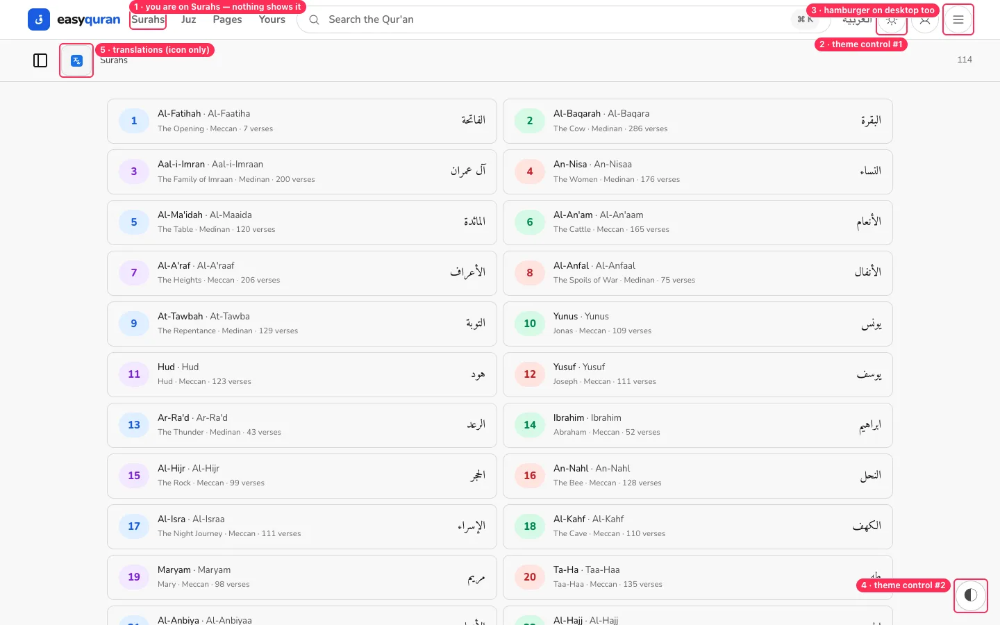
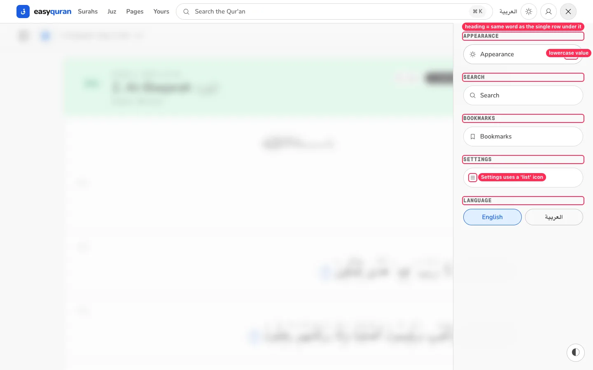
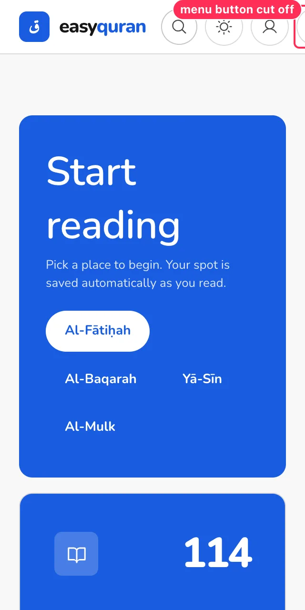

# 01 · Navigation and wayfinding

[← Back to the index](README.md)

> **Question this page answers:** *Can a reader always tell where they are, get where they want, and get back?*

Summary: the header is feature-rich but never says where you are, offers the same actions in two or three places, mixes two URL schemes (so some links lose the reader's language or return a bare "Not found"), and overflows on small phones.

---

### NAV-01 · The header never shows which section you are in

**P1** · everyone · all `/app/*` routes · `web/src/lib/components/nav/Nav.svelte:196-203`

**What's wrong.** On the Surahs page, "Surahs" in the header looks exactly like "Juz", "Pages" and "Yours" (all grey, `text-muted`). There is no underline, no weight change, no `aria-current="page"`. The reader sub-bar says "Surahs" in small grey text, but that is easy to miss.

**Why it matters.** "Where am I?" is the first question on every screen. Without an answer, people press Back to re-orient, which is slow and anxious — especially for older or first-time users.

**Fix.**
- In `Nav.svelte`, compare each `indexLinks[i].href` with `page.url.pathname` (after `deLocalizeUrl`) and, when it matches, add `aria-current="page"` plus a visible state: `text-foreground` + a 2 px underline or the primary soft pill used elsewhere.
- Treat reader routes as children: `/app/al-baqarah` → highlight "Surahs"; `/app/juz/3` → "Juz"; `/app/page/12` → "Pages".
- Use the same active style in the mobile menu panel.

**Done when.** On every index page, exactly one header link is visibly different and has `aria-current="page"`.

---

### NAV-02 · Two URL schemes: some links lose the language, some return a bare "Not found"

**P0** · Arabic readers, anyone who edits a URL or shares one · `web/src/routes/(application)/app/+layout.svelte:34-52`, `web/src/hooks.server.ts:201-212`

**What's wrong.** Reader routes live under `/en/app/…` and `/ar/app/…`. Search, Bookmarks, Yours and Settings live only at `/app/…` (no language prefix). So:

| You do this | You get |
| --- | --- |
| Type or share `/en/app/search` (the pattern every other page uses) | A white page with the words "Not found" — no header, no link home |
| In Arabic, tap **لك** (Yours) | Arabic page — the locale is passed in memory |
| Refresh that page, or open it from a bookmark/shared link | The whole page flips to English |
| In Arabic, open Settings from the menu | Header stays Arabic, the page body is English and left-to-right (see [RTL-04](10-arabic-and-rtl.md)) |

The header links also mix the two schemes today: `/en/app/surah`, `/en/app/juz`, `/en/app/pages` but `/app/yours`.

**Why it matters.** Language is not a preference you should have to re-pick after every refresh. Arabic-first readers will conclude the app "doesn't really support Arabic". A bare text "Not found" looks like the site is broken.

**Fix.**
1. Give Search, Bookmarks, Yours and Settings localized routes (`/en/app/search`, `/ar/app/search`, …) — add them to `paraglide.config.js` `urlPatterns` the same way `/app/:path(.*)` is handled — and keep `/app/search` as a redirect to the reader's saved locale.
2. Until then, at minimum redirect `/{en|ar}/app/{search|bookmarks|yours|settings}` to `/app/…` instead of 404.
3. Remove the in-memory `setAppLocale()` workaround once every page can read its locale from its own URL.

**Done when.** Any `/app` URL can be refreshed in Arabic and stays Arabic; `/en/app/search` and `/ar/app/settings` both load a real page.

---

### NAV-03 · Same action, many doors (theme × 4, search × 3, settings × 2)

**P2** · everyone · header, floating button, menu panel, settings page

**What's wrong.**

| Action | Where it lives |
| --- | --- |
| Change light/dark | Header sun/moon button · menu panel "Appearance" row · floating "Customize appearance" panel · Settings → Appearance |
| Search | Header pill (opens ⌘K palette) · menu panel "Search" row (opens `/app/search`) · landing hero box · sidebar search (surah filter) |
| Settings | Menu panel "Settings" · floating panel titled "SETTINGS" (a different, smaller set of controls) |

Each copy looks different ([11 · Visual consistency](11-visual-consistency.md#vis-04--four-different-selected-looks)). The desktop header also shows a hamburger button whose panel only repeats things already in the header. Inside the panel, every section heading ("SEARCH", "BOOKMARKS", "SETTINGS") repeats the only row beneath it, and Settings uses a "list" icon instead of a gear.

**Why it matters.** Duplicate controls make people wonder whether they do different things ("Is 'Settings' in the corner the same as 'Settings' in the menu?"). Fewer, predictable doors are easier to learn.

**Fix.**
- Keep **one** theme switch in the header and the full options in Settings → Appearance. Remove the floating button (also fixes [RDR-01](03-reader.md)) — or, if a quick reader panel is wanted, make it a clearly named "Aa" *Reading options* button in the reader bar only.
- Desktop: hide the hamburger at `lg` and above; put "Bookmarks" and "Settings" (gear icon) as header icons or in the account menu.
- Mobile menu panel: drop the one-row section headings; list rows directly with icons (Search, Bookmarks, Settings, Language). Use a gear icon for Settings.

**Done when.** Each action has one obvious home per screen size, and duplicate entry points (if kept) look and behave identically.

---

### NAV-04 · The logo leaves the app

**P2** · returning readers · `web/src/routes/(application)/app/+layout.svelte` (`brandHomeHref={marketingHomeHref(...)}`)

**What's wrong.** Inside the app, the easyquran logo links to the marketing landing page (`/`), not the app home (`/en/app`). Readers who tap the logo expecting "home" land on a sales page with a giant headline.

**Fix.** Inside `/app/*`, point the logo at the app home (`readerHomeHrefFor(locale)`); keep the marketing link in the footer.

**Done when.** From any reader page, the logo returns to the app home in the same language.

---

### NAV-05 · Header overflows on small phones

**P1** · phone users (320–390 px; also 200% zoom on desktop) · `Nav.svelte`

**What's wrong.** At 320 px (iPhone SE, Android "small", or desktop at 400% zoom) the menu button is cut off. At 390 px the same happens whenever the offline pill appears ([STATE-05](12-states-errors-offline.md)). WCAG 1.4.10 (Reflow) requires no two-dimensional scrolling at 320 CSS px.

**Fix.** Below `sm`, show only logo + search icon + menu; move theme and account into the menu panel. Or let the icon row shrink to 40 px targets with `gap-1`. Test at 320 × 640.

**Done when.** No header control is clipped at 320 px, online or offline.

---

### NAV-06 · The reader sub-bar hides two key tools behind unexplained icons

**P1** · first-time readers · `web/src/routes/(application)/app/_reader/ReaderShell.svelte:86`, `TranslationButton.svelte`

(See the red box **5** in the NAV-01 screenshot and [RDR-02](03-reader.md#rdr-02--verse-actions-are-tiny-unlabeled-and-ambiguous).)

**What's wrong.** The two buttons that unlock the most value — the surah/juz/page **sidebar** and **Translations** — are an unlabeled panel icon and a Google-Translate-look-alike badge. Neither says what it does until you hover (and phones have no hover).

**Fix.** Give both a text label at `sm` and up ("Surahs", "Translation: English ▾"), keep icon-only on the smallest phones but add a one-time coach mark on first visit ("Tap here to read with a translation").

**Done when.** A new user can find "read with English translation" within 10 seconds without hovering.

---

### NAV-07 · "Yours", "Bookmarks", and the home "Yours" card overlap

**P2** · everyone · header, home metric card, footer, `/app/yours`, `/app/bookmarks`

**What's wrong.** The header says **Yours**, the home card says big "**Yours**" with the title **Bookmarks**, the footer says **Bookmarks**, and both `/app/yours` and `/app/bookmarks` exist with different layouts and widths. In Arabic, "Yours" is translated as **لك** ("for you"), which reads oddly as a menu item.

**Fix.** Pick one name and one page. Suggested: **"My Qur'an"** / **"قرآني"** (or "Saved" / "المحفوظات") at `/app/yours`, containing Continue reading, Bookmarks, Notes. Turn `/app/bookmarks` into the "View all" sub-page of that section with the same header and width. Details in [07 · Bookmarks, notes, Yours](07-bookmarks-notes-yours.md).

**Done when.** The same word is used in the header, the home card, the footer and the page title, in both languages.
