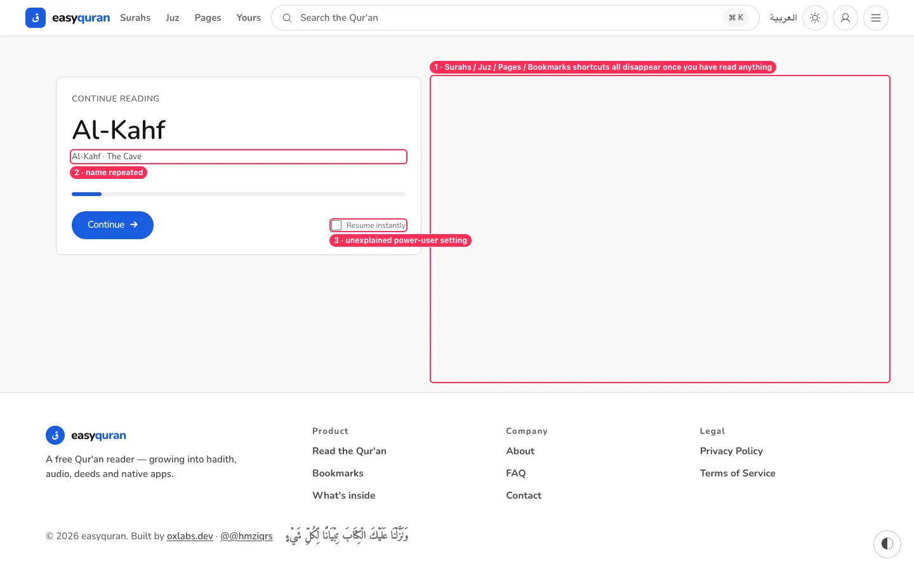
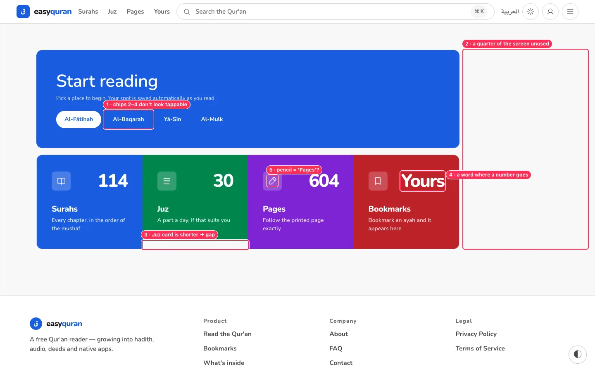
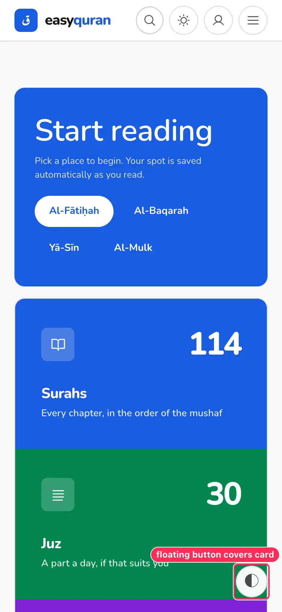

# 02 · App home (`/en/app`, `/ar/app`)

[← Back to the index](README.md)

> **Question this page answers:** *Does the first screen help a new reader start, and a returning reader continue?*

Summary: the first-visit home is bold but lopsided and slightly broken (short Juz card, chips that don't look tappable). The returning-visit home swaps everything out for a single "Continue" card, so the browse shortcuts disappear exactly when people have learned them. Neither version offers the most important first choice for non-Arabic readers: *read with a translation*.

---

### HOME-01 · Once you have read anything, the browse shortcuts disappear

**P1** · returning readers · `web/src/routes/(application)/app/+page.svelte:110-175`

**What's wrong.** The page is an `{#if reader.hasLastRead} … {:else} … {/if}`. On the second visit the "Start reading" hero **and** the Surahs / Juz / Pages / Bookmarks cards are replaced by one Continue card. The card also repeats the surah name ("Al-Kahf" then "Al-Kahf · The Cave") and offers an unexplained "Resume instantly" checkbox.

**Why it matters.** Returning readers want *both* "carry on" and "go somewhere else" (Friday's Al-Kahf, a juz for Ramadan). Moving the doors after the first visit breaks the mental map people just built.

**Fix.**
- Render the Continue card **above** the existing hero + metric strip, not instead of it. Keep the recent-reads list under it.
- Remove the duplicated name line; show `Al-Kahf · The Cave · verse 10 of 110`.
- Move "Resume instantly" to Settings → Reading, worded as "Open where I left off when I start the app".

**Done when.** A returning reader sees Continue + all four browse shortcuts on one screen.

**Second pass adds.**

- Manifest shortcut "Continue reading" → `/app` → home; it does not resume ([PWA-02](25-pwa-and-page-metadata.md#pwa-02--manifest-installed-app-always-opens-in-english-old-colours-brand-spelling)). _(from the 24–26 audit)_

---

### HOME-02 · Layout is lopsided on desktop and the Juz card is shorter than its neighbours

**P2** · desktop · `+page.svelte:110, 179, 215`

**What's wrong.**
1. The container is `mx-auto max-w-[1320px]` but its children are `max-w-5xl` (1024 px) and not centred, so a 400 px blank column sits on the right of a 1440 px screen. Every other page centres its content.
2. The Juz card's caption fits on one line, so the card is ~20 px shorter than the other three and a white strip shows under it (worse in dark mode: a black strip).
3. The metric card for Bookmarks shows the word **"Yours"** in the big-number slot.
4. The Pages card uses a **pencil** icon (it means "edit" everywhere else in the app).

**Fix.**
1. Centre the column: `mx-auto max-w-5xl` on the wrapper (or let the hero/strip span the full 1320 px).
2. Make the grid items stretch: `grid … items-stretch` and `h-full` on the `<a>` and `MetricCard` root.
3. Show the bookmark **count** ("0", "3") in the numeral slot, like the other cards, and "Bookmarks" as the label.
4. Use a page/book-open icon for Pages, a layers or "1/30" icon for Juz (see [VIS-02](11-visual-consistency.md#vis-02--icons-mean-different-things-in-different-places)).

**Done when.** At 1440 px the home content is centred; all four cards are the same height in both themes; no card uses a word where others use a number.

**Second pass adds.**

- At 2560 px the home content is 1024 px in the middle of a mostly empty page. _(from the 17–18 audit)_

---

### HOME-03 · Hero chips: only the first looks like a button

**P2** · touch users · `+page.svelte:184-213`

**What's wrong.** Al-Fātiḥah is a white pill; Al-Baqarah, Yā-Sīn and Al-Mulk are bare white text on blue (they only get a background on hover — which phones don't have). Many people will think only the first is tappable. The chips also use a **third spelling system** (Al-Fātiḥah, Yā-Sīn with diacritics) that appears nowhere else (the list says "Al-Fatihah · Al-Faatiha", the landing says "Ya-Sin") — see [LIST-01](06-browse-lists.md).

**Fix.** Give all four the same outlined pill (`border border-primary-foreground/60`), filled on hover/press. Use the app's canonical transliteration.

**Done when.** All hero chips look equally tappable on a phone.

---

### HOME-04 · New readers are never asked "Do you read Arabic?"

**P1** · non-Arabic readers (the majority of first-time visitors outside the Arab world) · home + reader

**What's wrong.** A new reader taps "Al-Fātiḥah" and gets Arabic-only text. Translations exist (378 of them, in 105 languages) but are hidden behind a small icon in the reader sub-bar ([NAV-06](01-navigation-and-wayfinding.md#nav-06--the-reader-sub-bar-hides-two-key-tools-behind-unexplained-icons)). Nothing on the home page mentions them.

**Why it matters.** For a reader who cannot read Arabic, the first experience is a page they cannot understand. Many will leave before finding the icon.

**Fix.** Add a one-line choice to the home hero on first visit: **"Read in: Arabic only · Arabic + English · Arabic + اردو …"** (default to the browser language if a translation exists; remember the choice). Show the chosen translation name on the Continue card. See [TR-01](04-translations.md) for how the reader should then look.

**Done when.** A first-time English-speaking visitor reaches a verse with an English translation in one tap from home.

---

### HOME-05 · Home copy is hard-coded English

**P1** · Arabic UI · `+page.svelte:141, 149, 182-183, 190-210, 165`

See [RTL-01](10-arabic-and-rtl.md#rtl-01--app-home-hero-and-continue-card-are-english). "Start reading", "Pick a place to begin…", "Continue", "Resume instantly", "Surah N" and the chip names are string literals, not messages, so the Arabic home shows English.

**Fix.** Move them to `messages/reader/{en,ar}.json`; use the Arabic surah names for chips in Arabic.

---

### HOME-06 · No page title (`<h1>`)

**P2** · screen-reader users · `+page.svelte:182`

axe: *page-has-heading-one*. "Start reading" is an `<h2>`; the page has no `<h1>`. Make the hero heading an `<h1>` (keep its size), or add a visually hidden "easyquran — home" `<h1>`.

**Second pass adds.**

- Full per-page heading outline in [KEY-12](21-keyboard-focus-and-screen-reader.md#key-12--heading-outline-gaps); range-reader surah groups are not headings. _(from the 21–23 audit)_

---

### HOME-07 · The floating appearance button covers content on phones

**P1** · phones · see [RDR-01](03-reader.md#rdr-01--the-floating-appearance-button-covers-the-quran-text-on-phones)

