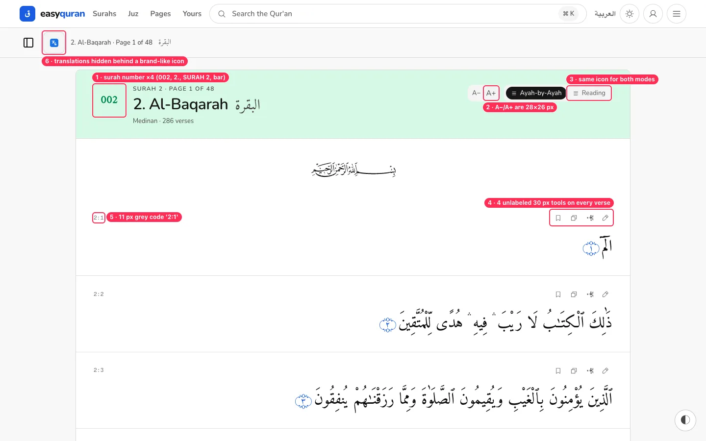
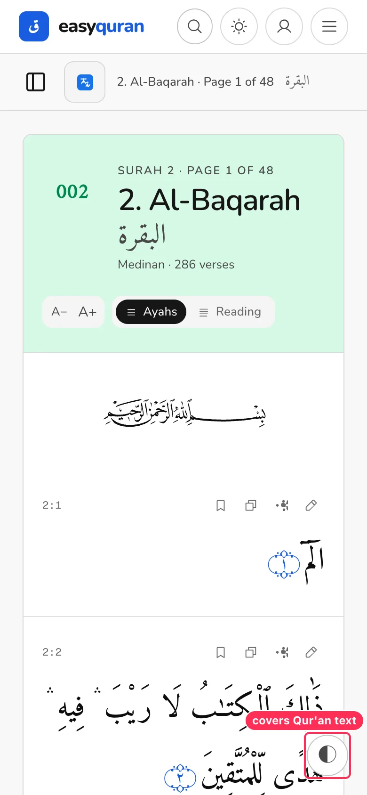
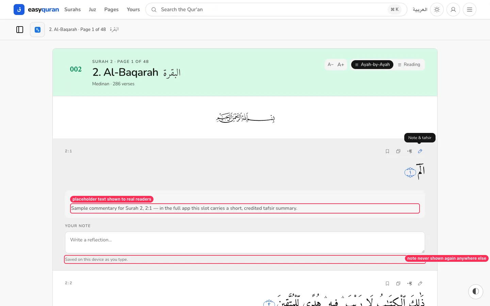
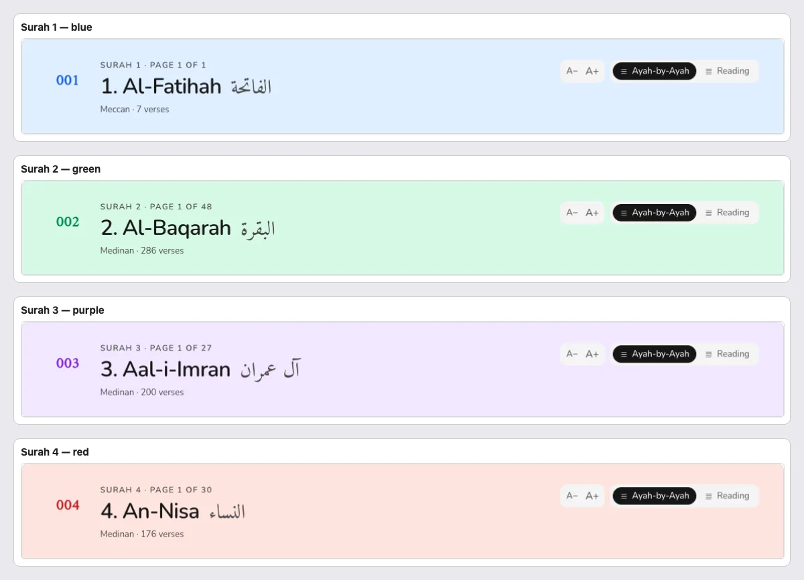
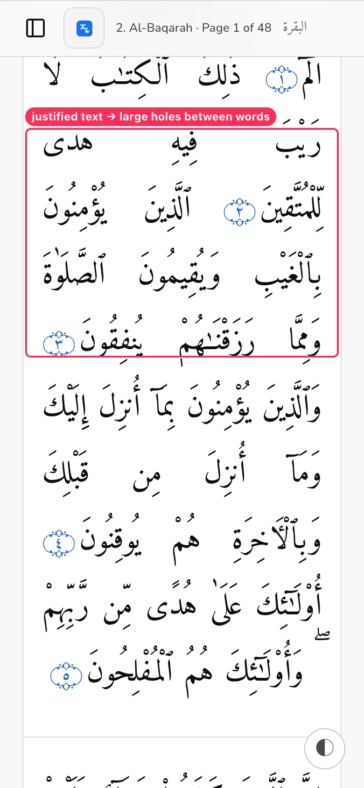
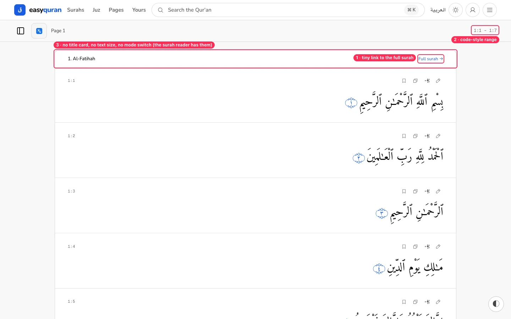
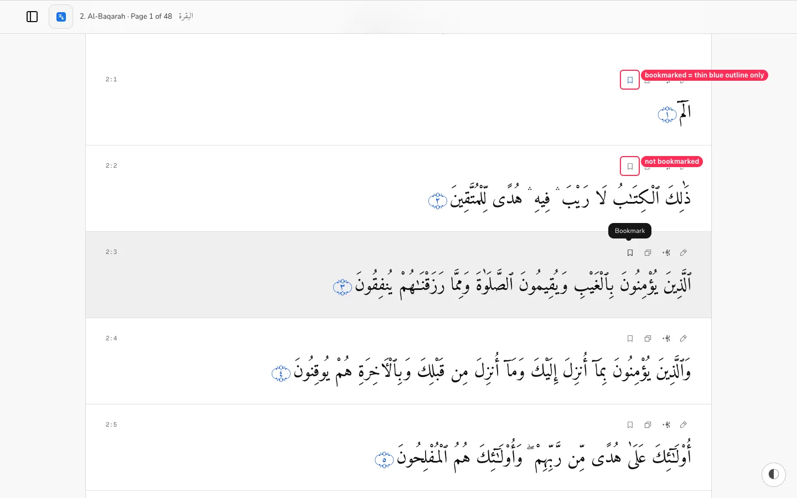
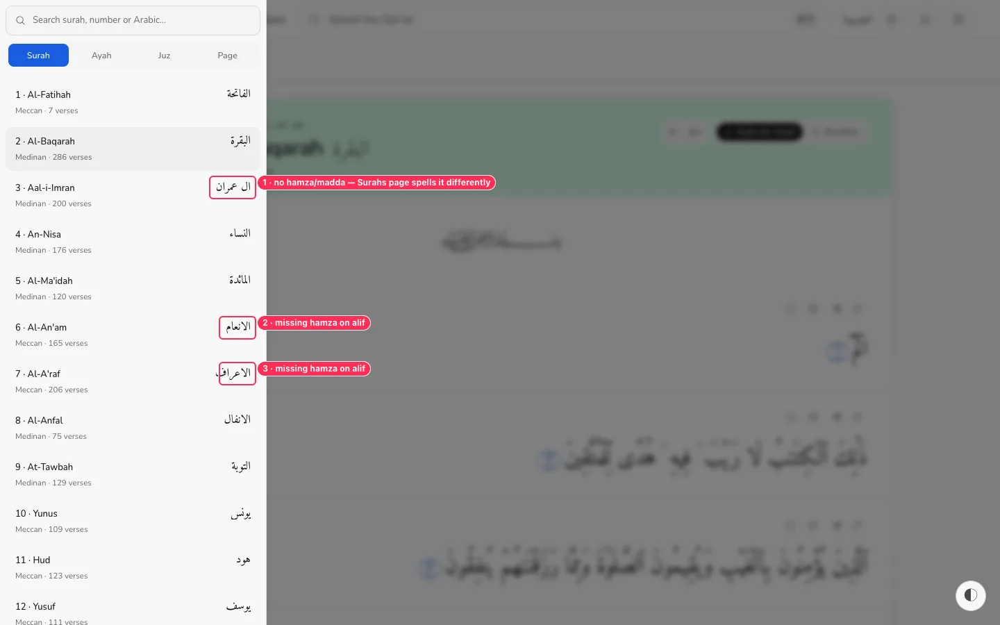
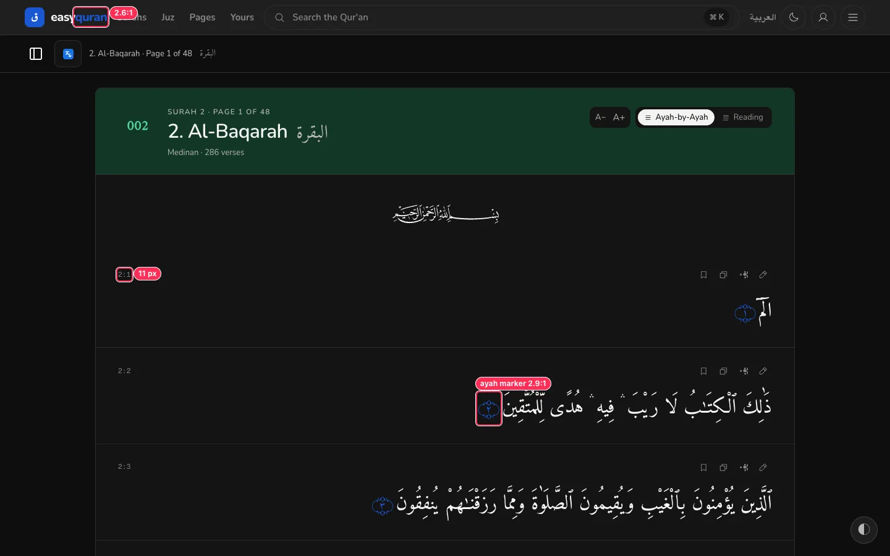

# 03 · Reader (surah, page and juz readers)

[← Back to the index](README.md)

> **Question this page answers:** *Is the Qur'an text the calmest, clearest thing on screen, and are the tools around it understandable?*

Summary: the Arabic text itself is beautifully set and the offline behaviour is excellent. The chrome around it is noisy (number shown four times, colour that changes per surah, four unlabeled tools on every verse) and in two places it is actively harmful: a floating button sits on top of the Qur'an text on phones, and the "tafsir" panel shows placeholder text to real readers.

---

### RDR-01 · The floating appearance button covers the Qur'an text on phones

**P0** · phone readers · `web/src/lib/components/tweaks/Tweaks.svelte:380-390`, mounted in `web/src/routes/(application)/app/+layout.svelte`

**What's wrong.** A 44 px round "Customize appearance" button is fixed to the bottom corner of every page. On phones it sits directly on top of Arabic words of the verse being read (and on list cards, footer links, the Juz card…). In Arabic UI it moves to the bottom-left — still over text.

**Why it matters.** Covering words of the Qur'an is a respect issue as much as a usability one, and it hides the very thing the app exists for. It also duplicates the header theme button and Settings → Appearance ([NAV-03](01-navigation-and-wayfinding.md#nav-03--same-action-many-doors-theme--4-search--3-settings--2)).

**Fix.** Remove the floating button from the app. If a quick "text size / mode / theme" panel is wanted while reading, open it from an **"Aa"** button in the reader sub-bar (next to Translations). If it must stay floating, reserve space for it (`padding-bottom` on the reading column equal to button height + 16 px) and hide it while scrolling down.

**Done when.** At 390 × 844, no fixed element overlaps Qur'an text, list cards or footer links at any scroll position.

**Second pass adds.**

- The floating panel also has a "Data & privacy" section below Copy CSS/Reset (visible when scrolled); clicking any `aria-expanded=false` button on FAQ opens it — the floating trigger is in the tab/expander flow of every page. _(from the 19–20 audit)_
- The floating button also sits above modal backdrops ([INT-08](23-interaction-details.md#int-08--the-floating-button-stays-on-top-of-open-dialogs)) and its panel lets focus wander behind it ([KEY-07](21-keyboard-focus-and-screen-reader.md#key-07--focus-wanders-behind-the-floating-appearance-panel)). _(from the 21–23 audit)_
- **Dependency:** `OfflinePackBar` (offline-pack progress) and `Notifications` are mounted *inside* `Tweaks.svelte` (lines 331, 376). Removing the floating panel also removes the offline-pack progress UI — move `OfflinePackBar` to the root layout first. _(from the 24–26 audit)_

---

### RDR-02 · Verse actions are tiny, unlabeled and ambiguous

**P1** · everyone, especially touch and older users · `web/src/routes/(application)/app/_reader/VerseTools.svelte:66-83`

**What's wrong.**
- Each verse carries 4 icon-only buttons, **30 × 30 px** with **15 px** icons in mid-grey. The design system promises 44 px targets.
- The **share** icon (Phosphor share-network at 15 px) reads as a blob. The **pencil** opens "Note & tafsir" — a pencil means "edit" everywhere else, and nobody would guess it also shows commentary.
- Labels exist only as hover tooltips; phones never see them.
- The row repeats on every single verse (286 times in Al-Baqarah), competing with the text.

**Fix.**
- Collapse the toolbar to **one** "⋯" (More) button per verse, 44 × 44 px, that opens a small sheet with **labelled** rows: Bookmark · Copy · Share · Add note · Read tafsir. Or show the 4 tools only for the tapped/focused verse.
- If the row stays, raise buttons to `size-11` (44 px), icons to 20 px, and split "Note" (pencil) and "Tafsir" (book-open) into two actions.
- Replace the share glyph with the platform-familiar "square + arrow" (iOS) / "share-2" shape.

**Done when.** Every verse action has a visible text label somewhere in the flow (sheet or inline), and each target is ≥ 44 × 44 px on phones.

**Second pass adds.**

- Keyboard cost: 4 Tab stops per verse, 1,144 in Al-Baqarah; names lack the verse number ([KEY-03](21-keyboard-focus-and-screen-reader.md#key-03--every-verse-adds-four-tab-stops-with-identical-names)). Reading mode has no verse actions at all ([INT-04](23-interaction-details.md#int-04--reading-mode-removes-every-verse-action)). _(from the 21–23 audit)_

---

### RDR-03 · The "tafsir" panel shows placeholder text to real readers

**P0** · everyone who opens it · `web/src/lib/data/quran.ts:163-166` (`tafsirFor`), `VerseTools.svelte:119-126`

**What's wrong.** Opening "Note & tafsir" on any verse shows: *"Sample commentary for Surah 2, 2:1 — in the full app this slot carries a short, credited tafsir summary."* This is developer placeholder copy presented under the heading **TAFSIR**.

**Why it matters.** In a Qur'an app, text shown under "tafsir" is read as religious commentary. Placeholder text there damages trust in everything else on the page. (Also tracked as feature gap R05 in `docs/remaining/feature-gap-catalogue.md`.)

**Fix.** Until real, credited tafsir ships, **hide the tafsir block** and rename the action to "Add a note". When tafsir ships, always show the source name (e.g., "Tafsir al-Muyassar — King Fahd Complex").

**Done when.** No user-visible string contains "Sample" or "in the full app".

---

### RDR-04 · The surah number is shown four times; the header colour changes per surah

**P2** · everyone · `web/src/routes/(application)/app/_reader/ReaderHeader.svelte:51-80`

**What's wrong.**
- Al-Baqarah's header shows **002**, **2.** Al-Baqarah, **SURAH 2 · PAGE 1 OF 48**, and the sticky bar repeats "**2.** Al-Baqarah · Page 1 of 48 · البقرة". Al-Fātiḥah even says "Page 1 of 1".
- The "002" badge is set in **Amiri** (the Arabic Qur'an font) with synthetic bold, so its digits look unlike every other number in the UI.
- The header background cycles through four colours by surah number (1 blue, 2 green, 3 purple, 4 red, repeat). The colour carries no meaning; red on surah 4 can read as "error".
- "PAGE 1 OF 48" is a *local* page count inside the surah, unrelated to the 604 mushaf pages in the Pages list, which invites confusion.

**Fix.**
- One number: keep a quiet "Surah 2" line (or the badge) and drop the others. Show the Arabic name larger than the transliteration.
- Use one neutral header tone for all surahs (e.g., `--background-subtle`), or tie colour to something meaningful (Meccan vs Medinan) *and* explain it.
- Replace "Page 1 of 48" with the mushaf page ("Page 2 of 604 in the mushaf") or remove it; show local progress as a thin progress bar instead.
- Use `font-sans tabular-nums` for the badge.

**Done when.** The surah number appears once per screen and header colour is identical (or meaningfully explained) across surahs.

**Second pass adds.**

- The changing "Page N of 48" is also in `<title>` and is announced assertively on every page boundary ([KEY-01](21-keyboard-focus-and-screen-reader.md#key-01--screen-readers-are-interrupted-with-page-n-of-48-while-you-scroll)). _(from the 21–23 audit)_

---

### RDR-05 · Text-size and mode controls are small and unclear

**P1** · older readers · `ReaderHeader.svelte:85-130`

**What's wrong.**
- A−/A+ are **28 × 26 px** grey letters. They change the Arabic size only; there is no visible "current size", and the Settings page uses a different control ("− 33px +").
- The mode toggle says **"Ayah-by-Ayah"** on desktop but **"Ayahs"** on phones; both modes use the *same* list icon, so the icon adds nothing.
- The active mode is a **black** pill; every other selected control in the app is **blue** ([VIS-04](11-visual-consistency.md#vis-04--four-different-selected-looks)).

**Fix.** Group these in the "Aa" reading-options panel suggested in RDR-01 with: a size slider with an Arabic preview word, a mode switch with distinct icons ("one verse per row" vs "flowing page"), and one label in all widths ("Verse by verse" / "Continuous"). Use the primary selected style.

**Done when.** Controls are ≥ 44 px, show their current value, and read the same on phone and desktop.

---

### RDR-06 · Reading mode on phones spreads words far apart

**P2** · phone readers · reading-mode styles in `SurahReader.svelte` / `RangeReader.svelte`

**What's wrong.** Continuous mode uses full justification. At phone width only 2–3 large Arabic words fit per line, so justification opens very large gaps and the text looks like a word list.

**Fix.** Below ~480 px use `text-align: start` (right in RTL) with `text-justify: inter-word` off, or use Arabic kashida-aware justification only when ≥ 5 words fit per line.

**Done when.** No gap between words exceeds roughly one word-width on a 390 px screen.

**Second pass adds.**

- At 56 px on a 360 px phone, continuous mode justifies two words per line into two columns (`screenshots/scripts/phone-56px-continuous.webp`). _(from the 17–18 audit)_
- Worst on Chromium/Android: Chromium fits fewer words per line than WebKit ([BRW-02](26-cross-browser.md#brw-02--continuous-reading-mode-breaks-arabic-lines-differently-per-engine)). _(from the 24–26 audit)_

---

### RDR-07 · Page and Juz readers lack the surah reader's header and controls

**P2** · readers using Pages/Juz · `web/src/routes/(application)/app/_reader/RangeReader.svelte`

**What's wrong.** The surah reader has a title card with text size and mode toggles. The page and juz readers start with a plain row ("1. Al-Fatihah … الفاتحة Full surah →"), no size/mode controls, a tiny blue link, and a monospace range "1:1 - 1:7" in the sub-bar. Page 1 and Juz 1 look identical.

**Fix.** Reuse `ReaderHeader` for range readers with a title like "Page 1 of 604 · Al-Fātiḥah" / "Juz 1 (Alif Lām Mīm)", the same controls, and a proper secondary button "Open full surah". Replace the code-style range with words: "Al-Fātiḥah 1 – 7".

**Done when.** Switching between surah, page and juz readers keeps the same header layout and controls.

---

### RDR-08 · Bookmarked state is a thin colour change only

**P2** · everyone, colour-blind users · `VerseTools.svelte:89-94`

**What's wrong.** A bookmarked verse's icon turns from grey outline to blue outline. There is no filled icon, no toast ("Saved to bookmarks · Undo"), and nothing on the verse itself. The accessible name does change ("Remove bookmark"), which is good.

**Fix.** Use a **filled** bookmark glyph for the on state (Phosphor `BookmarkSimple` fill), show a 3-second toast with Undo, and add a small bookmark ribbon next to the verse number.

**Done when.** A bookmarked verse is recognisable in greyscale.

**Second pass adds.**

- In forced colours the bookmarked state disappears completely ([DISP-02](18-display-conditions.md#disp-02--windows-high-contrast-nothing-shows-what-is-selected)). _(from the 17–18 audit)_

---

### RDR-09 · The sidebar spells some Arabic surah names differently from the rest of the app

**P1** · Arabic readers · `web/src/routes/(application)/app/_reader/Sidebar.svelte` data source vs the catalogue used by the Surahs list

**What's wrong.** The sidebar shows **ال عمران, الانعام, الاعراف** (no madda/hamza). The Surahs page, the ⌘K palette and the reader header show **آل عمران, الأنعام, الأعراف**. Two data sources are in use.

**Why it matters.** Arabic readers notice missing hamza immediately; in a Qur'an app it looks careless.

**Fix.** Source all surah names (Arabic and transliterated) from one catalogue module. Add a unit test that the sidebar and list render identical `name_ar` for all 114 surahs.

**Done when.** The same Arabic name string is used for a surah everywhere.

---

### RDR-10 · Dark mode: ayah markers and the wordmark are too faint

**P1** · dark-mode readers · `web/src/routes/layout.css:225` (sacred-dark `--primary`)

**What's wrong.** Ayah end-markers (۝ with the number) and the "quran" half of the wordmark use `--primary` (`oklch(0.50 0.20 262)`) as a *text* colour on the dark ground: **2.9:1** and **2.6:1** (need 3:1 for large text/graphics, 4.5:1 for small). The verse reference "2:2" is 11 px grey. Full list in [A11Y-01](09-accessibility.md#a11y-01--dark-mode-uses-the-fill-blue-as-a-text-colour).

**Fix.** Add a `--primary-legible` token (dark: L≈0.72–0.78 like `--hue-1-legible`) and use it for any primary-coloured text or glyph on the ground. Add the pair to `token-contrast.test.ts`.

**Done when.** axe reports no colour-contrast issues on the dark reader.

---

### RDR-11 · Verse numbers are code-style and tiny

**P2** · everyone · `VerseTools.svelte:66`

**What's wrong.** Each verse is labelled `2:1` in 11 px Geist Mono, letter-spaced, grey. "2:1" is scholar/developer notation; most readers know "Verse 1".

**Fix.** Show "Verse 1" (or just the ayah number in the end-marker, which is already there) at ≥ 13.5 px in the UI font; keep "2:1" for copy/share output and the aria-label.

**Done when.** No reader-facing label uses `font-mono`.

---

### RDR-12 · Continuous scroll changes "Page N of 48" silently

**P3** · readers using the page count · `SurahReader.svelte`

**What's wrong.** Al-Baqarah loads its 48 local pages as you scroll, and the sticky bar's "Page 1 of 48" silently becomes "Page 2 of 48". There is no page break marker in the text, so the number seems to jump at random.

**Fix.** Either drop the local page count (see RDR-04) or draw a subtle divider with the mushaf page number where pages meet ("— page 3 —").

**Second pass adds.**

- The changing "Page N of 48" is also in `<title>` and is announced assertively on every page boundary ([KEY-01](21-keyboard-focus-and-screen-reader.md#key-01--screen-readers-are-interrupted-with-page-n-of-48-while-you-scroll)). _(from the 21–23 audit)_

