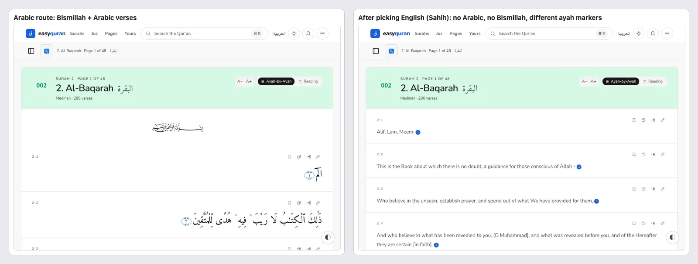
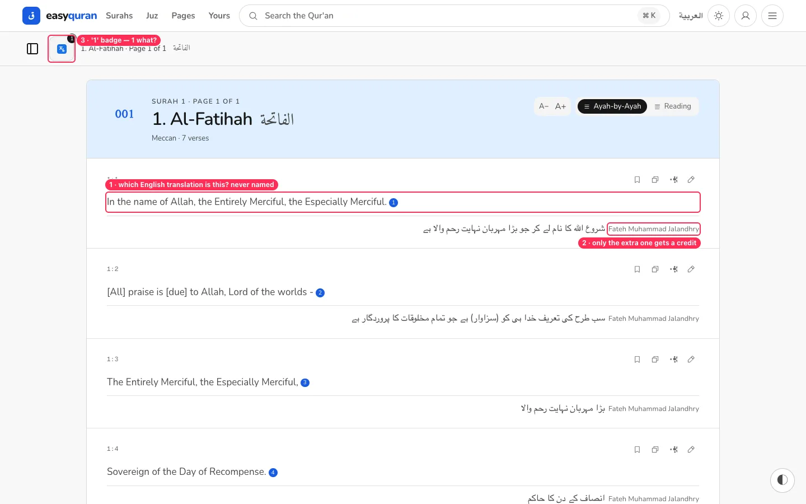
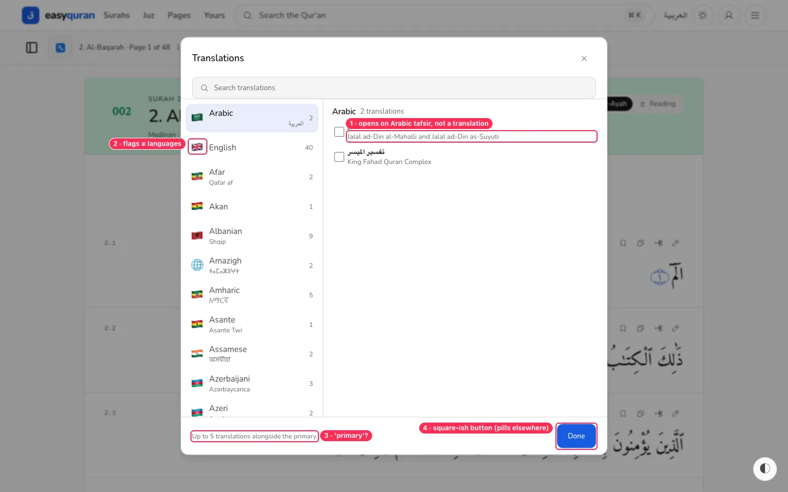
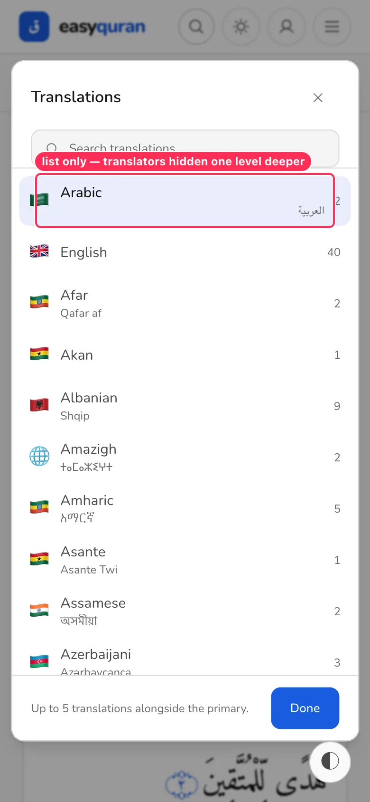
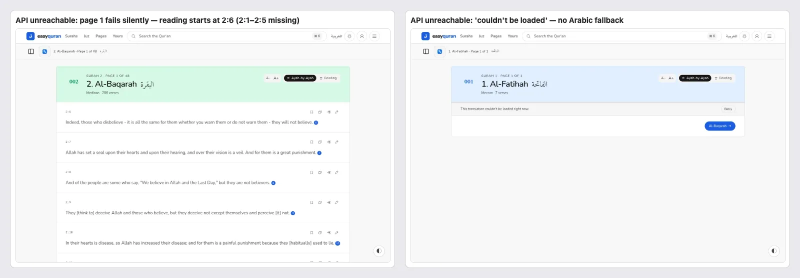

# 04 · Translations

[← Back to the index](README.md)

> **Question this page answers:** *Can a reader who doesn't read Arabic find, choose and trust a translation — without losing the Arabic?*

Summary: the catalogue is impressive (378 translations in 105 languages, native language names, stacking up to 5). But choosing a translation **replaces** the Arabic instead of adding to it, the translator of the main translation is never named, and the picker opens on Arabic *tafsir* rather than translations.

---

### TR-01 · Picking a translation removes the Arabic text (and the Bismillah)

**P0** · every translation reader · translated routes `/app/[surah]/t/[lang]/[translator]` · `SurahReader.svelte`, `VerseRow.svelte`

**What's wrong.** On the translated route, each verse row shows **only** the translation. The Arabic verse is gone, the Bismillah opener is gone, and verse numbers change style (ornamental ۝ → small blue filled circle).

**Why it matters.** Almost every Qur'an reader, including those who can't read Arabic, expects the Arabic with the translation beneath it — the translation is understood as an explanation *of* the Arabic, not a replacement. Losing the Arabic will feel wrong to many readers, and the two modes look like two different apps.

**Fix.**
- Default translated rows to **Arabic on top, translation below** (same `VerseRow` stacking already used for "more" translations).
- Offer "Show Arabic: on/off" in reading options for people who want translation-only.
- Keep the Bismillah opener on every surah except 1 and 9, in both modes.
- Use one verse-number style across modes.

**Done when.** The translated reader shows the same Arabic + Bismillah as the Arabic reader, with the translation added.

**Second pass adds.**

- Worse with tafsir as the main text — [TRX-01](22-translations-deep-dive.md#trx-01--arabic-commentary-chosen-as-the-main-translation-looks-like-quran-text). Copy on translated routes also drops the Arabic ([INT-05](23-interaction-details.md#int-05--what-copy-puts-on-the-clipboard)). _(from the 21–23 audit)_

---

### TR-02 · The main translation is never credited

**P1** · everyone · translated reader

**What's wrong.** With English (Sahih International) as the primary and Urdu (Jalandhry) stacked, every Urdu line says "Fateh Muhammad Jalandhry" but the English lines — the main text — never say whose translation they are. The only hint is the URL. The translation button shows a "1" badge with no explanation.

**Why it matters.** Readers (and scholars) care deeply about *which* translation they read. Crediting the translator is also a licence expectation for most sources.

**Fix.**
- In the sub-bar, replace the icon-only button with a labelled chip: **"English · Sahih International ▾"**.
- Credit once per page at the top of the verses ("Translation: Sahih International") rather than on every line; for stacked translations show a small language tag ("اردو") per line and the full credit in the same header.
- Remove or explain the numeric badge ("+1 more").

**Done when.** A reader can name the translation on screen without looking at the URL.

**Second pass adds.**

- The reading-mode dialog is the only UI that names the main translation ("Saheeh International"). _(from the 19–20 audit)_
- The stacked credit is inline Latin inside RTL text and splits lines at large sizes ([TRX-13](22-translations-deep-dive.md#trx-13--stacked-credits-break-right-to-left-lines)). _(from the 21–23 audit)_

---

### TR-03 · The translation picker opens on Arabic *tafsir*, uses flags, and says "primary"

**P1** · everyone choosing a translation · `web/src/routes/(application)/app/_reader/TranslationModal.svelte` (`flagFor`, line ~403)

**What's wrong.**
1. The picker opens with **Arabic** selected, listing *Tafsir al-Jalalayn* and *Tafsir al-Muyassar* — these are commentaries, not translations. An English reader has to find "English" (second in the list) themselves.
2. Every language has a **country flag** (UK for English, Saudi Arabia for Arabic, Ethiopia for Afar, India for Assamese). Languages aren't countries; flags are politically loaded for some languages and useless for others (Amazigh gets a globe).
3. The footer says "Up to 5 translations alongside the **primary**" — "primary" is internal vocabulary.
4. "Done" is a rounded rectangle, unlike the pill buttons everywhere else.
5. The search box is a grey rounded rectangle — a 7th search style ([VIS-03](11-visual-consistency.md)).

**Fix.**
- Open on the **UI language** (English → English list; Arabic UI → Arabic *translations*, with tafsir in a separate "Commentary (tafsir)" group).
- Pin a "Suggested" group at the top: browser language + the most-used 3.
- Replace flags with the language's own name in its script (already shown) and, optionally, a two-letter code badge.
- Footer copy: "You can show up to 5 extra translations under the main one."
- Use the standard pill `Button`.

**Done when.** An English-UI user sees English translations first; no flags are shown; no internal words remain.

**Second pass adds.**

- Reading-mode dialog: `rounded-lg` buttons, flags, `shadow-lg` ([SCR-08](19-remaining-screens-and-flows.md#scr-08--the-reading-mode-dialog-uses-its-own-button-and-list-styles)). The search page's picker is a different component ([FLOW-03](19-remaining-screens-and-flows.md#flow-03--search-has-a-second-different-translation-picker--and-it-needs-two-steps)). _(from the 19–20 audit)_
- Picker also lists duplicates ([TRX-03](22-translations-deep-dive.md#trx-03--the-same-translator-is-listed-twice-and-some-languages-twice)), search misses "sahih" ([TRX-04](22-translations-deep-dive.md#trx-04--picker-search-misses-common-spellings)), chips hide selections ([TRX-05](22-translations-deep-dive.md#trx-05--the-chosen-translation-chips-hide-most-of-your-choices)), × on the main chip is dead ([TRX-06](22-translations-deep-dive.md#trx-06--the--on-the-main-translation-does-nothing-primary-is-a-mystery-button)); flags also in the reading-mode dialog ([TRX-15](22-translations-deep-dive.md#trx-15--reading-mode-choice-dialog-clear-with-small-inconsistencies)). _(from the 21–23 audit)_

---

### TR-04 · On phones the picker hides translators one level deep

**P2** · phone users · `TranslationModal.svelte`

**What's wrong.** On phones the modal shows only the language column. Nothing indicates that tapping "English" opens a second list; there's no chevron. The selected language row shows its native name floating on the far side (the Arabic row places "العربية" under the count, unlike other rows).

**Fix.** Add a chevron (›) to each language row and a back button in the second step; align the native name consistently under the English name.

---

### TR-05 · Extra-language lines are small and use a generic font

**P2** · Urdu, Persian, Bengali, etc. readers · stacked translation rows

**What's wrong.** The stacked Urdu line is set small (caption size) in the generic Arabic UI font. Urdu is conventionally read in Nastaliq or a larger Naskh; at this size it is hard to read. The translator name sits inline in grey at the start of each line.

**Fix.** Give stacked translations the same size as the primary translation (or one step smaller, never caption size), and map script-specific fonts (Noto Nastaliq Urdu for `ur`, Noto Naskh for `fa`, Noto Sans Bengali for `bn`…) — self-hosted, per the no-CDN rule.

**Second pass adds.**

- Also applies to RTL translations as the **main** text ([TRX-12](22-translations-deep-dive.md#trx-12--right-to-left-translations-are-set-like-english)). _(from the 21–23 audit)_

---

### TR-06 · When the API is unreachable, translated pages fail without falling back to Arabic

**P1 (API unreachable)** · readers on poor connections · translated surah route first page

**What's wrong.** With the API down (the situation of a phone on a bad connection before the translation is cached), the first page of a translated surah fails. For Al-Baqarah the reader silently starts at **2:6** (2:1–2:5 are missing, with only a small banner); for Al-Fātiḥah the reader shows *"This translation couldn't be loaded right now."* and nothing else — even though the Arabic text is available offline.

**Why it matters.** The app's promise is offline-first. A missing first page with no clear message looks like missing Qur'an text.

**Fix.** On translation failure, render the Arabic rows (already local) with an inline notice per page: "English translation not available offline yet — [Download] [Retry]". Never render a page that skips verses without saying so.

**Done when.** With the API stopped, `/en/app/al-baqarah/t/en/sahih` shows 2:1 onward with Arabic and a clear notice.

**Second pass adds.**

- Positive counter-evidence for the "What's good" section: after one online visit, a never-opened surah, juz, mushaf page, search for a new word, the Arabic-UI reader, and even two never-opened translations (Sahih, Pickthall — apparently prefetched) all opened **offline** on the production build. _(from the 24–26 audit)_

