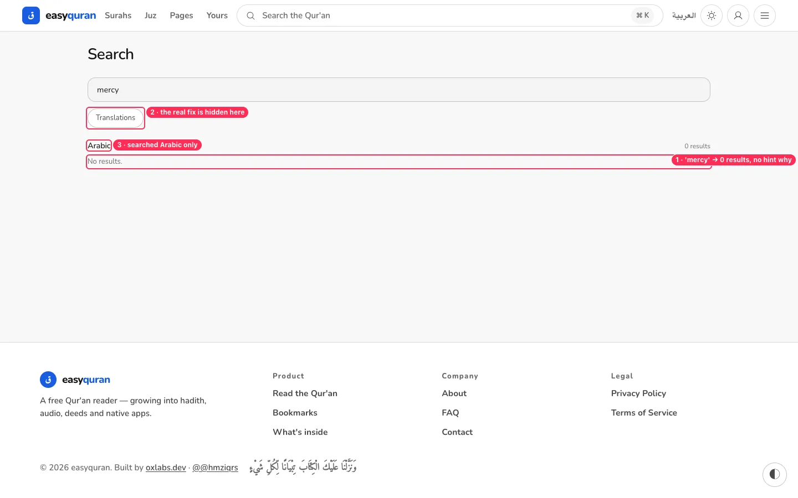
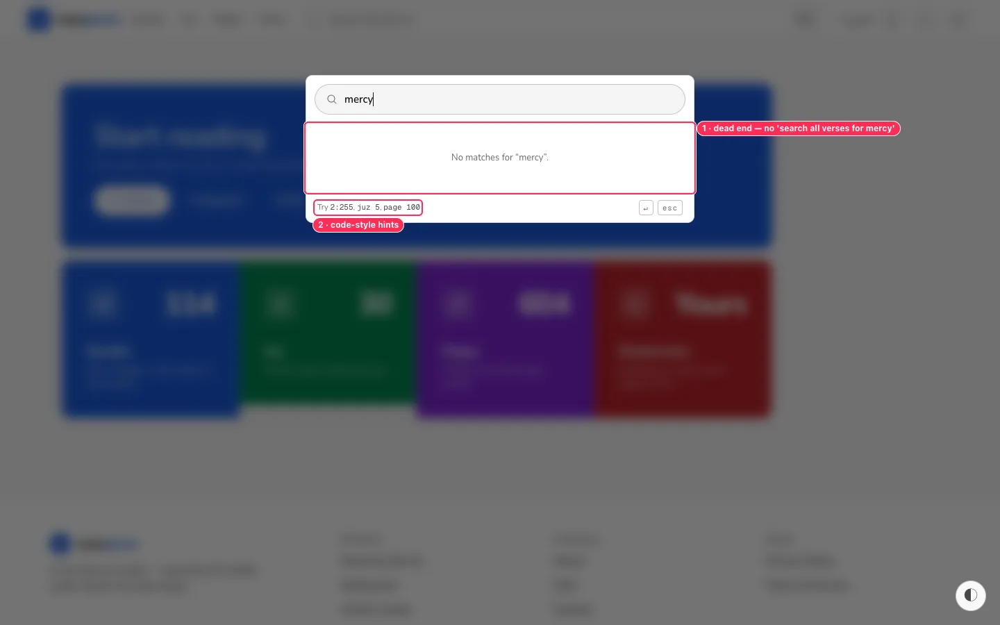
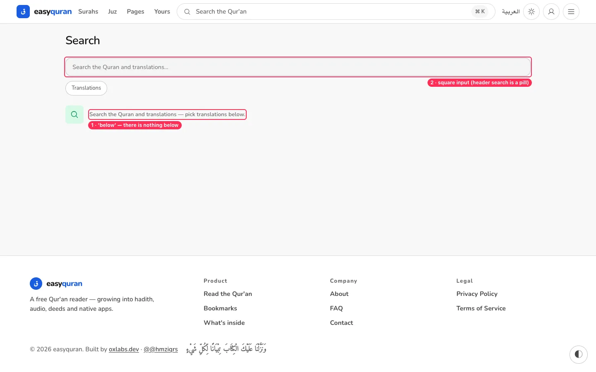
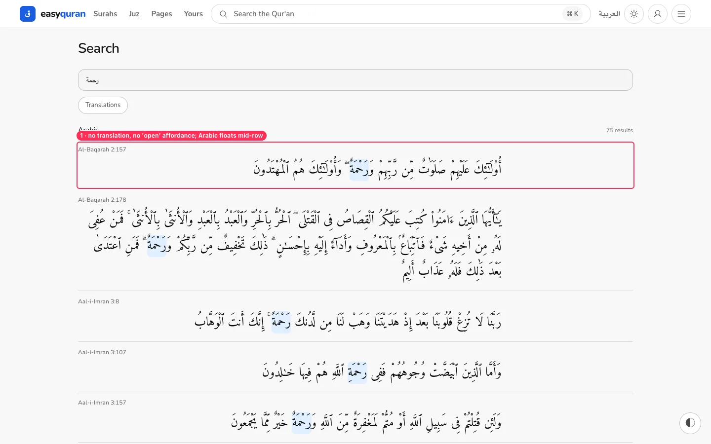
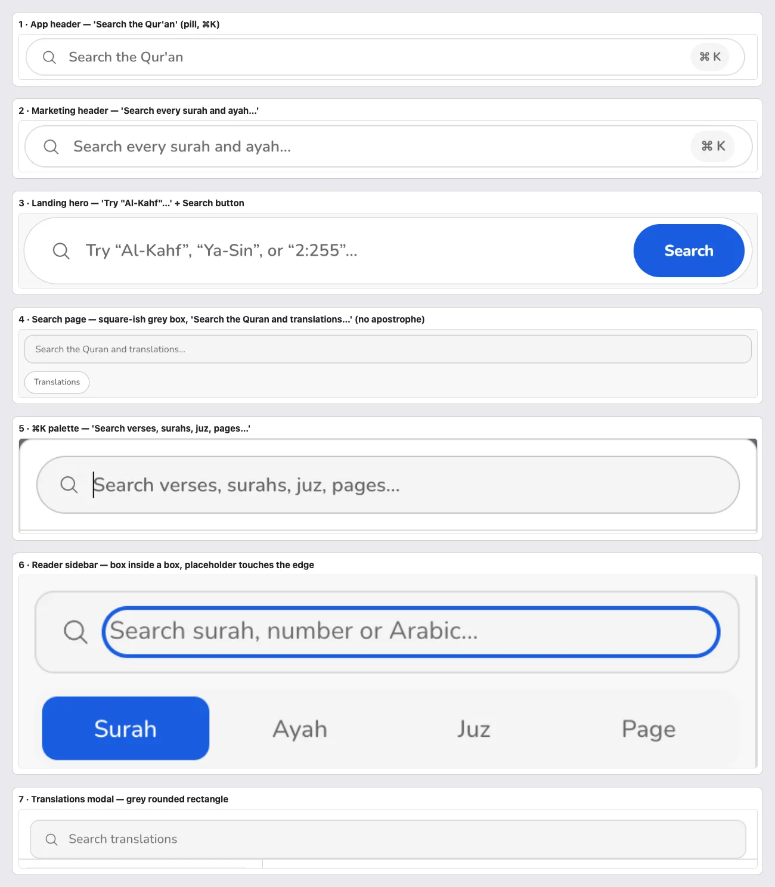

# 05 · Search

[← Back to the index](README.md)

> **Question this page answers:** *If I type what I'm looking for, in my own words, do I find it?*

Summary: search is powerful for Arabic and references (75 hits for رحمة, `2:255`, `juz 5`) but fails the most common query from an English speaker — an English word — with no explanation. There are also seven different-looking search boxes.

---

### SRCH-01 · Searching an English word returns nothing, with no hint why

**P0** · non-Arabic readers · `/app/search` · `web/src/routes/(application)/app/search/`

**What's wrong.** The search box says *"Search the Quran and translations…"*. Typing **mercy** returns **"Arabic — 0 results — No results."** Translations are only searched after you open the small "Translations" button and pick some. Nothing on the page tells you that. (Verified with the API running.)

**Why it matters.** "mercy", "patience", "Moses" are exactly what a non-Arabic reader types. Zero results tells them *the Qur'an doesn't contain it*, which is false and discouraging.

**Fix.**
- Always include the reader's current/most recent translation (or the UI-language default, e.g. Sahih International for English) in search by default. The Translations button then *adds* more.
- If a Latin-script query gets 0 Arabic hits, automatically search the default translation and say so: *"No Arabic matches. Showing results from English — Sahih International."*
- Empty-result copy: "No verses contain 'mercy' in the selected texts. Try another word, or [add translations to search]."

**Done when.** A fresh visitor searching "mercy" sees English verse results without touching any setting.

---

### SRCH-02 · The ⌘K palette dead-ends on words

**P1** · everyone using the header search · `web/src/lib/components/search/GlobalSearchPalette.svelte`

**What's wrong.** The header search opens a palette whose placeholder promises "Search **verses**, surahs, juz, pages…". Typing a word shows *No matches for "mercy"* with no way to run a full-text search. The footer hint is code: `Try 2:255, juz 5, page 100`.

**Fix.** Add a permanent last row: **"Search all verses for 'mercy' →"** (opens `/app/search?q=mercy`), highlighted when there are no quick matches so Enter goes there. Reword the hint: "Try a surah name, a verse like 2:255, or 'juz 5'".

**Done when.** Enter on any palette query that has no quick match opens full search.

---

### SRCH-03 · The empty state points at something that isn't there

**P2** · `/app/search`

**What's wrong.** *"Search the Quran and translations — pick translations below."* The picker is the "Translations" button **above** the message. The input is a grey rounded rectangle unlike the header pill.

**Fix.** Copy: "Type a word, a surah name, or a verse like 2:255." Show 4 example chips (رحمة · patience · Al-Kahf · 2:255). Use the shared pill `Input`.

---

### SRCH-04 · Results show Arabic only, floating mid-row

**P2** · `/app/search?q=…`

**What's wrong.** Each result is the Arabic verse (with the match highlighted — good) in a block that neither aligns right nor fills the row, plus a small grey "Al-Baqarah 2:157" label on the left. There's no translation line, no "Open in reader" cue, and no count per surah.

**Fix.** Right-align Arabic to the row edge (`text-end` inside `dir="rtl"`), show the reader's translation under it (matched words highlighted when the query was Latin), make the whole card a link with a visible "Open →" and hover state, and group results by surah with counts.

**Second pass adds.**

- ⌘K palette Arabic results start at the left edge in LTR rows (`screenshots/flows/palette-arabic-alignment.webp`). _(from the 19–20 audit)_

---

### SRCH-05 · Seven search boxes, seven looks, seven wordings

**P2** · everyone · see [VIS-03](11-visual-consistency.md#vis-03--seven-different-search-boxes)

Wordings in use: "Search the Qur'an", "Search every surah and ayah…", "Try 'Al-Kahf', 'Ya-Sin', or '2:255'…", "Search the Quran and translations…", "Search verses, surahs, juz, pages…", "Search surah, number or Arabic…", "Search translations". Note "Qur'an" vs "Quran".

**Fix.** One `SearchField` component (pill, 44 px, search icon, clear button), one spelling ("Qur'an"), and one placeholder pattern: *"Search the Qur'an — a word, surah or 2:255"*. Scoped searches say what they search: "Filter surahs", "Find a language".
