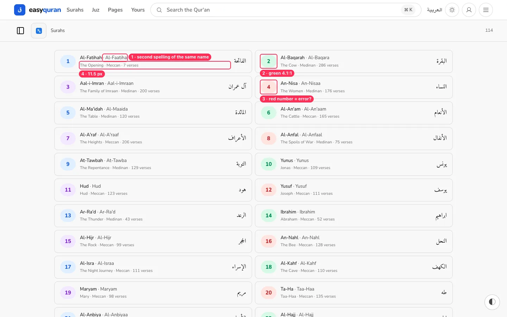
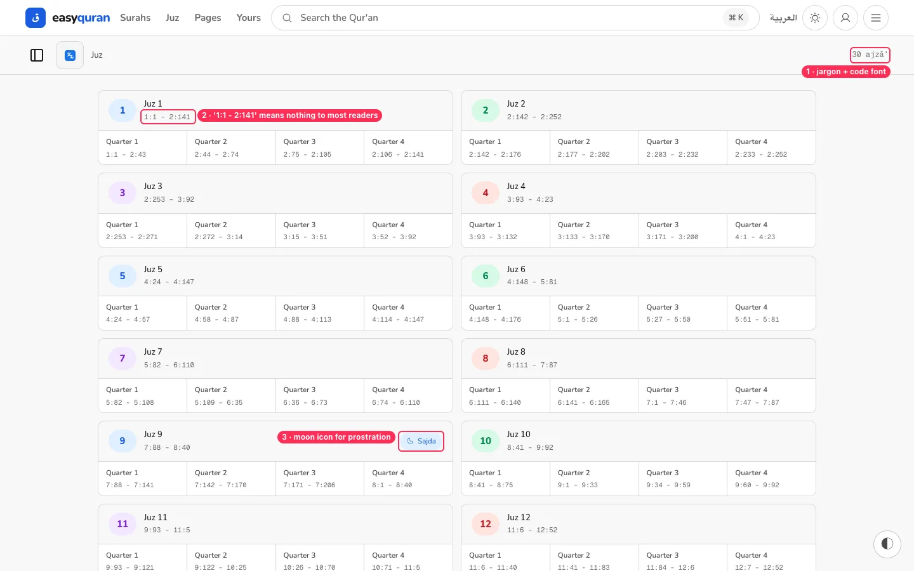
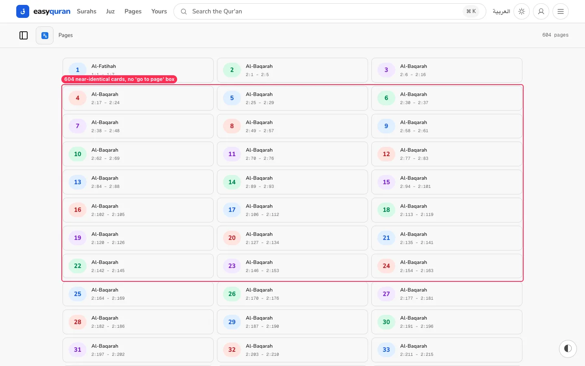
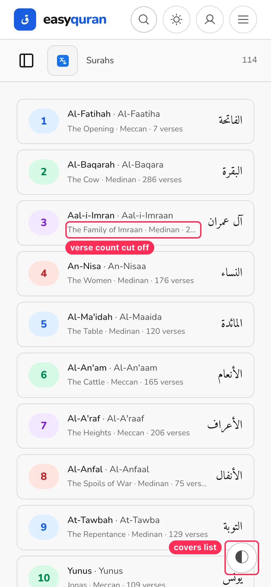

# 06 · Browse lists (Surahs, Juz, Pages)

[← Back to the index](README.md)

> **Question this page answers:** *Can I scan the lists and pick what I want without decoding them?*

Summary: the lists are fast and complete, but they show every surah name twice in two spellings, colour numbers at random, and use scholar/developer notation (`1:1 - 2:141`, `30 ajzā'`) that most readers won't parse.

---

### LIST-01 · Every surah has two (or three) English spellings

**P1** · everyone · `/en/app/surah`, home, palette, landing

**What's wrong.** Each row shows two transliterations side by side: **Al-Fatihah · Al-Faatiha**, **Al-Baqarah · Al-Baqara**, **Hud · Hud**. Elsewhere the app uses a third system: home chips say **Al-Fātiḥah, Yā-Sīn**; the landing says **Ya-Sin**; the palette subtitle says **Al-Faatiha**.

| Place | Surah 1 | Surah 36 |
| --- | --- | --- |
| Surahs list | Al-Fatihah · Al-Faatiha | Ya-Sin · Yaseen |
| App home chips | Al-Fātiḥah | Yā-Sīn |
| Landing chips / list | Al-Fatihah | Ya-Sin (list subtitle: "Yaseen · 83 ayahs") |
| ⌘K palette | 1. Al-Fatihah — Al-Faatiha · The Opening | 36. Ya-Sin — Yaseen |

**Why it matters.** Two names side by side look like two different surahs, or a typo. Consistent naming is how people learn and search.

**Fix.** Pick **one** display transliteration (the simple "Al-Fatihah" form reads best for non-specialists) and keep the alternates only as hidden search aliases. Remove the "· Al-Faatiha" part from rows and the palette.

**Done when.** A surah's English name is spelled identically on every screen.

---

### LIST-02 · Rainbow numbers carry no meaning (and the green fails contrast)

**P2** · everyone · list number chips, reader header, home cards

**What's wrong.** Number chips cycle blue → green → purple → red by position. The colour means nothing, red suggests an error, and the **green on pale-green** chip measures **4.1:1** (below the 4.5:1 AA minimum; axe flags 27–164 nodes per list page).

**Fix.** Use one neutral chip (`bg-surface border text-foreground-secondary`) for all numbers. If colour is wanted, make it meaningful (e.g., Meccan vs Medinan with a legend) and use the `--hue-N-legible` text tokens so every pair passes 4.5:1.

---

### LIST-03 · Juz list is written in reference code

**P1** · non-specialists · `/en/app/juz`

**What's wrong.**
- The count reads **"30 ajzā'"** in monospace — an Arabic plural with a transliteration mark.
- Ranges are **`1:1 - 2:141`** in a code font. Most readers don't know "surah:verse" notation.
- "Quarter 1…4" are the *rubʿ al-ḥizb* divisions; unexplained.
- The prostration (sajda) badge uses a **moon** icon.

**Fix.**
- Count: "30 parts (juz)".
- Range in words: **"Al-Fātiḥah 1 → Al-Baqarah 141"**, in the UI font. Keep `1:1–2:141` only as a tooltip/secondary line if wanted.
- Label quarters as "¼ · ½ · ¾" with a one-line explainer ("Each juz is split into 4 quarters — handy for daily reading").
- Sajda badge: use a prostration/"۩" glyph and the word "Sajdah (prostration) verse".

---

### LIST-04 · 604 page cards and no "go to page" box

**P2** · readers who read by page number · `/en/app/pages`

**What's wrong.** Pages are 604 cards that mostly say "Al-Baqarah" with a code range. People who read by mushaf page know the page number they want ("page 312") — the only way is scrolling, or finding the Page tab inside the sidebar icon.

**Fix.** Put a **"Go to page [___] Go"** field at the top (numeric keypad on phones), group cards under surah headings, and show juz boundaries.

---

### LIST-05 · Phone rows cut off the verse count

**P2** · phones · `/en/app/surah`

**What's wrong.** At 390 px the second line truncates ("… · Medinan · 2…"), hiding the verse count, and the metadata is **11.5 px**.

**Fix.** On phones show two short lines: "The Family of Imran" / "Medinan · 200 verses", at ≥ 13.5 px. Drop the second transliteration (LIST-01) to make room.

---

### LIST-06 · List pages have no title and no filter of their own

**P3** · everyone · list pages

**What's wrong.** The Surahs/Juz/Pages pages have no page heading — only the small grey sub-bar label — and no filter box; filtering lives in the sidebar sheet. Search, Bookmarks and Settings all have a large H1 title instead ([VIS-06](11-visual-consistency.md#vis-06--every-page-uses-a-different-width-and-header-pattern)).

**Fix.** Add the same page-title pattern used elsewhere ("Surahs · 114") and a "Filter surahs" field on the Surahs page.
