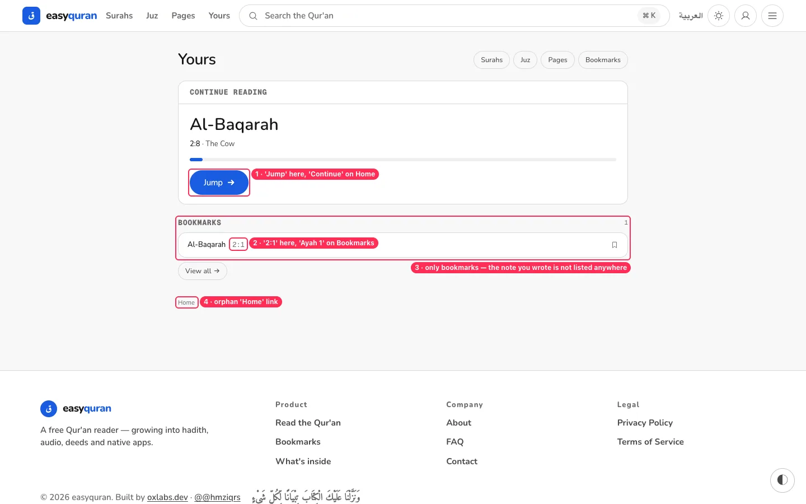
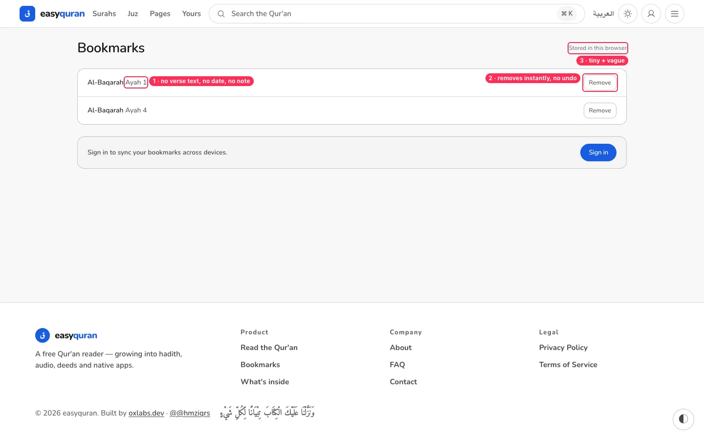

# 07 · Bookmarks, notes and "Yours"

[← Back to the index](README.md)

> **Question this page answers:** *Can I find what I saved, and does it look the same everywhere?*

Summary: two overlapping pages ("Yours" and "Bookmarks") describe the same saved verse differently, notes you write are never listed, and removing a bookmark has no undo.

---

### BM-01 · Two pages, two layouts, two formats for the same bookmark

**P2** · everyone · `/app/yours`, `/app/bookmarks`

**What's wrong.**

| | Yours (`/app/yours`) | Bookmarks (`/app/bookmarks`) | Home |
| --- | --- | --- | --- |
| Width | 804 px, centred | 1124 px | 1024 px, left |
| Verse format | `Al-Baqarah 2:1` | `Al-Baqarah Ayah 1` | `18:10` |
| Resume button | **Jump** | — | **Continue** |
| Section titles | mono uppercase "CONTINUE READING", "BOOKMARKS" | H1 "Bookmarks" | uppercase caption |
| Extra | orphan "Home" link at the bottom | "Stored in this browser" in tiny grey | "Resume instantly" |

**Fix.** Make **Yours** the single hub (see [NAV-07](01-navigation-and-wayfinding.md#nav-07--yours-bookmarks-and-the-home-yours-card-overlap)): Continue reading → Bookmarks → Notes → Recent. `/app/bookmarks` becomes its "See all bookmarks" page using the same header, width and row component. Use one verse format everywhere: **"Al-Baqarah · verse 1"**. Use one resume label: **"Continue"**. Remove the orphan "Home" link (or make it a proper breadcrumb at the top).

**Done when.** A bookmark row is the same component on Yours, Bookmarks and Home.

---

### BM-02 · Bookmark rows have no context

**P2** · everyone with more than a few bookmarks

**What's wrong.** A row is just "Al-Baqarah Ayah 1". No verse text, no translation snippet, no date, no note indicator. With 20 bookmarks, they are indistinguishable.

**Fix.** Show the first ~80 characters of the verse (Arabic, plus translation if the reader uses one), the saved date ("Saved 3 days ago"), and a note icon when a note exists.

**Second pass adds.**

- Anonymous bookmarks are stored as `{ "2:255": true }` — no timestamp, so "sort by date" needs a schema change ([FLOW-08](19-remaining-screens-and-flows.md#flow-08--many-bookmarks-become-an-unsorted-wall)). _(from the 19–20 audit)_

---

### BM-03 · Notes are saved but never shown anywhere

**P1** · anyone who writes a reflection · `VerseTools.svelte`, `/app/yours`

**What's wrong.** The verse panel says *"Saved on this device as you type."* The note is saved — but it is not listed on Yours (which says "your place, bookmarks, and notes will gather here"), not on Bookmarks, and not marked on the verse in the list. The only way back to a note is to remember which verse you wrote it on.

**Fix.** Add a **Notes** section on Yours (verse + first line of note + date), mark verses that have notes with a small note icon in the reader, and let the verse panel open straight to the note.

**Done when.** A note written on 2:1 is visible from Yours within one tap.

---

### BM-04 · "Remove" deletes instantly, no undo

**P2** · everyone · `/app/bookmarks`

**What's wrong.** "Remove" is a small outline button that deletes immediately. Mis-taps on phones are common.

**Fix.** Remove optimistically and show a toast "Bookmark removed · Undo" for 5 seconds; make the button an icon + label ≥ 44 px.

**Second pass adds.**

- Signed-in "Remove" also has no undo; removal while offline disappears instantly (queued). _(from the 19–20 audit)_

---

### BM-05 · "Stored in this browser" / "Sign in to sync" is vague

**P3** · everyone

**What's wrong.** A tiny grey "Stored in this browser" and a banner "Sign in to sync your bookmarks across devices." don't say what happens if you clear your browser or switch phones.

**Fix.** One friendly sentence: "Your bookmarks are saved on this device. Sign in (free) to keep them safe and see them on your other devices."
