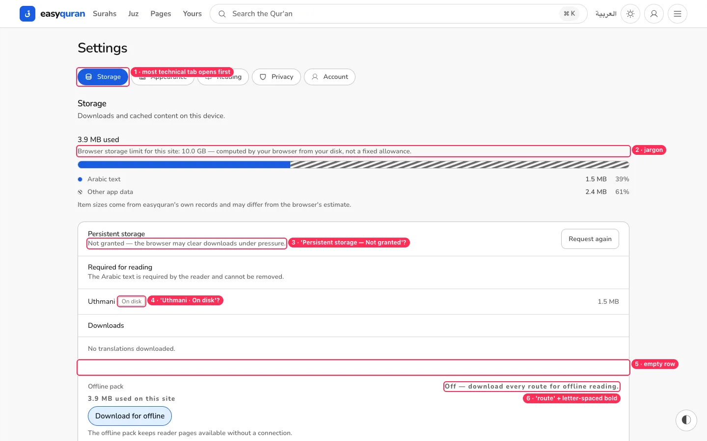
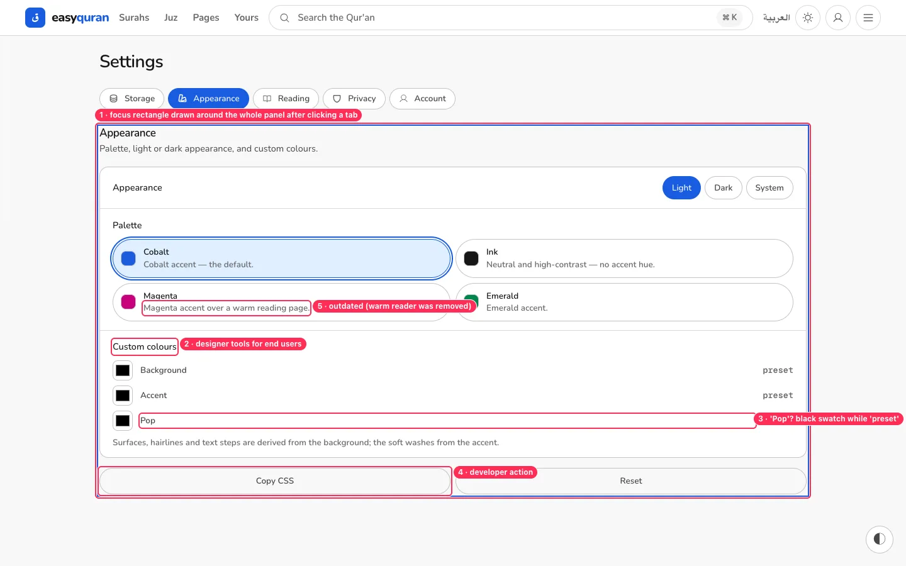
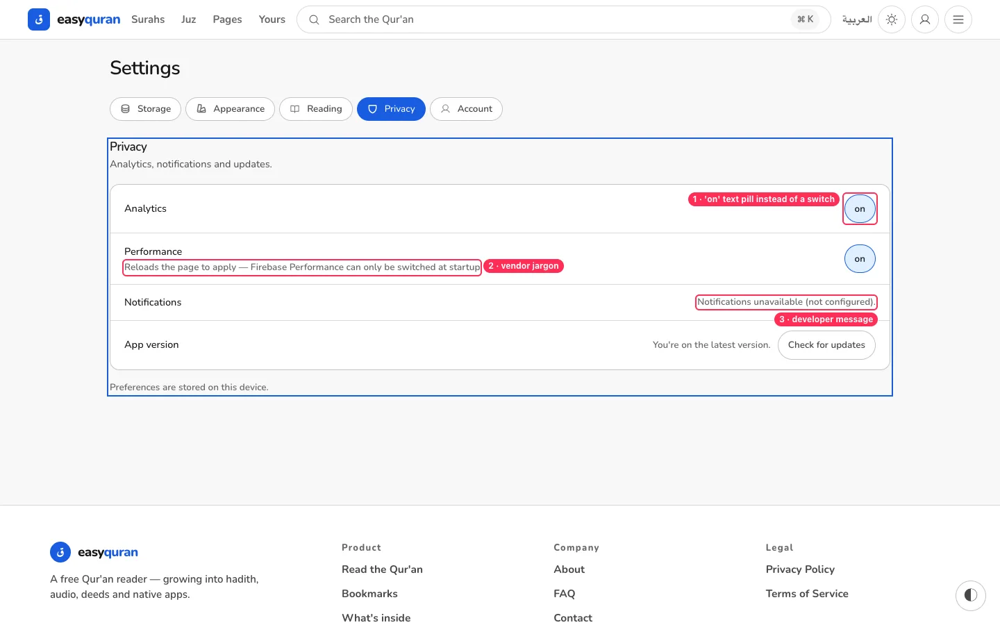
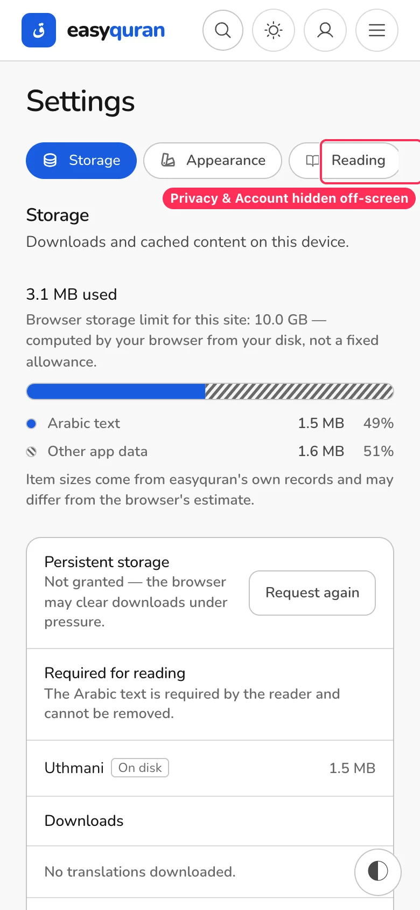
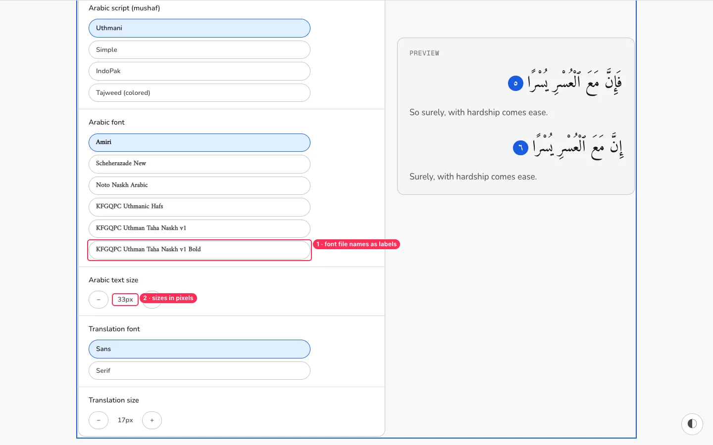
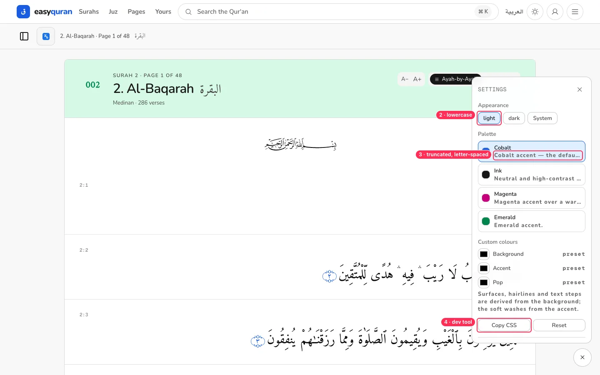

# 08 · Settings and appearance controls

[← Back to the index](README.md)

> **Question this page answers:** *Can a non-technical person change how the app looks and reads, without meeting developer vocabulary?*

Summary: Settings opens on its most technical tab, exposes designer/developer tools (custom colour seeds, "Copy CSS", "Pop"), labels things with vendor and browser jargon, and uses text pills where people expect switches. A second, different "Settings" panel floats over every page.

---

### SET-01 · Settings opens on "Storage", the most technical tab

**P1** · everyone · `web/src/routes/(application)/app/settings/+page.svelte:16-36`

**What's wrong.** Tab order is Storage → Appearance → Reading → Privacy → Account, and `active` defaults to `"storage"`. The first thing a reader sees in Settings is a quota bar, "Persistent storage — Not granted", "Uthmani · On disk", an empty row, and "Off — download every route for offline reading."

**Fix.** Order by how often people need it: **Reading → Appearance → Offline & downloads → Privacy → Account**. Default to Reading. Rename "Storage" to **"Offline & downloads"**.

---

### SET-02 · Storage copy is browser/developer jargon

**P1** · everyone · `messages/en.json:265, 303-308, 366` and `StorageSection.svelte`

| Current | Suggested |
| --- | --- |
| Browser storage limit for this site: 10.0 GB — computed by your browser from your disk, not a fixed allowance. | *(hide; show only "Using 3.9 MB")* |
| Item sizes come from easyquran's own records and may differ from the browser's estimate. | *(remove)* |
| Persistent storage — Not granted — the browser may clear downloads under pressure. · **Request again** | **Keep downloads safe** — Your browser may delete downloaded text when your phone is low on space. **[Keep them]** |
| Required for reading · Uthmani · On disk | **Qur'an text (Uthmani script)** · Downloaded · 1.5 MB |
| Off — download every route for offline reading. | **Read without internet** — Download the whole app ({size}) so every page opens offline. **[Download]** |
| 3.9 MB used on this site (letter-spaced bold) | *(remove the duplicate)* |
| Unused translations are removed automatically after 30 days or when downloads exceed 256 MB. | Translations you haven't opened for 30 days are removed to save space. |

Also: remove the **empty row** between "No translations downloaded" and "Offline pack"; don't letter-space whole sentences.

---

### SET-03 · Designer and developer tools are exposed to readers

**P1** · everyone · `AppearanceSection.svelte`, `Tweaks.svelte`, `messages/*: tweaks_pop, reader_pop, *_copy_css`

**What's wrong.**
- **Custom colours → Background / Accent / Pop** with black swatches while the value says "preset" (the swatch doesn't show the current colour). "Pop" means nothing to readers.
- *"Surfaces, hairlines and text steps are derived from the background; the soft washes from the accent."* — design-system vocabulary.
- **Copy CSS** — a developer action.
- Magenta is described as *"accent over a warm reading page"*, but the warm reader was removed (see `docs/design-system.md` §42).
- The row label "Appearance" repeats the section heading "Appearance".

**Fix.** Keep **Light / Dark / Automatic** and the four palettes (with honest descriptions: "Cobalt blue", "Ink (black & white)", "Magenta", "Emerald"). Move custom seeds and Copy CSS behind a "Developer options" toggle, or to `/design/tokens`. Show real current colours in swatches.

---

### SET-04 · Toggles are "on" text pills; analytics is on by default

**P1** · everyone · `PrivacySection.svelte`, `messages/reader/en.json:127, 228`

**What's wrong.**
- Analytics and Performance are pills reading **"on"** (lowercase). It's not obvious they are switches or what "off" would look like.
- *"Reloads the page to apply — Firebase Performance can only be switched at startup"* names a vendor and an implementation detail.
- *"Notifications unavailable (not configured)."* is a developer message (seen in the local environment — make sure production never shows it; hide the row instead).
- Analytics is on by default. For a religious reading app, readers may reasonably expect privacy by default.

**Fix.** Use a real switch component (`role="switch"`, `aria-checked`, 44 px, "On/Off" text beside it). Copy: "**Share anonymous usage** — Helps us see which features are used. No personal data." / "**Share speed reports** — Takes effect after the app reloads." Consider default-off with a one-time friendly ask.

---

### SET-05 · A focus rectangle is drawn around the whole panel after clicking a tab

**P2** · everyone · `SettingsShell.svelte` (tabpanel receives focus)

**What's wrong.** After clicking any tab, a square blue outline appears around the entire panel (visible in the Appearance, Privacy and Account screenshots), and the section heading touches it with no padding. It looks like a rendering bug.

**Fix.** When moving focus programmatically to the panel, use `focus({ preventScroll: true })` with `outline: none` on `:focus:not(:focus-visible)`, or move focus to the panel's heading (`tabindex="-1"`) instead.

---

### SET-06 · Phone: tabs run off-screen with no hint

**P2** · phones · `SettingsShell.svelte`

**Fix.** On phones, show settings as a **list of rows** (Reading ›, Appearance ›, …) opening sub-pages, or wrap tabs into two lines. If horizontal scroll stays, add an edge fade and scroll the active tab into view.

---

### SET-07 · Reading settings speak in pixels and font file names

**P2** · everyone · `ReadingSection.svelte`

**What's wrong.** Arabic size "33px" and translation size "17px"; fonts listed as "KFGQPC Uthmanic Hafs", "KFGQPC Uthman Taha Naskh v1 Bold". The preview uses a filled blue number circle, but the reader uses the ornamental ۝ marker — the preview doesn't match.

**Fix.** Sizes as a slider with "Small · Medium · Large · Extra large" stops and a live sample. Friendly font names with a short description ("Madinah Mushaf style (KFGQPC)", "Amiri — classic book style"). Render the preview with the real `VerseRow`.

---

### SET-08 · A second "Settings" floats over every page

**P1** · everyone · `web/src/lib/components/tweaks/Tweaks.svelte`

**What's wrong.** The floating button opens a panel titled **SETTINGS** (monospace, letter-spaced) with: "light / dark / System" (inconsistent casing), palette descriptions truncated mid-word and letter-spaced, the same custom-colour seeds, Copy CSS/Reset. It overlaps reader content and has two close buttons (its own ✕ and the floating button, which turns into ✕).

**Fix.** Remove it (see [RDR-01](03-reader.md#rdr-01--the-floating-appearance-button-covers-the-quran-text-on-phones)). If a quick panel is kept, make it the reader's "Aa" sheet with Size, Mode, Theme only — same components and wording as Settings.

**Done when.** There is exactly one surface titled "Settings".
