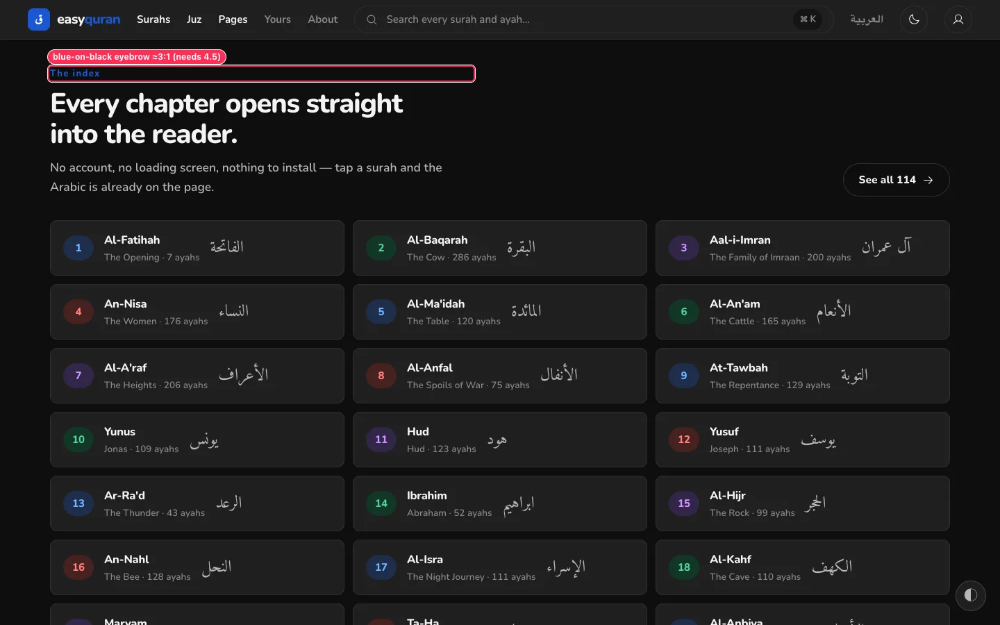
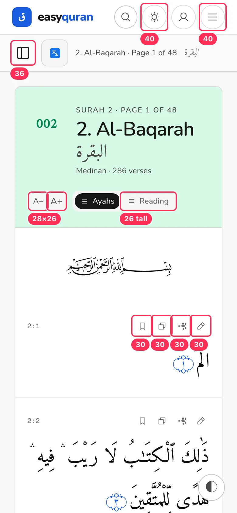
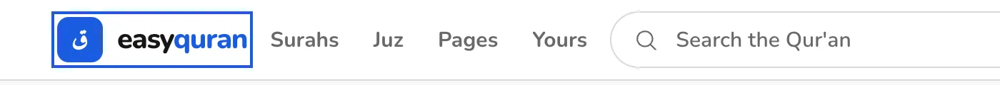

# 09 · Accessibility and readability

[← Back to the index](README.md)

> **Question this page answers:** *Can people with low vision, shaky hands, colour blindness, screen readers, or simply older eyes use the app comfortably?*

Summary: the token system is contrast-gated and the light theme mostly passes. The misses are systematic and fixable in a few places: (1) in dark mode the **fill** blue is reused as a **text** blue; (2) many controls are 26–40 px instead of the 44 px the design system promises; (3) a lot of secondary text is 11–12 px; (4) landmarks are duplicated.

## Automated scan (axe-core 4.10, WCAG 2.2 A/AA + best practice)

| Route | Light | Dark |
| --- | --- | --- |
| landing `/` | color-contrast ×30 | color-contrast ×5 |
| app home | color-contrast ×1, landmark-unique ×1, page-has-heading-one ×1 | color-contrast ×2, landmark-unique ×1, page-has-heading-one ×1 |
| surahs | color-contrast ×27, landmark-main-is-top-level, landmark-no-duplicate-main, landmark-unique ×2 | color-contrast ×2, + same landmark issues |
| juz list | color-contrast ×8, + landmark issues | color-contrast ×2, + landmark issues |
| pages list | color-contrast ×164, + landmark issues | color-contrast ×17, + landmark issues |
| surah reader | landmark issues | **color-contrast ×18**, + landmark issues |
| page reader | landmark issues | color-contrast ×10, + landmark issues |
| search / bookmarks / settings / yours | landmark-unique ×1 | color-contrast ×2, landmark-unique ×1 |
| login | **document-title**, link-in-text-block ×2 | color-contrast ×2, document-title |
| register | **document-title**, link-in-text-block ×1 | color-contrast ×1, document-title |
| about / contact | — | color-contrast ×2 / ×4 |
| faq | heading-order ×1 | color-contrast ×3, heading-order ×1 |
| Arabic home / reader | same as English | same as English |

---

### A11Y-01 · Dark mode uses the fill blue as a text colour

**P1 (WCAG 1.4.3 / 1.4.11)** · dark-mode users · `web/src/routes/layout.css:225` and every `text-primary` on the ground

| Element | Contrast (dark) | Needed |
| --- | --- | --- |
| "quran" in the header wordmark (every page) | **2.6:1** | 3:1 (large bold) |
| Ayah end-markers ۝ in the reader | **2.9:1** | 3:1 |
| Section eyebrows on landing ("The index", "On the way") | **2.9–3.1:1** | 4.5:1 |
| Contact card links, FAQ "Send us a question" | **2.9–3.1:1** | 4.5:1 |
| Page-reader "Full surah" link | **2.9:1** | 4.5:1 |
| Sajda badge on pages list (green on dark green) | **2.4:1** | 4.5:1 |

**Why.** The design system deliberately makes dark accents *darker* so white text on a blue **fill** passes ("white-on-colour", §5). The contrast test gates `--primary-foreground` on `--primary`, but nothing gates `--primary` **as text on the ground**. Hue slots already solved this with `--hue-N-legible`; primary has no equivalent.

**Fix.** Add `--primary-legible` to every block (light: `var(--primary)`; dark: ≈`oklch(0.74 0.15 262)` for cobalt, and per palette), map it to a `text-primary-legible` utility, and swap all text/glyph uses of `text-primary` that sit on `--background`/`--surface`/`--reader-background`. Add the pair to `web/src/routes/__tests__/token-contrast.test.ts`.

**Done when.** axe shows 0 color-contrast issues on the dark reader, landing, and contact pages.

**Second pass adds.**

- Magenta dark primary-as-text 2.5–3.0:1 (same failure as Cobalt); Emerald light eyebrow 4.45:1; **Ink passes in both modes** (0 contrast issues in dark on 9/10 routes). Suggest mentioning Ink as the accessible palette today. _(from the 17–18 audit)_

---

### A11Y-02 · Light mode: green-on-green chips and the Juz card caption

**P2 (WCAG 1.4.3)** · `MetricCard`, list number chips

- Green number chips (`--hue-2` on `--hue-2-soft`): **4.1:1** — every 4th chip on Surahs/Juz/Pages (164 nodes on Pages).
- Juz metric card caption (`#e0f0ea` on `#00864e`): **3.9:1**.

**Fix.** Use `--hue-2-legible` darkened to ≥4.5:1 on the soft tint in light mode (e.g., `oklch(0.46 0.14 162)`), and full-opacity `--on-hue-2` for captions. Extend the contrast test to "hue-N-legible on hue-N-soft" in light mode too. (Or drop colour chips — [LIST-02](06-browse-lists.md#list-02--rainbow-numbers-carry-no-meaning-and-the-green-fails-contrast).)

**Second pass adds.**

- The 4.17:1 green chip and 3.94:1 Juz caption appear identically in all four palettes (hue slots don't change per palette). _(from the 17–18 audit)_

---

### A11Y-03 · Tap targets are well below the promised 44 px

**P1 (WCAG 2.5.8 AA is 24 px; the project's own §51 promises 44 px)** · touch users, tremor, older users

| Control | Size | File |
| --- | --- | --- |
| Header theme / account / menu buttons | 40 × 40 | `Nav.svelte:250, 261, 273` (`size-10`) |
| Header search icon (phone) | 38 × 38 | `SearchTrigger.svelte` |
| Reader sidebar toggle | 36 × 36 | `ReaderShell.svelte:86` |
| A− / A+ | **28 × 26** | `ReaderHeader.svelte:93, 101` |
| Ayah-by-Ayah / Reading toggle | 75–124 × **26** | `ReaderHeader.svelte:118, 128` |
| Verse tools (×4 per verse) | **30 × 30** | `VerseTools.svelte:78` |
| Previous / Next surah | 114 × 36 | `ReaderPageNav.svelte` |
| Settings tabs | 99–129 × 34 | `SettingsShell.svelte` |
| Yours quick pills (Surahs/Juz/Pages/Bookmarks) | 43–89 × 32 | `yours/+page.svelte` |
| Search "Translations" button | 101 × 35 | `SearchControls.svelte` |
| Login "Show password" | 32 × 32 | auth form |
| Footer links, "Reset it", "Create one", "Home" on Yours | **15–21 px tall** | `Footer.svelte`, auth pages |

**Fix.** Apply the `IconButton`/`Button` primitives (which already encode 44 px) instead of hand-sized buttons; where the visual must stay small, extend the hit area with padding or `::before { inset: -8px }`. Add a Vitest/Playwright check that interactive elements in `/app/*` are ≥ 44 px on a 390 px viewport (allow-list inline text links).

---

### A11Y-04 · Too much text is 11–13 px

**P1** · older readers, low vision · many components

| Text | Size | Where |
| --- | --- | --- |
| Verse reference "2:1" | **11 px** mono | `VerseTools.svelte:66` |
| Juz / page ranges | 11 px mono | juz and pages lists |
| Surah list meta "The Opening · Meccan · 7 verses" | **11.5 px** | surah list |
| Tafsir/note labels "TAFSIR", "YOUR NOTE" | 11.5 px uppercase | `VerseTools.svelte:122, 128` |
| "SURAH 2 · PAGE 1 OF 48" eyebrow | 12 px uppercase | `ReaderHeader.svelte:66` |
| "On disk" badge, "114" count | 12 px | settings, list sub-bar |
| Hero subtitle, yours pills, sub-bar title, toggles | 12.5–13 px | various |

**Fix.** Floor UI text at **13.5 px (caption)** for secondary and **15 px (body)** for anything people read; use `text-caption`/`text-body` ramp roles rather than `text-[11px]`. For this audience consider a 16 px body default. Ban `text-[1Xpx]` below 13.5 in `/app` via the existing lint/test guards.

**Second pass adds.**

- Tiny px sizes can't be rescued by the browser text-size setting ([DISP-01](18-display-conditions.md#disp-01--the-app-ignores-the-browsers-text-size-setting)). _(from the 17–18 audit)_

---

### A11Y-05 · Duplicate and nested landmarks; missing page titles

**P2 (WCAG 1.3.1, 2.4.2)** · screen-reader users

- **Two `<main>` on reader and list pages**: the app layout's `<main id="main">` and the sidebar inset's `<main class="bg-background">` (nested). Change the inner one to `
`.
- **Two `<nav>` both labelled "Primary"**: `Nav.svelte:181` (outer) and `:194` (inner links). Make the outer a `<header>` and keep one `<nav aria-label="Main">`.
- **Login and Register have no `<title>`** (axe *document-title*). Add `<svelte:head><title>Sign in · easyquran</title>`.
- **Home has no `<h1>`**; **FAQ skips heading levels**.

**Second pass adds.**

- Add the duplicate skip link ([KEY-02](21-keyboard-focus-and-screen-reader.md#key-02--two-skip-to-content-links--and-in-arabic-the-first-one-is-english)) and inconsistent tab titles ([KEY-13](21-keyboard-focus-and-screen-reader.md#key-13--browser-tab-titles-follow-five-different-patterns)). _(from the 21–23 audit)_
- Login/Register missing `<title>` also applies to **/forgot-password** and **/verify-email**; the app home's title is just "Home"/"الرئيسية" ([PWA-03](25-pwa-and-page-metadata.md#pwa-03--tab-titles-follow-five-patterns-several-pages-have-no-title)). _(from the 24–26 audit)_

---

### A11Y-06 · Links identified by colour only; focus ring style inconsistent

**P2 (WCAG 1.4.1, 2.4.7)**

- Auth links "Reset it", "Create one" differ from surrounding text only by colour (**1.6:1** against the text). Underline them.
- Header text links show a square outline on focus while pills show a rounded ring; Settings draws a rectangle around the whole panel ([SET-05](08-settings-and-appearance.md#set-05--a-focus-rectangle-is-drawn-around-the-whole-panel-after-clicking-a-tab)). Use one `focus-visible` style: 2 px `--focus-ring`, offset 2, `rounded-pill` on pills and `rounded-sm` on text links.

**Second pass adds.**

- Focus ring invisible on the blue home card ([KEY-04](21-keyboard-focus-and-screen-reader.md#key-04--the-focus-ring-vanishes-on-the-blue-surahs-card)). _(from the 21–23 audit)_

---

### A11Y-07 · State shown by colour or hover alone

**P2 (WCAG 1.4.1, 1.4.13)**

- Bookmarked verse = blue outline vs grey outline ([RDR-08](03-reader.md#rdr-08--bookmarked-state-is-a-thin-colour-change-only)).
- Verse tool names appear only as hover tooltips (none on touch) ([RDR-02](03-reader.md#rdr-02--verse-actions-are-tiny-unlabeled-and-ambiguous)).
- Language flags stand in for language identity ([TR-03](04-translations.md#tr-03--the-translation-picker-opens-on-arabic-tafsir-uses-flags-and-says-primary)).

---

### A11Y-08 · Reflow and obscured content

**P1 (WCAG 1.4.10, 2.4.11)**

- Header clips at 320 px ([NAV-05](01-navigation-and-wayfinding.md#nav-05--header-overflows-on-small-phones)).
- The floating button obscures text and focused elements near the bottom corner ([RDR-01](03-reader.md#rdr-01--the-floating-appearance-button-covers-the-quran-text-on-phones)). WCAG 2.2's *Focus Not Obscured* applies when a focused verse tool scrolls under it.

---

### What's already good (keep it)

- Skip link to `#main`, visible on focus.
- Light-theme body text and Qur'an text contrast are excellent (Qur'an ≥ 15:1).
- Icon-only buttons all carry `aria-label`s; bookmark button label reflects its state.
- Arabic text is marked `lang="ar" dir="rtl"`.
- A global `prefers-reduced-motion` rule in `layout.css`, and keyboard shortcuts go through one shared hotkey wrapper.
