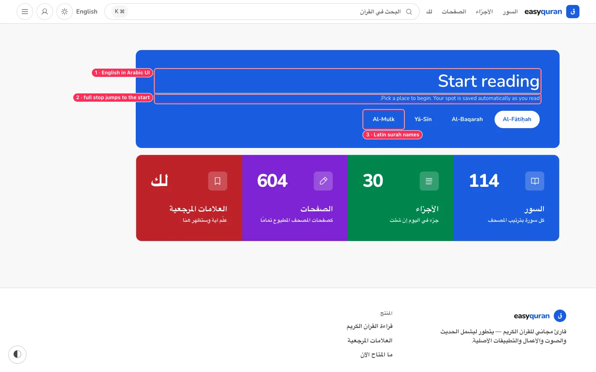
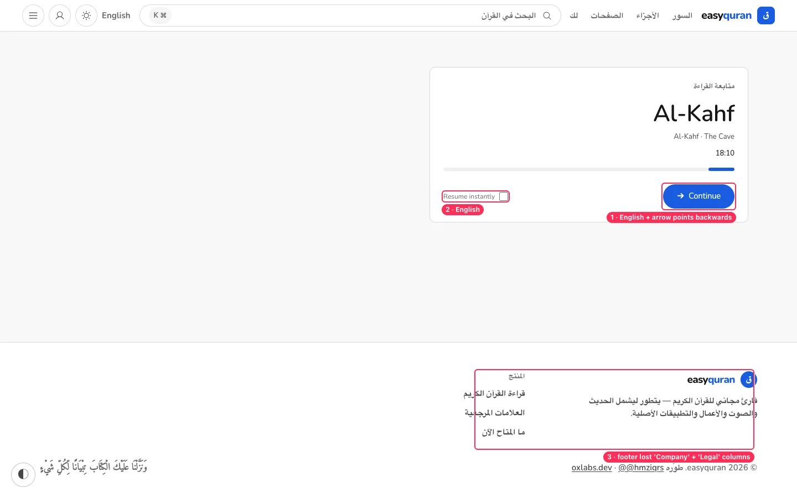
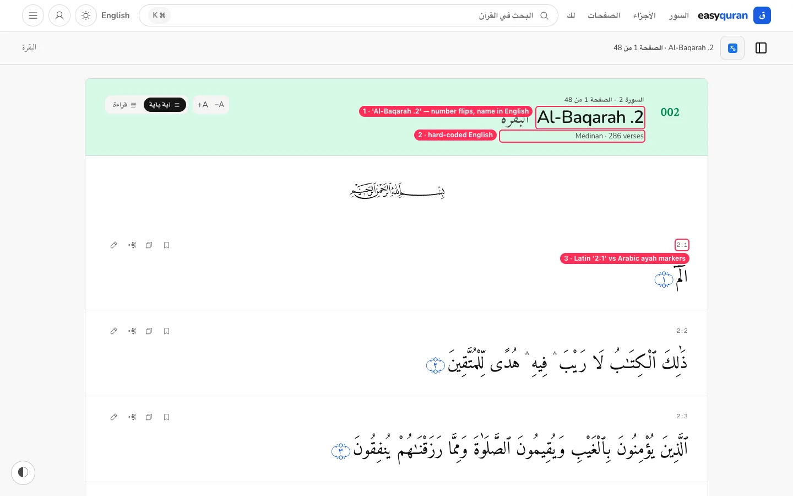
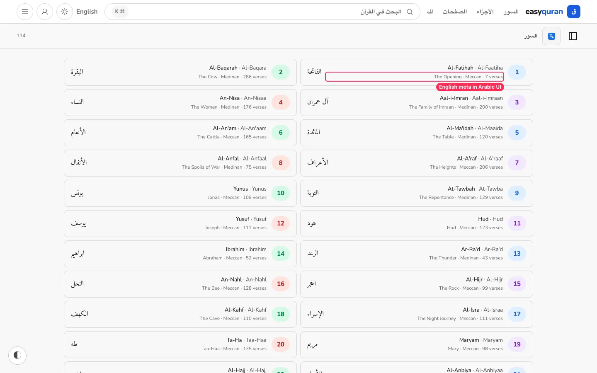
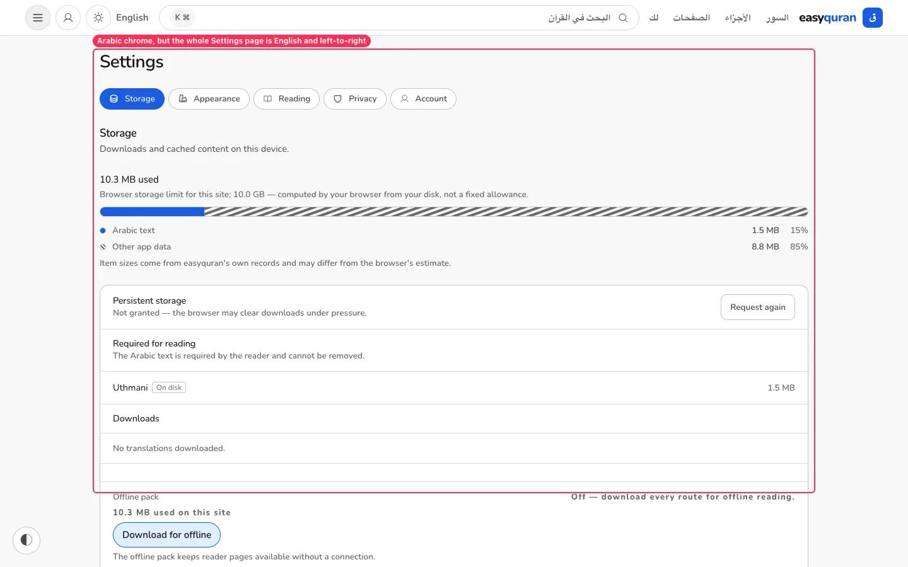
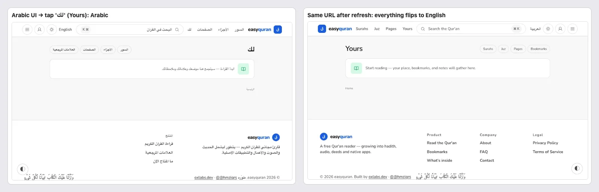
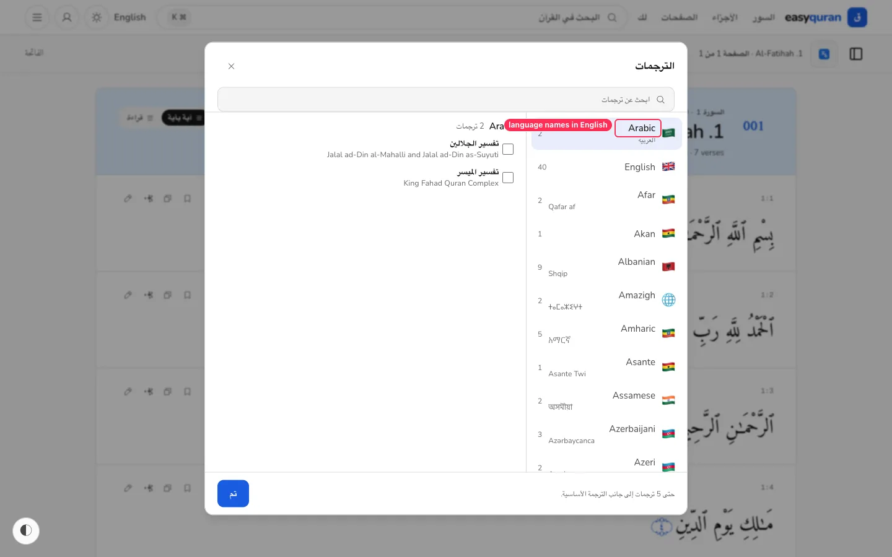

# 10 · Arabic UI and right-to-left

[← Back to the index](README.md)

> **Question this page answers:** *Does an Arabic-speaking reader get a fully Arabic, correctly mirrored app?*

Summary: the header, lists chrome, landing page and translation modal title are translated and mirrored well. But the app home, reader header, surah metadata, settings and the continue card are English; refreshing some pages drops Arabic entirely; mixed-direction strings break punctuation; the footer loses two columns. For an app whose core content is Arabic, the Arabic UI currently feels like a partial translation.

(Overlaps the known gap **L01 — UI localization and document semantics** in `docs/remaining/feature-gap-catalogue.md`; this page lists the concrete, visible instances.)

---

### RTL-01 · App home hero and continue card are English

**P1** · Arabic UI · `web/src/routes/(application)/app/+page.svelte:141, 149, 165, 182-210`

**What's wrong.**
- "Start reading", "Pick a place to begin. Your spot is saved automatically as you read.", "Continue", "Resume instantly", "Surah N", and the chips "Al-Fātiḥah / Al-Baqarah / Yā-Sīn / Al-Mulk" are literals in the component.
- Because the English sentence sits in an RTL box, its full stop renders at the **start** (".Pick a place…").
- The Continue button's arrow points → (backwards in RTL). `docs/design-system.md` §36 says directional glyphs mirror automatically; the `Button` `arrow` prop appears to bypass `Icon`'s mirroring.
- The continue card's subtitle "Al-Kahf · The Cave" is English.

**Fix.** Move all strings to `messages/reader/{en,ar}.json`; in Arabic show surah names in Arabic (الفاتحة، البقرة، يس، الملك) and the subtitle as the Arabic meaning. Render the Button arrow through `Icon name="arrow-right"` so it mirrors.

---

### RTL-02 · Reader header: English name first, broken number order, English metadata

**P1** · Arabic UI · `web/src/routes/(application)/app/_reader/ReaderHeader.svelte:70-78`, `web/src/lib/data/quran.ts:160-161`

**What's wrong.**
- The H1 is the English transliteration with the number: in RTL it renders **"Al-Baqarah .2"** (the period and number flip to the wrong side).
- `surahMeta()` hard-codes `"Meccan" | "Medinan"` and `"verses"` in English.
- The sticky bar mixes: "Al-Baqarah .2 · الصفحة 1 من 48" with the Arabic name stranded at the far edge.
- Verse refs use Latin digits "2:1" while ayah markers use Arabic-Indic digits (١، ٢).

**Fix.** In Arabic UI: H1 = **سورة البقرة**, subtitle = transliteration (optional), meta = **مدنية · ٢٨٦ آية** (localize via messages and `Intl.NumberFormat('ar')` or keep Latin digits consistently — decide once). Wrap any Latin fragment inside Arabic text in `<bdi>` so punctuation stays with it.

---

### RTL-03 · Surah list metadata is English in Arabic UI

**P1** · Arabic UI · surah list rows

**What's wrong.** Every row's primary text is the English transliteration and meaning ("Al-Fatihah · Al-Faatiha / The Opening · Meccan · 7 verses"); the Arabic name is secondary on the far side.

**Fix.** In Arabic UI, lead with the Arabic name (الفاتحة), then "مكية · ٧ آيات"; show the transliteration small or not at all.

---

### RTL-04 · Settings, Search, Bookmarks, Yours: English body, and English after refresh

**P0** · Arabic UI · `web/src/routes/(application)/app/+layout.svelte:34-52`, all four pages

**What's wrong.** These four pages have no `/ar/` route. Reached by in-app navigation they get Arabic chrome, but Settings' body is **entirely English and left-to-right**. After a refresh (or opening a shared link) all four are fully English. Cause and fix in [NAV-02](01-navigation-and-wayfinding.md#nav-02--two-url-schemes-some-links-lose-the-language-some-return-a-bare-not-found).

**Also:** translate every Settings string (Storage/Appearance/Reading/Privacy/Account copy), and set `dir` on the settings container from the locale.

---

### RTL-05 · Arabic footer drops "Company" and "Legal"

**P2** · Arabic UI · `web/src/lib/i18n/footer-links.ts`

**What's wrong.** The English footer has Product / Company / Legal columns. The Arabic footer shows only المنتج (Product) — no About, FAQ, Contact, Privacy, Terms (visible in the continue-card screenshot above). Privacy and Terms links matter legally.

**Fix.** Show all three columns; link to the English pages with a small "(English)" marker until Arabic versions exist.

---

### RTL-06 · Translation picker lists language names in English

**P2** · Arabic UI · `TranslationModal.svelte`

**Fix.** Use `Intl.DisplayNames(['ar'], { type: 'language' })` for the primary label and keep the endonym as the secondary line.

---

### RTL-07 · Small bidi and wording issues

**P3** · Arabic UI

| Where | Now | Suggest |
| --- | --- | --- |
| Header search shortcut | "K ⌘" (keys reversed) | Wrap the kbd hint in `dir="ltr"` |
| Nav label for "Yours" | **لك** ("for you") | **قرآني** or **محفوظاتي** |
| Brand in header/footer | Latin "easyquran" | Fine as a logo; ensure the footer sentence isn't split ("easyquran 2026 ©" reads reversed) — wrap in `<bdi>` |
| Digits | Latin in UI chrome, Arabic-Indic in markers | Pick one per locale and apply everywhere |
| Search result references | "Al-Baqarah 2:157" (English) | "البقرة ٢:١٥٧" |
