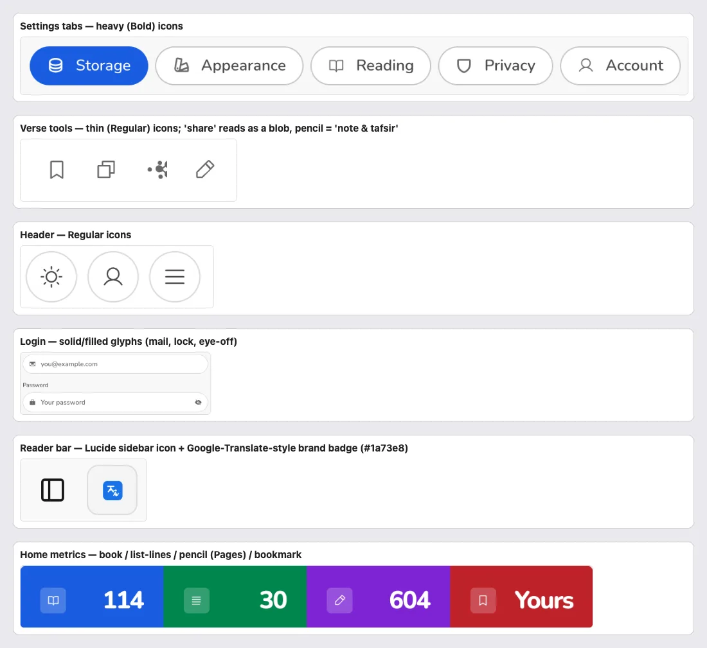
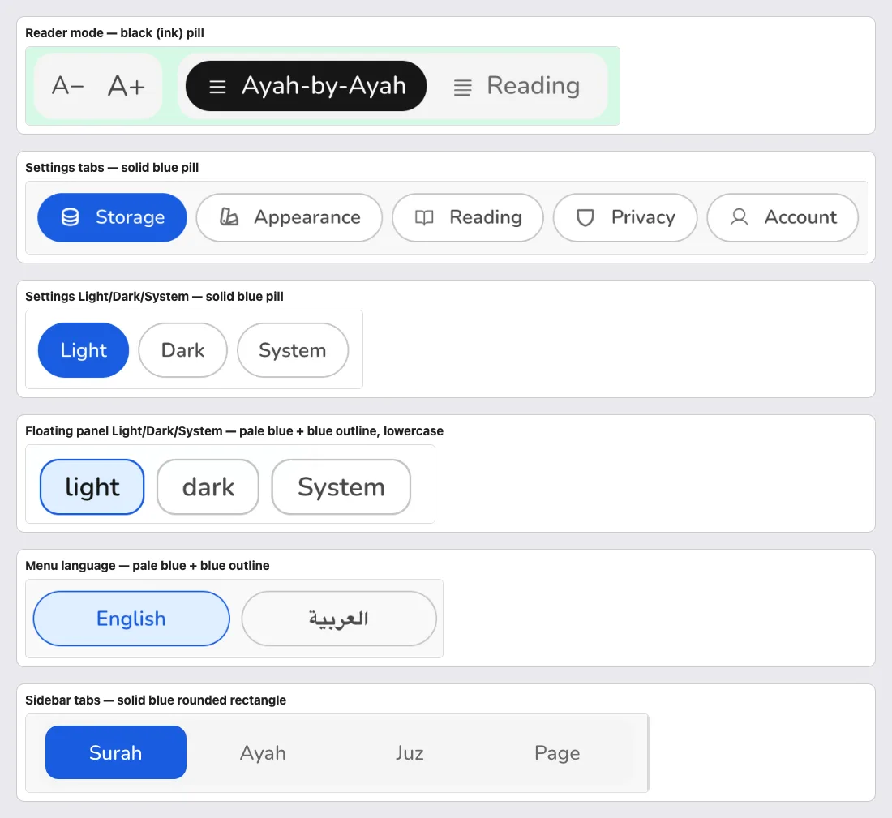
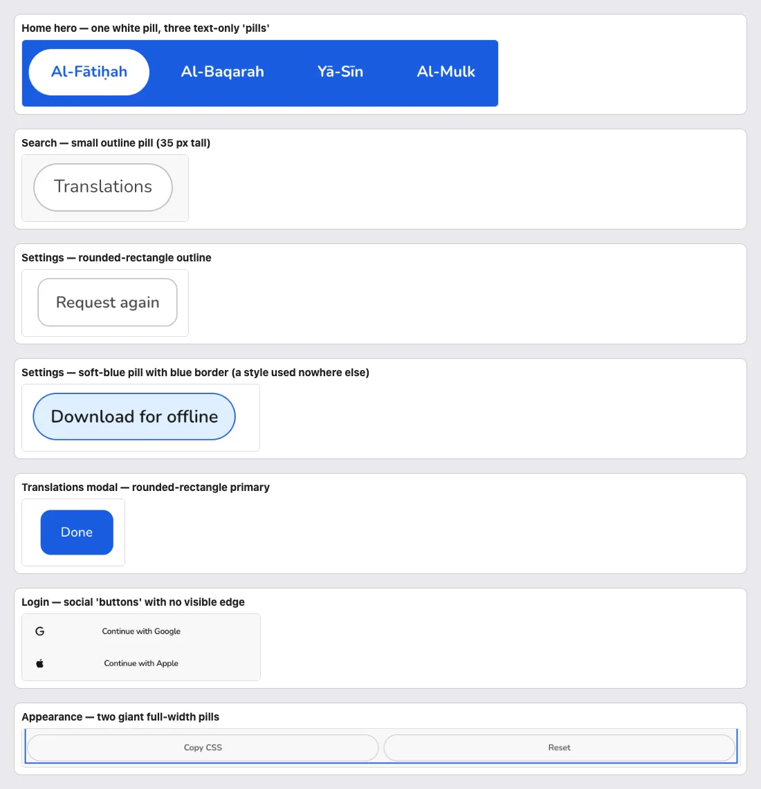
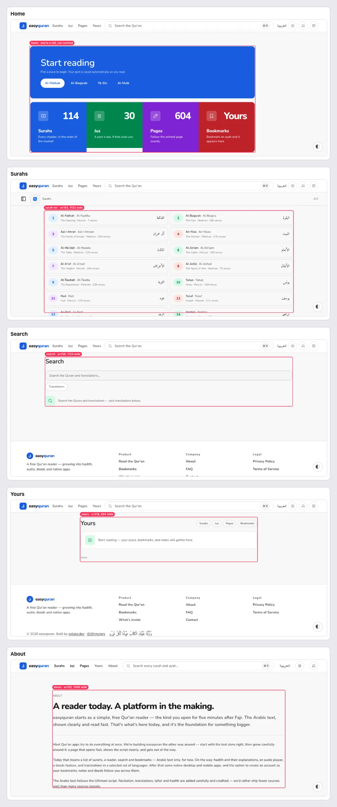

# 11 · Visual consistency (design-system parity)

[← Back to the index](README.md)

> **Question this page answers:** *Does the same kind of thing look and behave the same everywhere?*

The design system (`docs/design-system.md`) is thorough: Nunito, pill controls, Lucide icons, semantic tokens, 44 px targets, one focus ring. The app drifts from it in visible ways. Each item below lists what the doc promises and what ships.

---

### VIS-01 · Four icon families and two icon weights

**P2** · everyone · `web/src/lib/components/icon/icons.ts`, auth forms, `TranslationButton.svelte:56-75`

| Where | Family / weight |
| --- | --- |
| Header, verse tools, bookmark, share, note | Phosphor **Regular** paths (256 viewBox, 8-unit strokes) |
| Settings tabs (database, shield, swatches) | Phosphor **Bold** (12-unit strokes) — visibly heavier |
| Reader sidebar toggle | **Lucide** (shadcn sidebar) |
| Login/register inputs (mail, lock, eye-off) | **Solid / filled** glyphs |
| Translations button | Hand-drawn Google-Translate-style badge with hard-coded `#1a73e8` |

The design doc (§36) says "One line family: **Lucide**". The code is mostly Phosphor.

**Fix.** Pick one family and weight (Phosphor Regular fits what's there; update §36 accordingly, or migrate to Lucide). Re-export the three Bold icons as Regular; replace the auth solids; replace the brand badge with a normal "languages" icon + label ([TR-02](04-translations.md#tr-02--the-main-translation-is-never-credited)) — the hex colour also violates §61 "semantic tokens only".

---

### VIS-02 · Icons mean different things in different places

**P2** · everyone

| Icon | Used for |
| --- | --- |
| Pencil | "Pages" (home metric card) **and** "Note & tafsir" (verse tool) |
| Three lines (list) | "Juz" (home card), "Settings" (menu panel, ⌘K), both reader modes |
| Moon | Dark theme **and** "Sajda" badge |
| Book | Surahs, Yours empty state, Reading settings tab |

**Fix.** One meaning per icon: Pages → file/page; Juz → layers or "1/30"; Settings → gear; Verse-by-verse vs Continuous → rows vs paragraph; Sajda → ۩ or a prostration pictogram; Note → pencil only.

---

### VIS-03 · Seven different search boxes

**P2** · everyone · see also [SRCH-05](05-search.md#srch-05--seven-search-boxes-seven-looks-seven-wordings)

Three are pills, three are rounded rectangles, one is a box-inside-a-box with the placeholder touching the edge (sidebar). §37 says inputs are 44 px pills. **Fix:** one `SearchField` built on `ui/input`.

---

### VIS-04 · Four different "selected" looks

**P2** · everyone · `ReaderHeader.svelte:118-128`, `Tweaks.svelte`, `Nav.svelte:355-370`, `Sidebar.svelte`

| Control | Selected style |
| --- | --- |
| Reader mode toggle | **Black** (ink) pill — `aria-pressed:bg-foreground` |
| Settings tabs, Settings Light/Dark/System | Solid **blue** pill |
| Floating panel Light/dark, palette cards, menu language, reading-settings options | **Pale blue** fill + blue outline |
| Sidebar tabs | Solid blue **rounded rectangle** |

§38 says: active = primary fill. **Fix:** segmented controls and tabs → solid primary pill; option cards (palette, font) → pale fill + 2 px primary outline + check mark. Nothing black.

---

### VIS-05 · Buttons come in seven shapes

**P2** · everyone

Pill primary, text-only "pills", rounded-rectangle outline ("Request again"), soft-blue bordered pill ("Download for offline"), rounded-rectangle primary ("Done"), border-less social rows, full-width giant pills ("Copy CSS / Reset"). §35 defines primary / secondary / ghost / quiet / link — all pills. **Fix:** route every button through `ui/button` with those variants; forbid ad-hoc `rounded-md` on buttons via the geometry guard.

---

### VIS-06 · Every page uses a different width and header pattern

**P2** · desktop · home, lists, search, yours, about

| Page | Content column | Page header |
| --- | --- | --- |
| Home | 1024 px, **left-aligned** at x=88 | none (blue hero) |
| Surahs / Juz / Pages | 1132 px at x=154 | small grey sub-bar label, no H1 |
| Search, Bookmarks, Settings | 1124 px at x=158 | 28 px H1 |
| Yours | **804 px** at x=318 | 28 px H1 + pills on the right |
| About / FAQ | 1056 px at x=192 | eyebrow + 40 px H1 |

**Fix.** Two widths only: **reading width** (≈ 880, reader + Yours + Settings) and **browse width** (1200, lists + search + home), both centred via `Band`/`Container`. One page-header component: title + optional subtitle + optional actions.

---

### VIS-07 · Monospace and letter-spacing where people read words

**P2** · everyone

Code font (Geist Mono) or wide letter-spacing is used for: verse refs "2:1", juz/page ranges, "30 ajzā'", "604 pages", "OR CONTINUE WITH", floating panel "SETTINGS" / palette descriptions / "preset", reading settings "PREVIEW", "CONTINUE READING" / "BOOKMARKS" on Yours, "Off — download every route…", the 404 link "← Back to EasyQuran". §10 keeps mono for code. **Fix:** Nunito everywhere readers read; `text-micro` (uppercase, tracked) only for 1–3-word eyebrows, never sentences.

---

### VIS-08 · Colour used as decoration, not meaning

**P2** · lists, reader header, home

Rotating hue on surah numbers, reader headers ([RDR-04](03-reader.md#rdr-04--the-surah-number-is-shown-four-times-the-header-colour-changes-per-surah)) and home cards contradicts §43: "Colour means something … or it is not there." **Fix:** neutral by default; hue only with a legend.

---

### VIS-09 · Browser theme colour is from the old design

**P3** · phones (address bar colour) · `web/src/app.html:7-8`

`<meta name="theme-color">` is `#0D1210` (dark forest) and `#F8F7F2` (warm ivory) — v1 "Sacred Editorial" values. The v2 grounds are neutral (`oklch(0.165 0 0)` ≈ `#141414`, `oklch(0.98 0 0)` ≈ `#f8f8f8`). **Fix:** update both, and update at runtime when the user toggles theme.

---

### VIS-10 · Legacy tokens and ad-hoc sizes on un-migrated pages

**P3** · `web/src/routes/+error.svelte`, `app/+page.svelte`, `ReaderHeader.svelte`

- `+error.svelte` uses `text-fg-3`, `text-accent`, `font-medium`, `font-mono` (v1 aliases).
- Many components use `text-[13px]`, `text-[32px] font-semibold`, `text-2xl font-semibold` instead of ramp roles (§11 says weight rides the role).
- The surah badge uses the Qur'an font (Amiri) for Latin digits ("002").

**Fix.** Sweep to ramp roles (`text-h2`, `text-body`, `text-caption`) and extend the §61 guards to `/app` routes.

---

### VIS-11 · Terminology drifts between screens

**P2** · everyone · see [15 · Plain language](15-plain-language-copy.md)

"verse" vs "ayah" ("Ayah-by-Ayah", "286 verses", "Copy ayah", "Share verse", landing "7 ayahs"); "Qur'an" vs "Quran"; "easyquran" vs "EasyQuran"; "Yours" vs "Bookmarks"; "Continue" vs "Jump".
