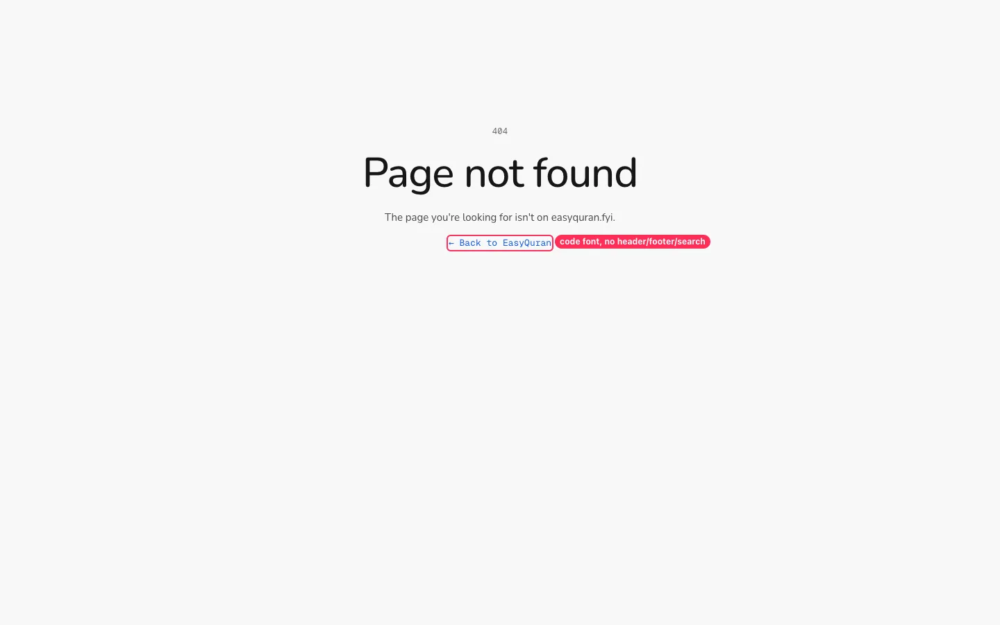
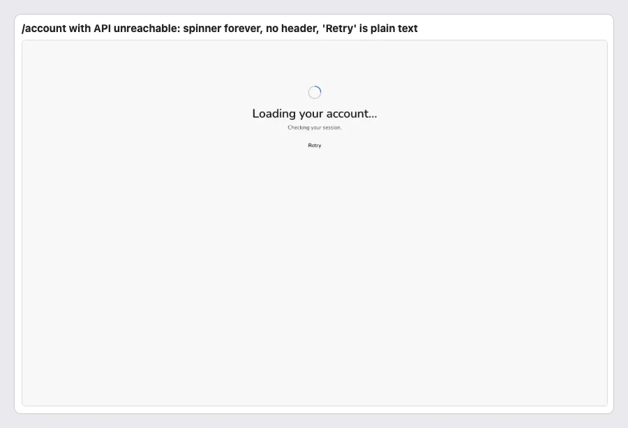
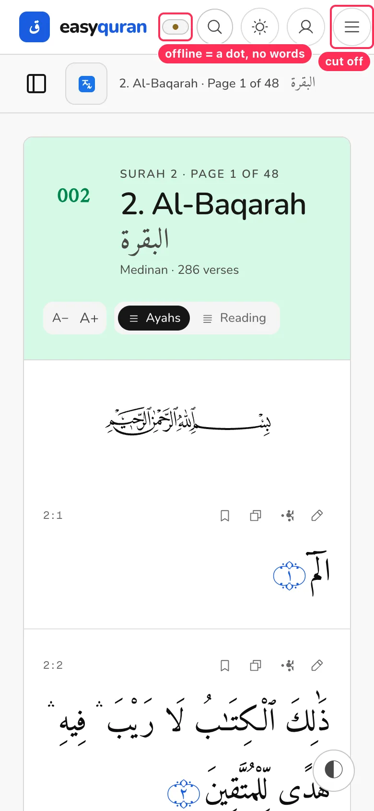
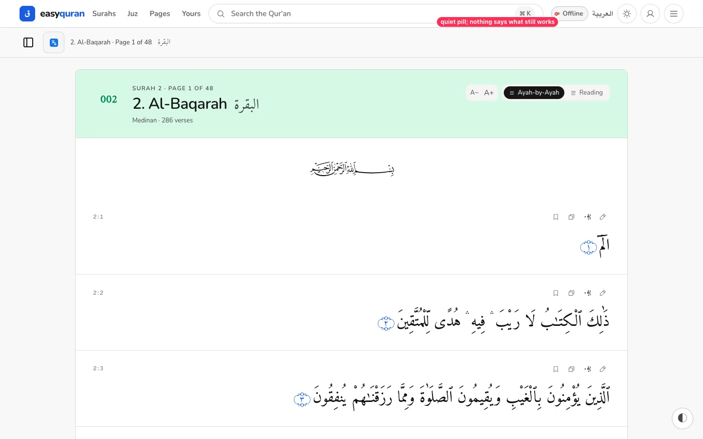

# 12 · Loading, empty, error and offline states

[← Back to the index](README.md)

> **Question this page answers:** *When something goes wrong — bad link, no internet, server down — does the reader know what happened and what to do?*

Summary: offline reading of Arabic works impressively (navigating to a new surah with the network off just works). But mistyped reader URLs return raw text, the error page has no navigation, some screens hang when the API is down, and the offline indicator doesn't explain anything.

---

### STATE-01 · Wrong reader URLs return a plain-text "Not found"

**P0** · anyone following an old or mistyped link · `web/src/hooks.server.ts:201-212`

**What's wrong.** Any unknown path under `/en/app/…` or `/ar/app/…` (`/en/app/juz/31`, `/en/app/page/700`, `/en/app/al-baqarah/page/99`, `/en/app/search`, `/en/app/1`) returns `new Response("Not found", { "content-type": "text/plain" })`. No header, no styling, no link.

**Fix.** Return the SvelteKit error page for browsers (`error(404)` or render `+error.svelte`) and keep the plain/markdown body only when `Accept` prefers it (agents). Add helpful redirects: `/en/app/1` → `/en/app/al-fatihah`; `/en/app/juz/31` → `/en/app/juz` with a message.

**Done when.** Every 404 a browser can hit shows the app header and a way back.

---

### STATE-02 · The error page is a dead end

**P1** · everyone who hits it · `web/src/routes/+error.svelte`

**What's wrong.** "404 / Page not found / The page you're looking for isn't on easyquran.fyi. / ← Back to EasyQuran" — no site header, footer, or search. The link is monospace, and the brand is spelled "EasyQuran" (header says "easyquran"). The page uses v1 tokens (`text-fg-3`, `text-accent`).

**Fix.** Render inside the normal layout (header + footer). Offer: search box, "Go to Surahs", "Continue reading {last surah}" if known. Use ramp roles and a primary pill button.

---

### STATE-03 · Account page spins forever when the API is unreachable

**P1 (API unreachable)** · signed-in readers on bad connections · `web/src/routes/(account)/account/+page.svelte`

**What's wrong.** With the API down, `/account` shows a spinner, "Loading your account… Checking your session." and a plain-text "Retry" — indefinitely, with no header, no back link, no explanation. (With the API up, it correctly redirects to Sign in.)

**Fix.** Time out after ~8 s → "We couldn't reach easyquran's servers. Your bookmarks and reading on this device still work." with **Retry** (pill button) and **Back to reading**. Render inside the app layout.

---

### STATE-04 · Translation failures hide verses instead of falling back

**P1 (API unreachable)** · see [TR-06](04-translations.md#tr-06--when-the-api-is-unreachable-translated-pages-fail-without-falling-back-to-arabic)

---

### STATE-05 · Offline indicator: a dot on phones, and nothing about what still works

**P2** · offline readers · `web/src/lib/components/nav/Nav.svelte:214-226`

**What's wrong.** On phones the offline state is a 30 px pill containing only a yellow dot (the word is `hidden sm:inline`). On desktop it is a small "• Offline" pill. Neither explains that reading still works. On phones the extra pill also pushes the menu button off-screen ([NAV-05](01-navigation-and-wayfinding.md#nav-05--header-overflows-on-small-phones)).

**Fix.** Show a one-time, dismissible banner when going offline: "You're offline. The Arabic Qur'an still works. Translations you haven't opened before need internet." Keep a compact icon (cloud-off) with an accessible name in the header afterwards, and tap it to see the same message.

---

### STATE-06 · Empty states are inconsistent and sometimes wrong

**P2** · search, bookmarks, yours

| Page | Empty message | Issue |
| --- | --- | --- |
| Search | "Search the Quran and translations — pick translations below." | Nothing is below ([SRCH-03](05-search.md#srch-03--the-empty-state-points-at-something-that-isnt-there)) |
| Bookmarks | "No bookmarks yet. Tap the bookmark icon on any verse to save it here." | Good — but the icon isn't pictured |
| Yours | "Start reading — your place, bookmarks, and notes will gather here." | Notes never do ([BM-03](07-bookmarks-notes-yours.md#bm-03--notes-are-saved-but-never-shown-anywhere)) |

All use a small green-tinted icon tile. **Fix:** one `EmptyState` component (icon, title, one sentence, one primary action — e.g., "Open Al-Fātiḥah"), with the bookmark icon drawn inline in the bookmarks text.
