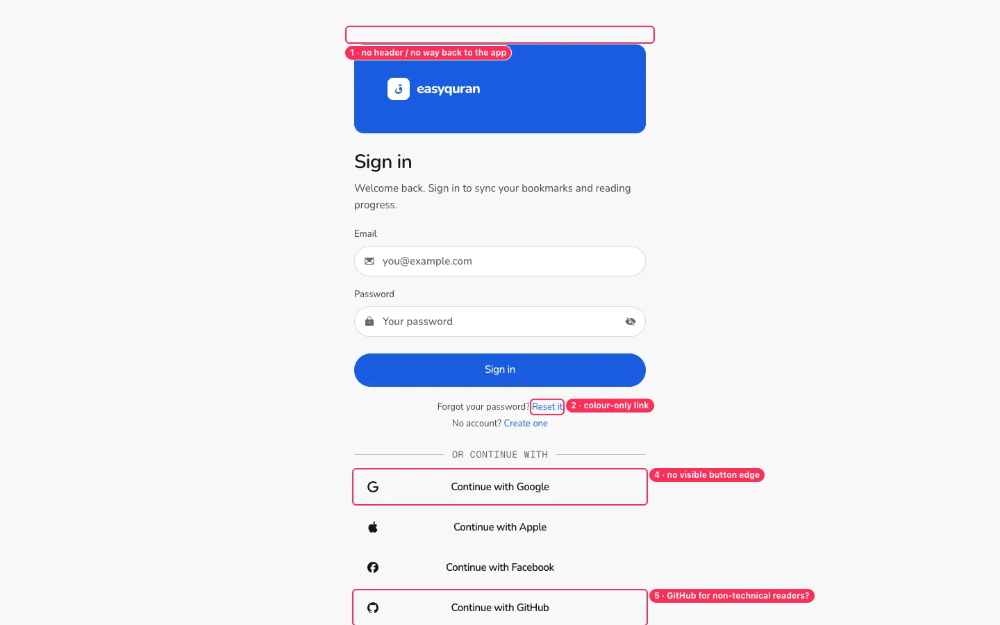
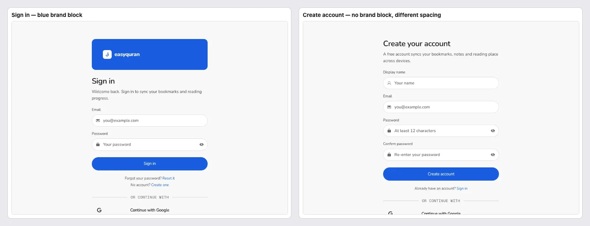

# 13 · Sign in, register and account

[← Back to the index](README.md)

> **Question this page answers:** *Is signing in simple, trustworthy, and easy to back out of?*

---

### AUTH-01 · No way back from Sign in / Create account

**P1** · everyone who opens it by accident or changes their mind · `web/src/routes/(auth)/+layout.svelte`

**What's wrong.** `/login` and `/register` render with no header, no logo link, no "Back to reading". On phones, the browser Back button is the only exit.

**Fix.** Add a slim header (logo → app home, "✕ Close" / "← Back to reading" on the right) and keep the reader's return URL.

**Second pass adds.**

- Also applies to `/forgot-password`, `/verify-email`, `/auth/[provider]/success|failure`. After sign-in/sign-up the app always goes to `/en/app` (or `/verify-email`) — e.g. signing in from Bookmarks lands on Home. After Sign out it lands on `/login`. _(from the 19–20 audit)_
- Worse in the installed app (no browser toolbar) — [PWA-06](25-pwa-and-page-metadata.md#pwa-06--in-the-installed-app-some-screens-have-no-way-back). _(from the 24–26 audit)_

---

### AUTH-02 · Sign in and Create account don't match

**P2** · `(auth)/login/+page.svelte`, `(auth)/register/+page.svelte`

**Fix.** Use one `AuthShell` for both (either both with the brand block or neither), same spacing, same title size.

**Second pass adds.**

- Forgot password and Verify email also lack the brand block; the forgot-password email field has no icon/placeholder. _(from the 19–20 audit)_

---

### AUTH-03 · Social sign-in rows don't look like buttons; GitHub for this audience

**P2** · everyone

**What's wrong.** "Continue with Google / Apple / Facebook / GitHub" rows have no border or background — they read as a list of text. Four providers + email is a lot of choice; GitHub is a developer service most of the audience won't have. "OR CONTINUE WITH" is in the code font.

**Fix.** Outline pill buttons (44 px, icon left, label centred). Show Google and Apple first; move Facebook/GitHub behind "More options" (or drop GitHub). Divider text in the UI font, sentence case: "or".

---

### AUTH-04 · Small, colour-only links and missing page titles

**P2 (WCAG 1.4.1, 2.4.2)**

- "Reset it" and "Create one" are 13 px, colour-only (1.6:1 against body text), 18 px tall. Underline, raise to 15 px, give 44 px hit area.
- `/login` and `/register` have no `<title>` (axe *document-title*).
- The password field's eye icon shows "eye-off" while the password is hidden; many users read that as "hidden — tap to show" and others as "tap to hide". Add visible text "Show" / "Hide".

**Second pass adds.**

- Sign-in validates the 12-character *registration* rule and drops focus after a server error ([KEY-15](21-keyboard-focus-and-screen-reader.md#key-15--sign-in-errors-well-built-two-gaps)); otherwise error semantics are good. _(from the 21–23 audit)_

---

### AUTH-05 · Why sign in? The value isn't stated where it matters

**P3**

Bookmarks, Settings → Account and Sign in all say "sync across devices". For non-technical readers, lead with the benefit and the safety: "Keep your bookmarks and notes safe if you lose your phone." State clearly that reading never needs an account (the FAQ says it; the sign-in page doesn't).
