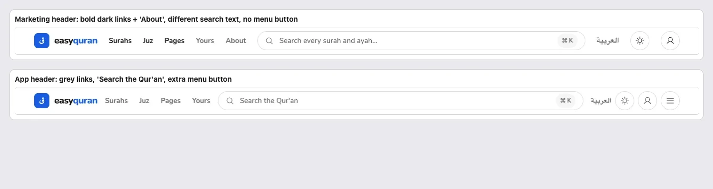
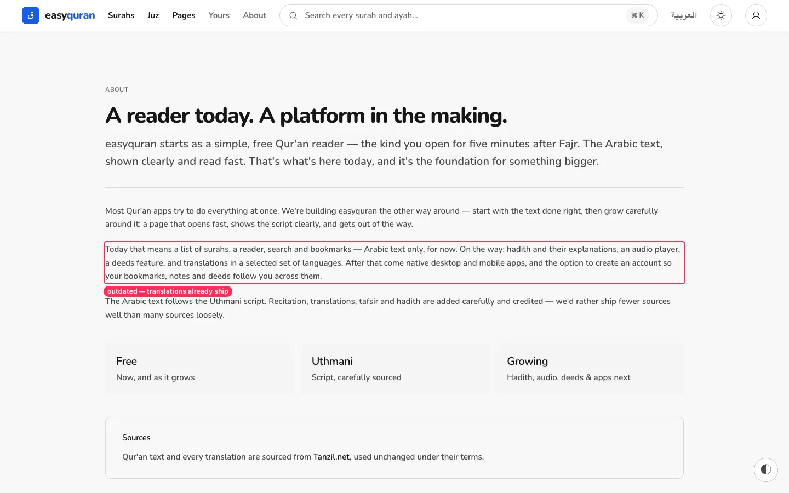
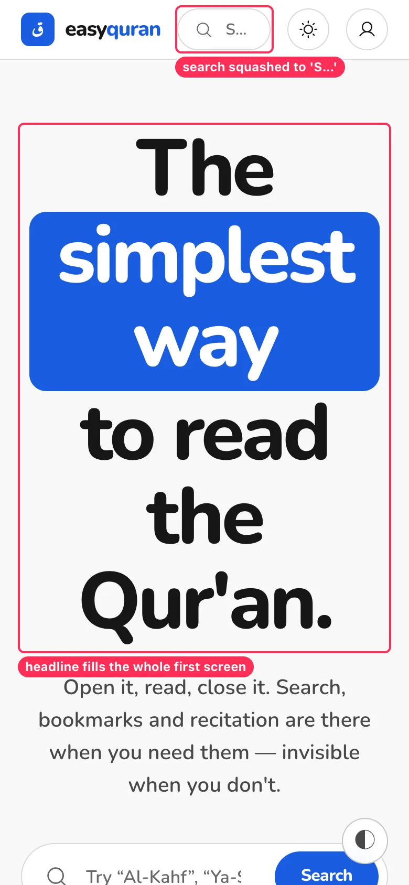
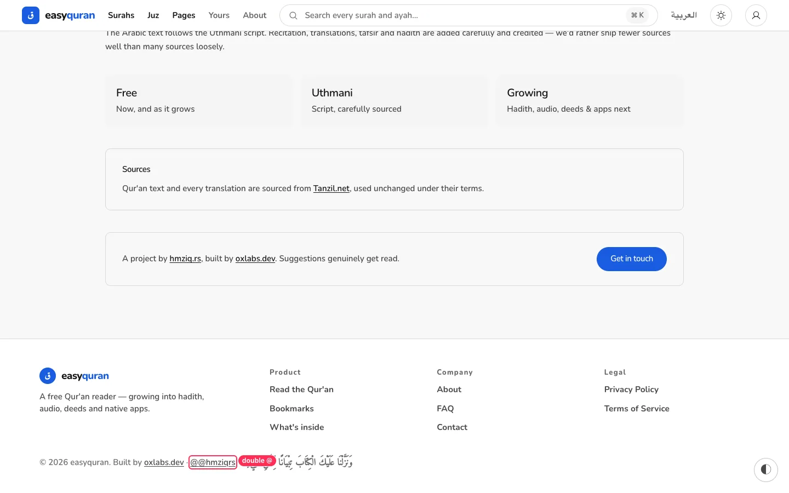

# 14 · Marketing site ↔ app parity

[← Back to the index](README.md)

> **Question this page answers:** *When someone moves from the website to the app, does it feel like the same product?*

---

### MKT-01 · Two different headers

**P2** · everyone crossing from landing to app · `web/src/routes/(marketing)/_components/MarketingHeader.svelte` vs `web/src/lib/components/nav/Nav.svelte`

| | Marketing header | App header |
| --- | --- | --- |
| Link style | Bold, dark (Surahs, Juz, Pages) + grey (Yours, About) | All grey |
| Links | Surahs · Juz · Pages · Yours · **About** | Surahs · Juz · Pages · Yours |
| Search placeholder | "Search every surah and ayah…" | "Search the Qur'an" |
| Right side | Language · theme · account | Language · theme · account · **menu** |

**Fix.** One header component with a `variant` prop for the extra marketing link; same link colours, same search wording.

---

### MKT-02 · Website copy is out of date with the app

**P1** · first-time visitors deciding whether to use the app · `web/src/routes/(marketing)/about/+page.svelte`, FAQ, palette descriptions

| Where | Says | Reality |
| --- | --- | --- |
| About | "a list of surahs, a reader, search and bookmarks — **Arabic text only, for now**. On the way: … translations" | 115 translations ship |
| FAQ | "Will you add translations and tafsir?" | Translations exist; tafsir is a placeholder ([RDR-03](03-reader.md#rdr-03--the-tafsir-panel-shows-placeholder-text-to-real-readers)) |
| Settings/Tweaks | Magenta = "accent over a warm reading page" | Warm reader removed (design-system §42) |
| Landing surah cards | "7 **ayahs**" | App lists say "7 **verses**" |

See also `docs/remaining/copy-corrections.md` (C06) — this adds the About/FAQ items.

---

### MKT-03 · Landing on phones: headline fills the screen; header search is "S…"

**P2** · phone visitors · `web/src/routes/(marketing)/+page.svelte`, `MarketingHeader.svelte`

**Fix.** Scale the display headline down on phones (`text-h1` below `sm`) so the search box and "Start reading" are above the fold. Replace the squashed search pill with a search icon button below `sm`.

---

### MKT-04 · Footer typo and brand spelling

**P3** · every page

- Footer credit shows **"@@hmziqrs"** (double @).
- Brand appears as "easyquran" (wordmark), "EasyQuran" (404 page, home link label), and "easyquran.fyi". Pick one display form.
