# 17 · Themes, palettes and Arabic scripts

[← Back to the index](README.md)

> **Question this page answers:** *Whatever colours, script and font a reader picks, is the Qur'an still clear, correct and comfortable to read?*

Summary: the four built-in palettes mostly behave, and **Ink is the most accessible** (almost clean in dark mode). But the palette a reader picks only recolours the buttons — surah headers, cards and the translation badge keep their own colours. The "custom colours" tools can make the Qur'an text invisible. The Tajweed colours are the same in light and dark mode, so some letters almost disappear in dark mode. The two King Fahd (KFGQPC) fonts draw the verse-end marker wrongly, and one of them shows a placeholder circle instead of a letter in IndoPak text.

Checked: 4 palettes × light/dark × 10 routes (80 axe scans), custom colour seeds at extreme values, 4 Arabic scripts × 6 Arabic fonts, light/dark, verse-by-verse and continuous mode, Arabic sizes 22 px and 56 px at 360, 390 and 1440 px wide, font/script swap timing, and whether search follows the chosen script.

## Automated scan per palette (axe-core, colour-contrast violations)

| Palette · mode | landing | home | surahs | juz | reader | translated reader | search | settings → appearance | bookmarks | yours |
| --- | --: | --: | --: | --: | --: | --: | --: | --: | --: | --: |
| Cobalt · light | 30 | 1 | 27 | 8 | 0 | 0 | 0 | 0 | 0 | 0 |
| Cobalt · dark | 5 | 2 | 2 | 2 | **18** | 2 | 2 | 3 | 2 | 2 |
| Ink · light | 29 | 1 | 27 | 8 | 0 | 0 | 0 | 0 | 0 | 0 |
| Ink · dark | 0 | 0 | 0 | 0 | 0 | 0 | 0 | 1 | 0 | 0 |
| Magenta · light | 31 | 2 | 27 | 8 | 0 | 0 | 0 | 0 | 0 | 0 |
| Magenta · dark | 6 | 2 | 2 | 2 | **18** | 2 | 2 | 3 | 2 | 2 |
| Emerald · light | 34 | 2 | 27 | 8 | 0 | 0 | 0 | 0 | 0 | 0 |
| Emerald · dark | 7 | 3 | 2 | 2 | 2 | 2 | 2 | 3 | 2 | 2 |

The counts per node are dominated by known issues: the green number chips ([A11Y-02](09-accessibility.md#a11y-02--light-mode-green-on-green-chips-and-the-juz-card-caption), identical in every palette because hue slots don't change) and primary-coloured text in dark mode ([A11Y-01](09-accessibility.md#a11y-01--dark-mode-uses-the-fill-blue-as-a-text-colour)). The 18s in the dark reader are the ayah end-markers. Emerald dark passes the reader (its markers reach 3.4:1). New failures are below.

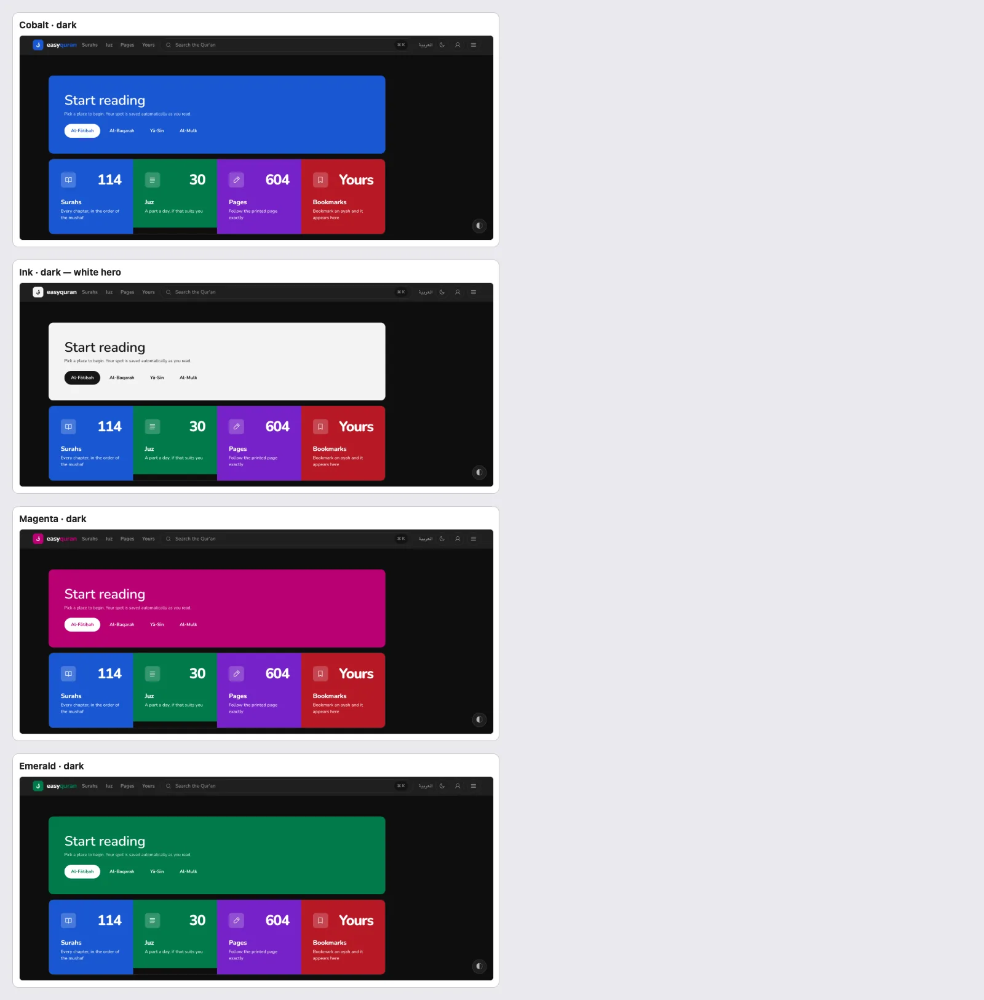

---

### THEME-01 · Custom colours can make the Qur'an text invisible

**P1** (P0 while custom colours stay visible to readers) · anyone who tries "Custom colours" · Settings → Appearance, floating panel · `web/src/lib/theme/derive.ts:170-205` (`backgroundTokens`)

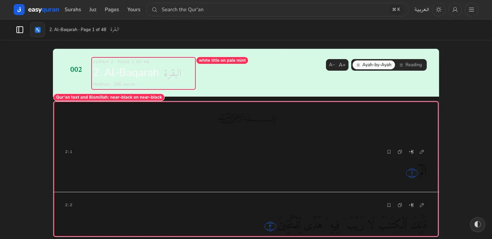

**What's wrong.** A custom background colour rewrites the page ground and UI text, but **not** the reading-surface text tokens (`--quran-foreground`, `--translation-foreground`, `--reader-divider`) or the hue-soft tints. Measured:

| Mode · custom background | Reader ground | Qur'an text colour | Result |
| --- | --- | --- | --- |
| Light · `#202020` | `#1a1a1a` | `oklch(0.16 0 0)` (near-black) | Qur'an text and Bismillah invisible; header title white on pale mint |
| Dark · `#f5f5f5` | `#f6f6f6` | `oklch(0.975 0 0)` (near-white) | Qur'an text invisible |

**Why it matters.** Picking "a dark background" while in light mode is a natural thing to try. The result is a blank page where the Qur'an should be, and the reader may not know how to undo it.

**Fix.**
- In `backgroundTokens`, derive the reading-surface tokens from the seed too: `--quran-foreground` = the seed's max-contrast ink; `--translation-foreground` = secondary; `--reader-divider` = the border step. Also re-derive `--hue-N-soft` for the header card.
- Better: when a custom background's lightness disagrees with the mode, switch `data-mode` to match (a dark seed means dark mode).
- Either way, hide custom colours from readers ([SET-03](08-settings-and-appearance.md#set-03--designer-and-developer-tools-are-exposed-to-readers)).

**Done when.** For any background seed in either mode, Qur'an text on the reader ground measures ≥ 7:1 (add a property test over seeds `#000…#fff` to `token-contrast.test.ts`).

---

### THEME-02 · Custom colours pick the wrong text colour for middle tones

**P1** · custom-colour users · `web/src/lib/theme/derive.ts` (`isLight = luminance > 0.45`, `accentTokens`)

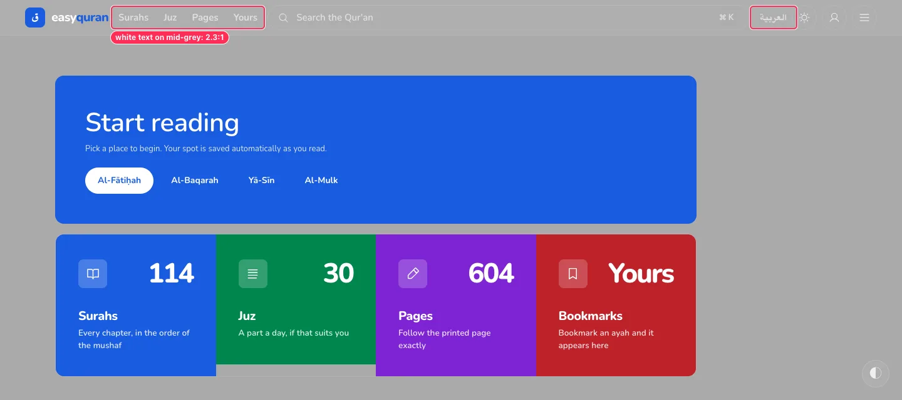

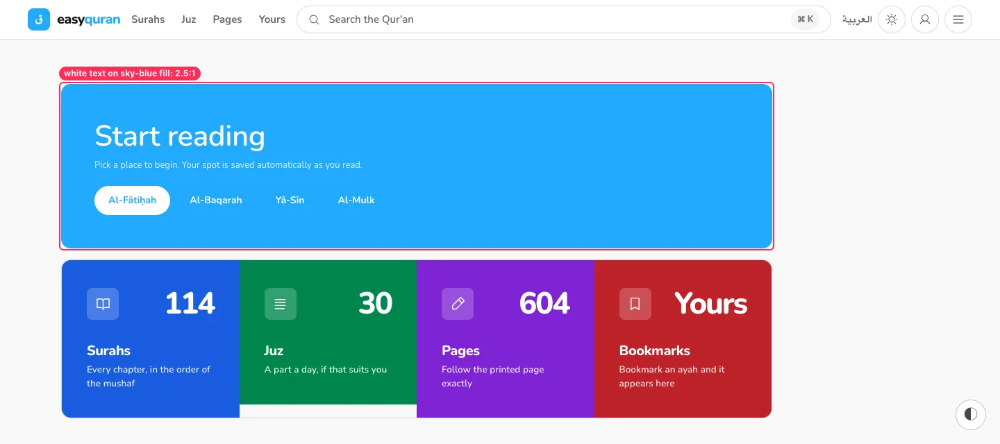

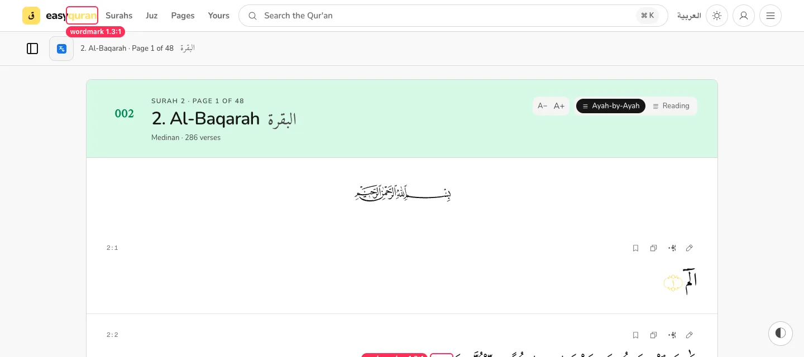

**What's wrong.** `isLight()` treats anything with luminance ≤ 0.45 as "dark" and puts white text on it. The real crossover (equal contrast with black and white) is ≈ 0.18, so middle tones get white text. The accent is also reused as a text colour with no legibility check.

| Seed | Derived pair | Contrast |
| --- | --- | --- |
| background `#aaaaaa` | white text / `#e0e0e0` muted | **2.26 / 1.76** |
| background `#999999` | white text | **2.78** |
| background `#777777` | muted `#cecece` | **2.85** |
| accent `#22aaff` | white on the fill | **2.54** |
| accent `#ff4fa0` | white on the fill | **3.05** |
| accent `#ffe066` | as text on white (wordmark, links, markers) | **1.30** |
| accent `#111111`, dark mode | as text / focus ring on `#141414` | **1.02** |

**Fix.** Choose on-colours by **maximum contrast** (compare with black and white, pick the higher). Derive `--primary-legible` from the accent by moving its lightness until it reaches 4.5:1 on the ground (see A11Y-01). Show a live contrast warning in the picker, or reject seeds that can't reach the floor.

**Done when.** Every derived text/fill pair passes the same floors as the built-in palettes (§9) for any seed.

---

### THEME-03 · The focus ring is too faint on dark surfaces (Cobalt, Magenta, Emerald)

**P1** (WCAG 2.4.11 / 1.4.11, 3:1 for focus indicators) · keyboard users in dark mode · `web/src/routes/layout.css` (`--focus-ring: var(--primary)` in each dark block)

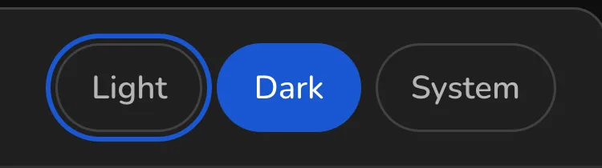

| Dark palette | Ring vs page ground | Ring vs surface (header, cards, panels, dialogs) |
| --- | --: | --: |
| Cobalt | 3.07 | **2.62** |
| Magenta | 3.04 | **2.60** |
| Emerald | 3.57 | 3.05 |
| Ink | 17.4 | 14.9 |

Most focusable controls sit on `--surface` (header, settings cards, modals), so the ring fails where it is needed most.

**Fix.** In dark blocks set `--focus-ring` to the lighter `--primary-legible` (L ≈ 0.72–0.78), and add "focus ring vs `--surface`/`--surface-raised` ≥ 3:1" to the contrast gate.

---

### THEME-04 · The chosen palette only reaches the buttons

**P2** · everyone who picks a palette · hue slots in `layout.css`, `ReaderHeader.svelte`, `MetricCard`, `TranslationButton.svelte:62`

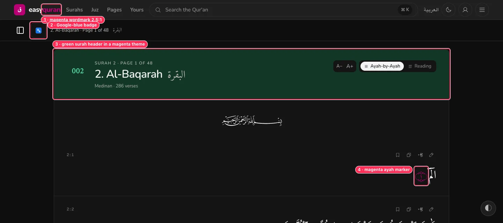

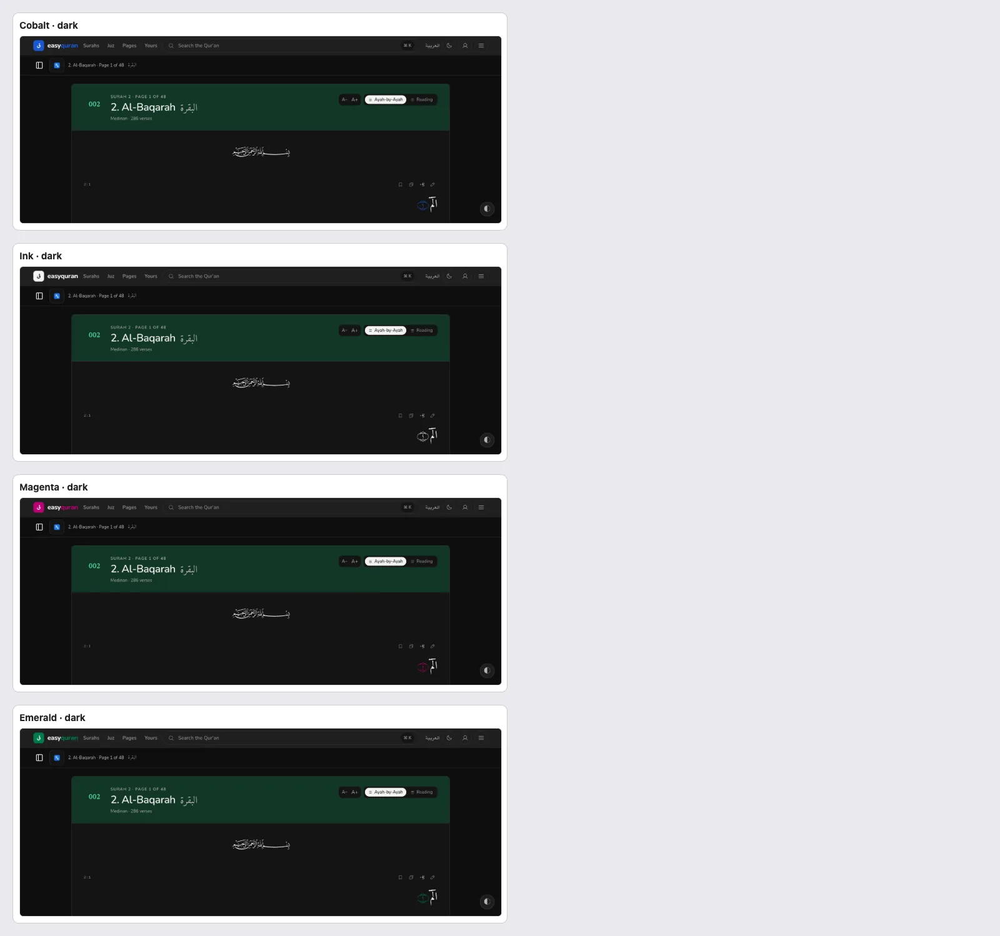

**What's wrong.** The palette changes `--primary` only. The home metric cards, the rotating surah-header colours and the number chips use the four fixed hue slots, and the translation button is hard-coded `#1a73e8`. So:
- **Ink** is described as *"Neutral and high-contrast — no accent hue"*, yet home still shows blue, green, purple and red cards and the reader header is green.
- **Magenta** shows a magenta wordmark next to a green surah header and a Google-blue badge.

**Why it matters.** People choose a palette to make the app calmer or more personal. Seeing four other colours next to their choice feels broken.

**Fix.** Make decoration follow the palette: neutral (or `--primary-soft`) surah headers and number chips ([VIS-08](11-visual-consistency.md#vis-08--colour-used-as-decoration-not-meaning)); metric cards in `--primary`/`--surface` tones; translation button in theme tokens ([VIS-01](11-visual-consistency.md#vis-01--four-icon-families-and-two-icon-weights)). For Ink, have hue slots resolve to greys.

**Done when.** A screenshot of home and reader in each palette shows only that palette's accent plus neutrals.

---

### THEME-05 · Ink dark mode turns the home hero into a bright white slab

**P2** · Ink + dark users · `web/src/routes/(application)/app/+page.svelte:179` (`Panel variant="accent"`)

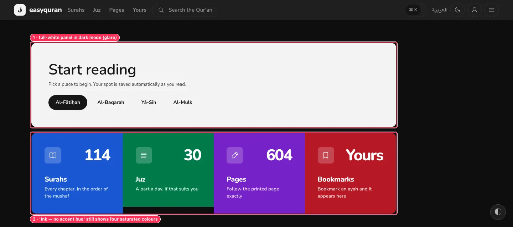

**What's wrong.** In Ink dark, `--primary` is near-white, so the "accent" hero becomes a 1024 × 237 px white panel — the brightest thing on a dark page. The same happens to every primary-filled large surface (landing closing band, selected tabs are fine at pill size).

**Fix.** For large fills in Ink dark use `--surface-raised` with a primary border, or a `--primary-soft` fill; keep full inversion for small controls only.

---

### THEME-06 · See-through text on colour fills fails in Magenta and Emerald

**P2** · Magenta/Emerald users · `+page.svelte:183` (`opacity-85`), landing closing band (`.opacity-80`)

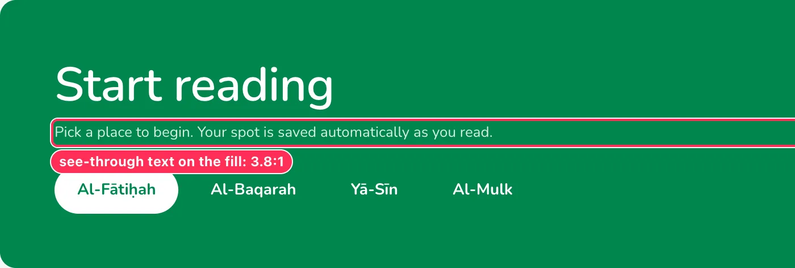

| Where | Magenta light | Emerald light | Magenta dark | Emerald dark |
| --- | --: | --: | --: | --: |
| Home hero "Pick a place to begin…" (13 px, opacity 85 %) | **4.32** | **3.80** | — | **4.36** |
| Landing closing band text (opacity 80 %) | — | — | **4.37** | **4.04** |

Cobalt passes by a small margin, so this was invisible in the default palette.

**Fix.** Never lower text opacity on fills; use `--primary-foreground` at full strength (and the ramp size ≥ 13.5 px). If a quieter tone is wanted, add an `--on-primary-secondary` token per palette and gate it at 4.5:1.

---

### THEME-07 · The selected palette card's description is 3.7–3.9:1 in dark mode

**P2** · dark-mode users · `AppearanceSection.svelte` (selected card: `--primary-soft` fill + `--muted` text)

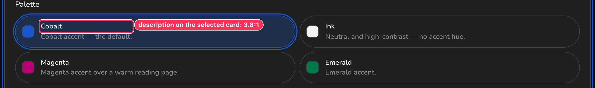

Measured on the selected card: Cobalt **3.82**, Ink **3.78**, Magenta **3.89**, Emerald **3.69** (needs 4.5). The contrast gate checks `--muted` on background and surface, not on `--primary-soft`.

**Fix.** Use `--foreground-secondary` for text on selected (soft-filled) cards, and add "muted and secondary on `--primary-soft`" to `token-contrast.test.ts`.

---

### SCRIPT-01 · Tajweed colours don't change for dark mode; several letters nearly vanish

**P1** · Tajweed readers · `web/src/lib/quran/view/tajweed.ts:22-39` (`RULE_COLORS`), `VerseRow.svelte:102`

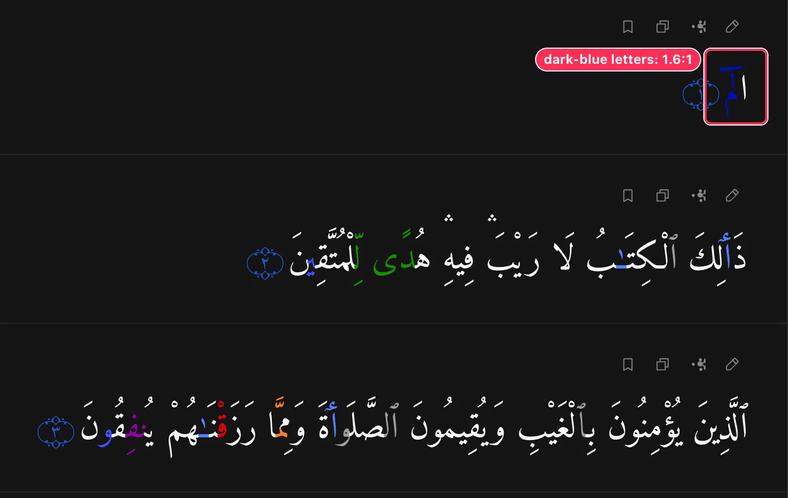

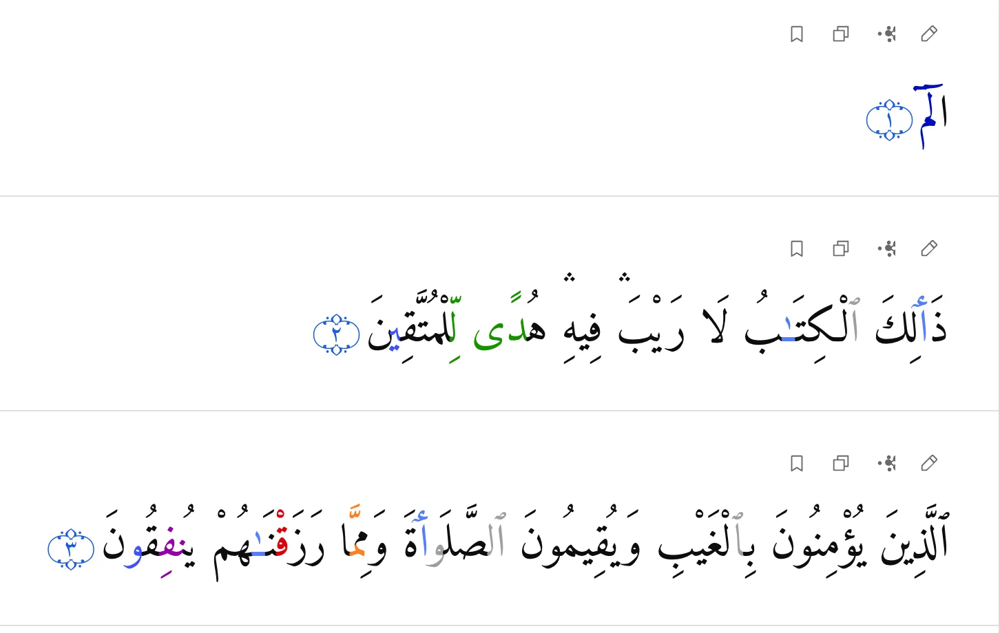

**What's wrong.** One fixed hex palette is used for both modes. Measured against the reader ground (Arabic is large text, so the floor is 3:1):

| Rule | Colour | Light (on `#ffffff`) | Dark (on `#141414`) |
| --- | --- | --: | --: |
| Madda necessary (6 counts) | `#000ebc` | 11.74 | **1.57** |
| Madda obligatory (4–5) | `#2144c1` | 7.89 | **2.33** |
| Ikhfa | `#9400a8` | 7.43 | **2.48** |
| Idgham shafawi | `#c20067` | 6.02 | 3.06 |
| Madda permissible | `#4050ff` | 5.51 | 3.34 |
| Qalqalah | `#dd0008` | 5.15 | 3.58 |
| Ikhfa shafawi | `#d500b7` | 4.65 | 3.96 |
| Idgham (with/without ghunnah) | `#169200` | 4.08 | 4.51 |
| Madda normal | `#537fff` | 3.59 | 5.13 |
| Hamzat al-wasl / silent / lam shamsiyyah | `#9e9e9e` | **2.68** | 6.88 |
| Idgham mutajanisayn | `#a1a1a1` | **2.58** | 7.13 |
| Ghunnah | `#ff7e1e` | **2.54** | 7.24 |
| Iqlab | `#26bffd` | **2.11** | 8.73 |

Grey for silent letters is traditional (they are meant to look faded), but at 2.6:1 on white they are hard to see for older readers, and in dark mode the dark blues are almost black on black.

**Why it matters.** Tajweed colours tell the reader *how* to recite. A letter you can't see is a rule you can't follow.

**Fix.** Define the tajweed palette as CSS custom properties per mode in `layout.css` (e.g. `--tj-madd-necessary`), keep the traditional hue families, and lighten the dark-mode set (e.g. madda necessary `#6f7cff`, obligatory `#7f98ff`, ikhfa `#d27ae0`). Darken the light-mode greys/orange/cyan slightly (`#8a8a8a`, `#d9650a`, `#0a93d1`). Add all 16 × 2 pairs to the contrast gate at ≥ 3:1. Add a small "Colour key" link under the reader header for Tajweed mode.

**Done when.** Every tajweed colour is ≥ 3:1 on the reader ground in both modes.

---

### SCRIPT-02 · The KFGQPC fonts draw the verse-end marker wrongly

**P1** · readers choosing the King Fahd fonts · `web/src/routes/(application)/app/_reader/VerseRow.svelte:109-111` (marker = `U+06DD` + Arabic-Indic digits, set in the chosen font)

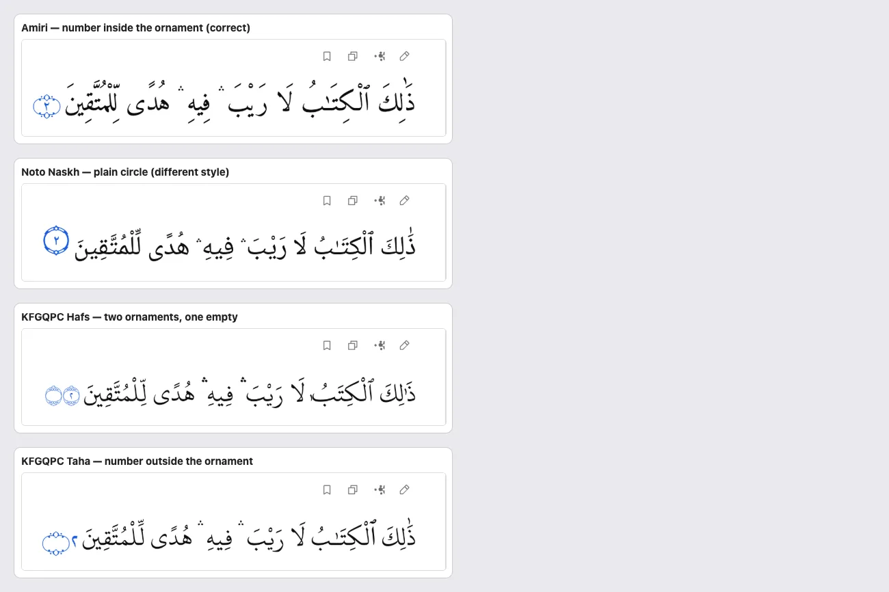

**What's wrong.** The verse-end marker is the character ۝ followed by digits, drawn in whatever Arabic font the reader picked. Only Amiri composes it as a numbered ornament:

| Font | Marker renders as |
| --- | --- |
| Amiri, Scheherazade New | Number inside the ornament (correct) |
| Noto Naskh Arabic | Plain circle with the number (acceptable, but a different style) |
| KFGQPC Uthmanic Hafs | **Two ornaments, the second empty** |
| KFGQPC Uthman Taha Naskh (regular and bold) | **Ornament with the number beside it** |
| Any font + IndoPak script | Number beside the ornament (see SCRIPT-03 image) |

**Why it matters.** The KFGQPC fonts are the ones Madinah-mushaf readers choose on purpose. Broken markers on every verse make the "authentic" option look the least finished.

**Fix.** Decouple the marker from the text font: render `.ayah-ornament` in a fixed font known to compose it (Amiri), or as an SVG ornament with the number overlaid, sized in `em` so it follows the Arabic size. Add a visual test per font × script.

**Done when.** The marker looks the same (number inside one ornament) for all six fonts and four scripts.

---

### SCRIPT-03 · IndoPak text with KFGQPC Hafs shows a dotted circle in place of a letter

**P1** · IndoPak readers · font list in `web/src/lib/config/reader-fonts.ts`, script × font combinations in Settings → Reading

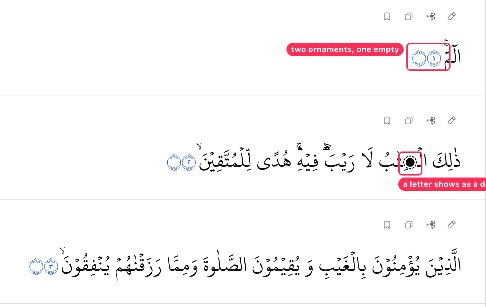

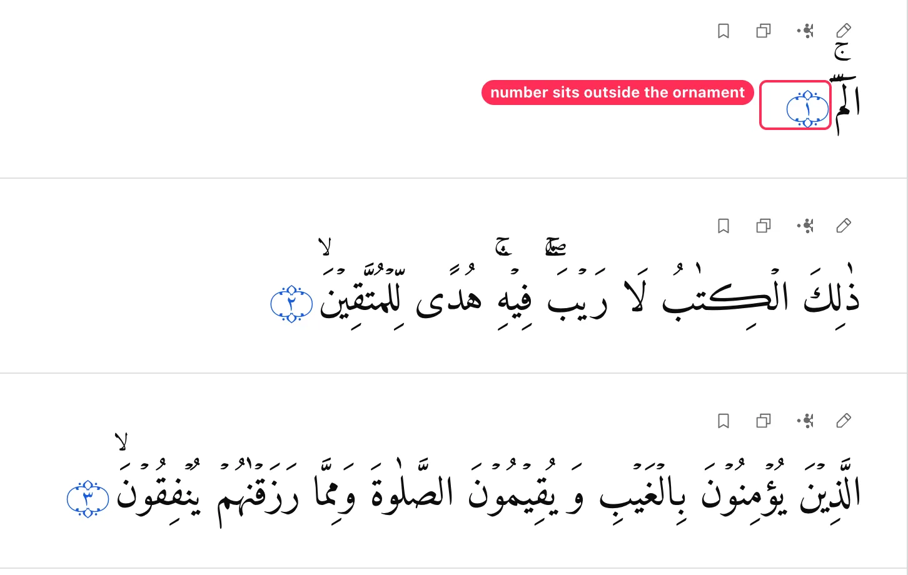

**What's wrong.** The IndoPak text uses letters such as **ڪ** (U+06AA, as in الۡڪِتٰبُ). KFGQPC Uthmanic Hafs has no usable glyph for it and draws a dotted circle with a dot — inside a word of the Qur'an. Every script can be combined with every font, with no check that the font covers the script's characters.

**Why it matters.** A corrupted letter in the Qur'an text is the most serious kind of rendering error for this app.

**Fix.**
- Offer only compatible fonts per script (IndoPak → an IndoPak/Nastaliq-style Qur'an font plus a safe fallback; Uthmani → Amiri/KFGQPC; Simple → any).
- Add a build-time test: for each script DB, collect every codepoint used and assert each allowed font covers it (e.g., with `fontkit`/`opentype.js`). Fall back automatically when coverage is missing.

**Done when.** No script × font combination offered in Settings renders a missing glyph for any verse.

---

### SCRIPT-04 · The chosen script and font appear late: Uthmani and Amiri flash first

**P2** · readers who changed script or font · SSG reader routes, `web/src/lib/fonts/arabic-fonts.ts`

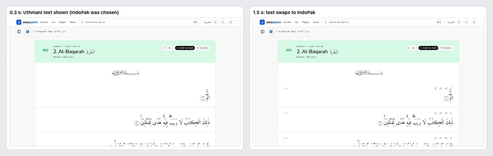

**What's wrong.** Measured on `/en/app/al-baqarah` (fresh load, local dev server):

| Choice | First paint | Swap |
| --- | --- | --- |
| IndoPak script | Uthmani text | IndoPak text by ~0.8 s |
| Scheherazade New font | Amiri | Scheherazade at ~0.42 s |
| KFGQPC fonts | chosen font at first sample (≤ 0.3 s) | — |

Layout shift stays small (CLS 0.05–0.06), so this is a visible text swap rather than a jump. For the Qur'an, briefly showing a *different* script than the one chosen is still confusing.

**Fix.** When the saved script isn't Uthmani, keep the verse text hidden (`visibility: hidden`, not removed) until the variant arrives, with a timeout fallback. Preload the saved Arabic font from the inline script in `app.html` (it already reads `easyquran.reader`) by injecting `<link rel="preload" as="font">`.

**Second pass adds.**

- Related: [LOAD-06](24-loading-and-perceived-performance.md#load-06--ayah-markers-change-shape-during-loading) (ayah-marker glyphs re-draw at ~29 s on Slow 3G) and [LOAD-04](24-loading-and-perceived-performance.md#load-04--the-ui-font-arrives-late-and-moves-the-page) (Nunito not preloaded). Fix together as "font loading" work. _(from the 24–26 audit)_

---

### SCRIPT-05 · Search results ignore the chosen script and font

**P2** · IndoPak/Tajweed/KFGQPC readers · `/app/search` result rows

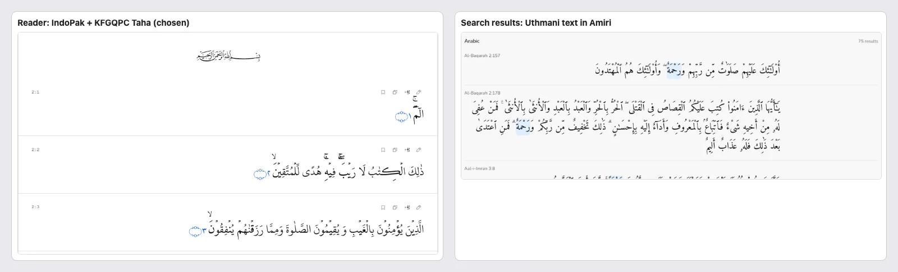

**What's wrong.** With IndoPak + KFGQPC Taha selected, search results show Tanzil Uthmani text in Amiri. The reader header's Arabic name and the sidebar also stay in Amiri.

**Fix.** Render result text from the reader's preferred Arabic source (the worker already knows it: `quranWorker.setPreferredArabicSource`) and use `var(--font-quran)` for all Qur'an text outside the reader.

---

### SCRIPT-06 · The Bismillah doesn't scale with the Arabic text size

**P3** · readers who change text size · `web/src/lib/components/brand/Bismillah.svelte` (`w-44`, 176 px fixed)

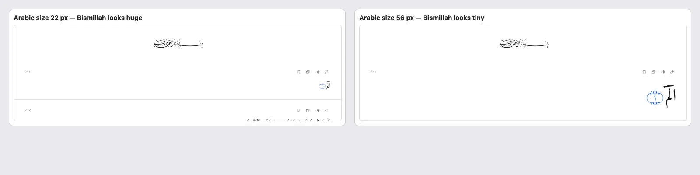

**Fix.** Size the calligraphy relative to the reader's Arabic size, e.g. `width: calc(var(--reader-arabic-size, 33px) * 5.3)` with a sensible max on phones.

---

## Extends existing findings

- **[RDR-06](03-reader.md#rdr-06--reading-mode-on-phones-spreads-words-far-apart)** — at 56 px on a 360 px phone, continuous mode fits two words per line and justification splits them into two columns:

  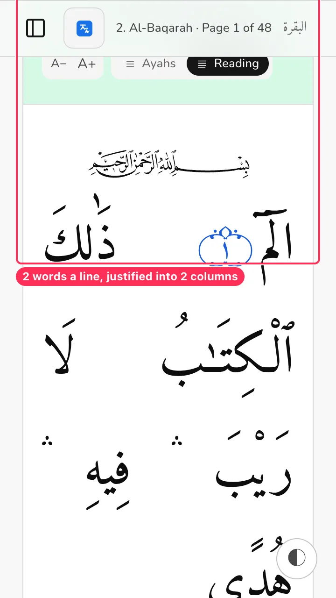

- **[SET-07](08-settings-and-appearance.md#set-07--reading-settings-speak-in-pixels-and-font-file-names)** — the font list also offers fonts that can't render some scripts (SCRIPT-03).
- **[A11Y-01](09-accessibility.md#a11y-01--dark-mode-uses-the-fill-blue-as-a-text-colour)** — Magenta dark primary text is 2.5–3.0:1 (like Cobalt). Emerald light eyebrows are 4.45:1. **Ink passes in both modes** — it is the most accessible palette today.
- **[A11Y-02](09-accessibility.md#a11y-02--light-mode-green-on-green-chips-and-the-juz-card-caption)** — the 4.17:1 green chips appear identically in all four palettes.
- **[SET-03](08-settings-and-appearance.md#set-03--designer-and-developer-tools-are-exposed-to-readers)** — THEME-01 and THEME-02 are strong reasons to hide custom colours.

## What was checked and passed

- Arabic sizes 22 px and 56 px, verse and continuous modes, at 360, 390 and 1440 px: **no horizontal overflow**, no clipped diacritics (line height 2.15 holds for all six fonts).
- Uthmani, Simple, IndoPak and Tajweed all load and render with Amiri in both modes (apart from the issues above).
- Layout shift on reader load with any font: CLS 0.05–0.06 (below the 0.1 "good" threshold).
- Focus ring in light mode: ≥ 4.37:1 in every palette.
