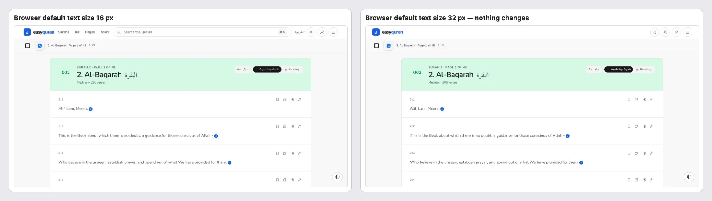
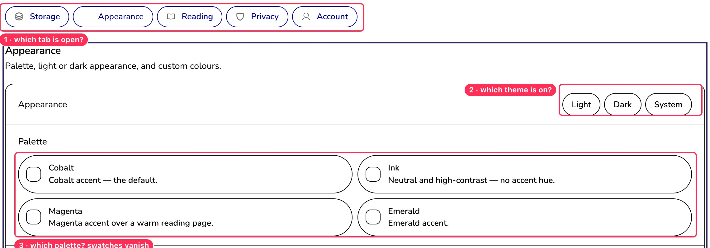
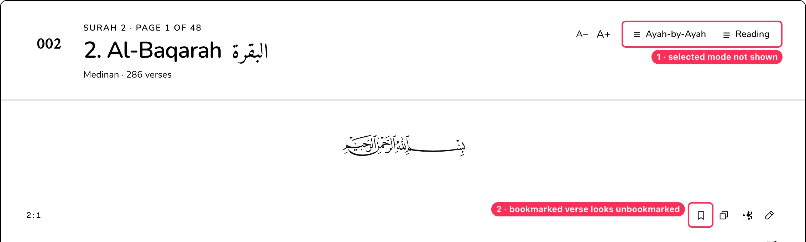
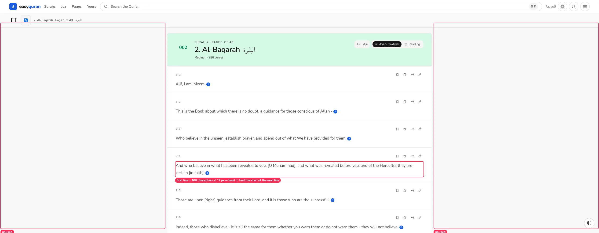
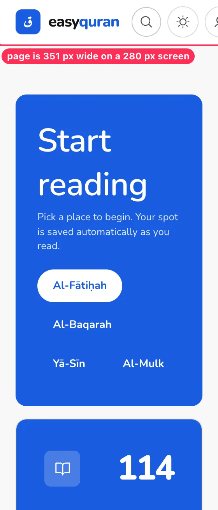

# 18 · Display conditions: text size, high contrast, motion, screen sizes

[← Back to the index](README.md)

> **Question this page answers:** *Does the app respect how people set up their devices — bigger text, Windows high contrast, less motion, very large or very small screens?*

Summary: page zoom and phone/tablet/desktop widths from 360 px to 2560 px work without horizontal scrolling. But the app **ignores the browser's text-size setting**, **loses every "selected" state in Windows High Contrast**, lets translation lines run to ~100 characters on wide screens, and keeps one menu animation when "reduce motion" is on.

Checked: browser default font size 16 → 32 px (Chrome font-size preference), page zoom 200 % and 400 % (equivalent to 720 and 360 CSS px), `forced-colors: active`, `prefers-contrast: more`, `prefers-reduced-motion: reduce` on four overlays, and viewports 2560 × 1440, 1920 × 1080, 1440 × 900, 1024 × 768, 768 × 1024, 844 × 390 (phone landscape), 360 × 640 and 280 × 653 (fold).

---

### DISP-01 · The app ignores the browser's text-size setting

**P1** · older and low-vision readers (the core audience) · `web/src/routes/layout.css:775` (`html { font-size: 16px; }`), px sizes throughout



**What's wrong.** Many people who find text small never zoom — they set "Font size: Large / Very large" once in their browser or phone. The root font size is hard-coded to `16px` and most text uses px (`text-[13px]`, `text-[11px]`, `--reader-arabic-size: 33px`). With Chrome's default font size set to 32 px, nothing changes:

| Element | Default 16 px | Browser set to 32 px |
| --- | --: | --: |
| Root (`html`) | 16 px | **16 px** |
| Body / nav links / buttons | 15 px | **15 px** |
| Verse reference "2:1" | 11 px | **11 px** |
| Translation text | 17 px | **17 px** |

(Control: a plain page in the same browser did go to 32 px.)

**Why it matters.** This is the setting older readers are most likely to use, and the app silently overrides it. WCAG 1.4.4 is technically met via page zoom, but the user's own choice is lost.

**Fix.** Remove the fixed `html { font-size: 16px }` (or set `100%`), express the type ramp and ad-hoc sizes in `rem`, and store the reader's Arabic/translation sizes as a multiplier of `1rem` rather than absolute px (keep the 22–56 px range as the default-size equivalent).

**Done when.** With the browser default set to 20 px, UI body text becomes ≈ 19 px and translation ≈ 21 px.

---

### DISP-02 · Windows High Contrast: nothing shows what is selected

**P1** (WCAG 1.4.1 / 1.4.11) · people using Windows High Contrast / forced colours · all selected states; no `@media (forced-colors: active)` rule anywhere in `web/src`





**What's wrong.** Selected states are drawn only with a background fill (`bg-primary`, `bg-foreground`, `bg-primary-soft`), which forced-colours mode removes. Measured computed styles: `aria-pressed="true"` and `"false"` buttons end up with the same text colour and the same border. Affected:
- Settings tabs, Light/Dark/System, palette cards (and the colour swatches disappear, leaving empty squares).
- Reader "Ayah-by-Ayah / Reading" toggle.
- Bookmarked verse (outline icon + colour only).
- Sidebar tabs and the current-surah row, menu-panel language buttons, floating panel options.
- The "Appearance" tab loses its icon.

**Fix.** Add a forced-colours layer in `layout.css`:

```css
@media (forced-colors: active) {
  [aria-pressed="true"], [aria-selected="true"], [aria-checked="true"], [aria-current="page"] {
    background: Highlight; color: HighlightText; border-color: Highlight;
  }
  /* the palette colour swatch element */
  .palette-swatch { forced-color-adjust: none; }
}
```

Also give selected items a non-colour cue (check mark, filled bookmark icon — see [RDR-08](03-reader.md#rdr-08--bookmarked-state-is-a-thin-colour-change-only)).

**Done when.** With forced colours on, every selected control is distinguishable from its siblings.

---

### DISP-03 · Translation lines are ~100 characters long on wide screens

**P2** · desktop readers · reader column (`max-width` ≈ 1130 px) with fixed 17 px translation



| Viewport | Translation width | Characters per line (measured) |
| --- | --: | --: |
| 1024 – 2560 px | 902 – 1058 px | **≈ 96** |
| 768 px | 646 px | 67 |
| 360 px | 270 px | 29 |

Comfortable reading is roughly 50–75 characters per line (WCAG 1.4.8 AAA asks for ≤ 80). At 2560 px the column is 44 % of the screen with 17 px text in the middle.

**Fix.** Cap translation text at `max-width: 68ch` inside the row (aligned to the start edge), or raise the translation size with the column width (e.g. 19–20 px at ≥ 1280 px). Keep the Arabic line full width.

---

### DISP-04 · The menu panel still slides when "reduce motion" is on

**P3** · people with vestibular disorders · `web/src/lib/components/nav/Nav.svelte:287, 299` (Svelte `fade` 150 ms, `fly` 220 ms)

**What's wrong.** The global rule in `layout.css:934` shortens CSS animations and transitions, which works for the sidebar sheet, translations modal and floating panel (measured: 0–1 ms). The menu panel uses Svelte's JavaScript `fly`/`fade` transitions (Web Animations), which the CSS rule can't reach — they still run 150–220 ms with reduced motion on.

**Fix.** `import { prefersReducedMotion } from "svelte/motion"` and pass `duration: prefersReducedMotion.current ? 0 : 220` (and `x: 0`).

---

### DISP-05 · No response to "increase contrast"

**P3** · low-vision users who turn on "Increase contrast" (macOS/iOS) · no `prefers-contrast` rule in `web/src`

**What's wrong.** `prefers-contrast: more` changes nothing. The app already has a high-contrast palette (Ink) and a stronger text step, but doesn't use them when asked.

**Fix.** Under `@media (prefers-contrast: more)`: raise `--muted` to `--foreground-secondary`, use `--border-strong` for all borders, remove opacity-reduced text, and (optionally) default to the Ink palette if the reader hasn't picked one.

---

## Extends existing findings

- **[NAV-05](01-navigation-and-wayfinding.md#nav-05--header-overflows-on-small-phones)** — on a 280 px foldable (cover screen) the header forces the whole page to 351 px, so it is zoomed out and the account/menu buttons are cut off:

  

- **[A11Y-04](09-accessibility.md#a11y-04--too-much-text-is-1113-px)** — the tiny sizes can't be rescued by the browser setting either (DISP-01).
- **[RDR-06](03-reader.md#rdr-06--reading-mode-on-phones-spreads-words-far-apart)** — see the 56 px phone example in [17](17-themes-palettes-and-scripts.md#extends-existing-findings).

## What was checked and passed

| Condition | Result |
| --- | --- |
| Page zoom 200 % / 400 % (720 / 360 CSS px) | Reflows to the tablet/phone layouts; no horizontal scroll (except the header at ≤ 320 px, NAV-05) |
| 2560 × 1440, 1920 × 1080, 1440 × 900 | No overflow; content centred (reader); home still left-heavy ([HOME-02](02-home.md#home-02--layout-is-lopsided-on-desktop-and-the-juz-card-is-shorter-than-its-neighbours)) |
| Tablet 1024 × 768 and 768 × 1024 | No overflow; layouts sensible |
| Phone landscape 844 × 390 | After scrolling, the header hides and only the 61 px reader bar stays: 329 of 390 px (84 %) left for reading. At the top, chrome takes 117 px (30 %) |
| Phone 360 × 640 | No overflow in reader or home |
| Reduced motion: sidebar sheet, translations modal, floating panel | Respected (≤ 1 ms) |
| Focus indicator in forced colours | Visible (system Highlight) |
