# 19 · Remaining screens and flows

[← Back to the index](README.md)

> **Question this page answers:** *Outside the core pages, do the less-visited screens (legal, auth side pages, landing sections, reader edges) and the everyday flows (offline download, clearing data, translation downloads, sharing, jumping to a verse, switching language, many bookmarks, update prompts) hold up for a release?*

Summary: offline reading is genuinely solid — after "Download for offline", pages, translated pages and Arabic search all work with the network off, and copying a verse on a phone gives clear "Copied" feedback. The problems are around the edges: legal pages still say "placeholder text", the landing page promises "nothing tracking what you read" while analytics is on, the auth side pages look like a different product, "Clear cached pages & data" gives no confirmation and no visible result, the search page has a second, different translation picker, and several flows (⌘K verse jump, language switch, share) lose the reader's place or context.

Environment: local dev (`PUBLIC_ENV=local`, :5391) plus the production build served by `bun server.ts` on :5392 for offline-pack and analytics checks. No SMTP or OAuth providers are configured locally; findings that depend on that are labelled.

---

## Screens

### SCR-01 · Legal pages say "placeholder text" and promise things the app doesn't do

**P0** · everyone, and anyone checking the app before trusting it · `/privacy`, `/terms` · content in `web/src/lib/data/content.ts`

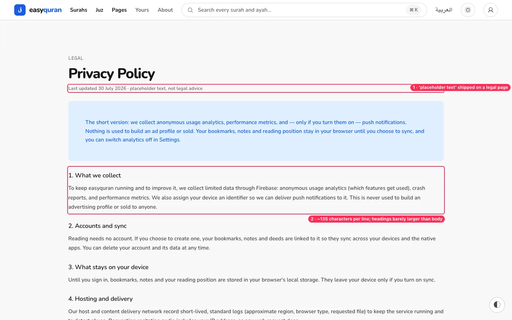

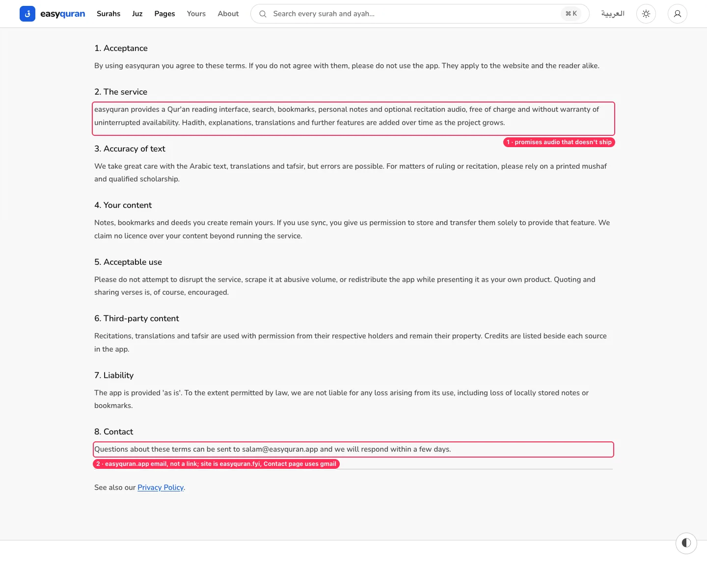

**What's wrong.**
- Both pages print **"placeholder text, not legal advice"** under the title.
- Terms promise "optional recitation audio" and "credits are listed beside each source in the app"; Privacy mentions "deeds", "native apps" and audio requests. None of these ship (and the main translation is not credited — [TR-02](04-translations.md#tr-02--the-main-translation-is-never-credited)).
- Terms give **salam@easyquran.app** as the contact (plain text, not a link). The site is **easyquran.fyi** and the Contact page offers **hmziqrs@gmail.com**. Three different identities for "who runs this".

**Why it matters.** Legal pages are where cautious readers (and app stores, and parents) check whether to trust an app. A visible "placeholder" label undoes that trust instantly. (The content mismatches extend `docs/remaining/copy-corrections.md` C02/C03; the visible placeholder label and the contact mismatch are new.)

**Fix.** Remove the placeholder label only after the text has been reviewed; rewrite to describe exactly what ships (reader, translations, local bookmarks/notes, analytics, account). Use one contact address on one domain everywhere, as a `mailto:` link.

**Done when.** No legal page contains "placeholder"; every capability named in Terms/Privacy can be found in the app; Terms, Privacy, Contact and footer show the same contact.

---

### SCR-02 · Legal pages are hard to read

**P2** · everyone · `web/src/routes/(marketing)/privacy/+page.svelte`, `terms/+page.svelte`

**What's wrong.** Body text is 15 px set across **1056 px ≈ 135 characters per line** (comfortable reading is 60–80). Section headings are 17.5 px / weight 600 — barely larger than body, so the page reads as one grey block. There is no table of contents; the date format "30 July 2026" is fine but only in English.

**Fix.** Cap the text column at `max-w-[68ch]`, use the `text-h3` role for section headings, add an "On this page" list of the 8 sections, and keep the short summary box at the top (it's good).

---

### SCR-03 · Auth side pages look like a different product

**P2** · anyone resetting a password or finishing sign-in · `web/src/routes/(auth)/forgot-password/+page.svelte`, `verify-email/+page.svelte`, `web/src/routes/auth/[provider]/failure/+page.svelte`

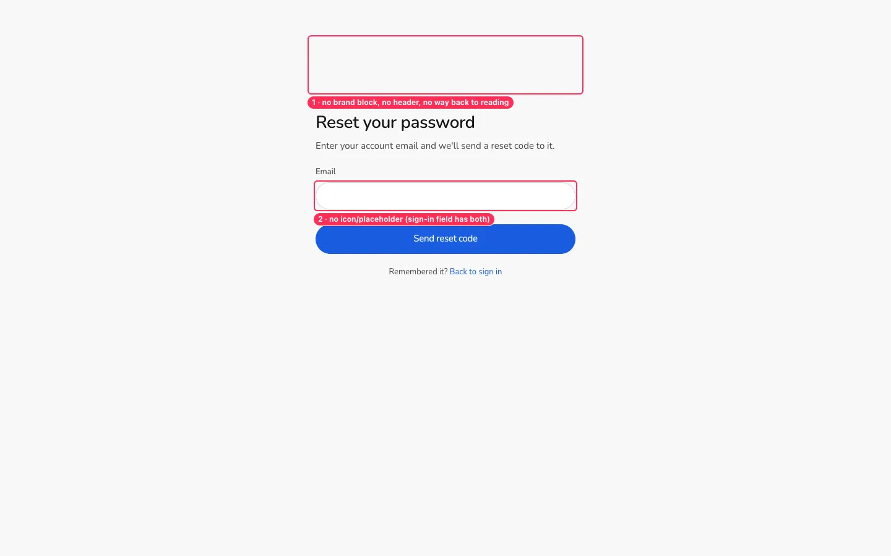

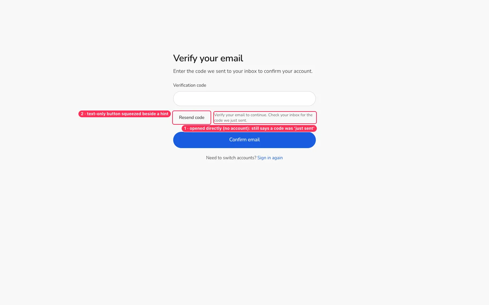

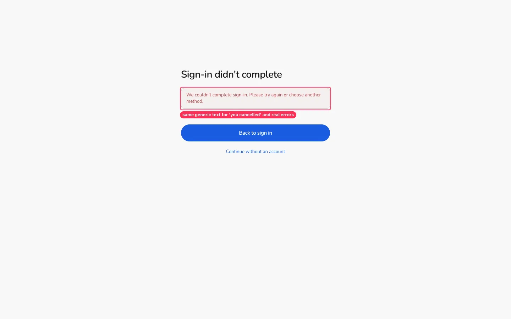

**What's wrong.**
- Sign in has a blue brand block; Forgot password, Verify email and the OAuth result pages have none — and, like Sign in, no header or "Back to reading" ([AUTH-01](13-sign-in-and-account.md#auth-01--no-way-back-from-sign-in--create-account) extends here).
- The Forgot-password email field has no icon or placeholder, while the Sign-in email field has both.
- `/verify-email` opened directly (no account, nothing sent) still says "Check your inbox for the code we just sent." "Resend code" is a text-only button squeezed beside a hint.
- `/auth/google/failure?error=access_denied` (user pressed "Cancel" at Google) shows the same "We couldn't complete sign-in" alert as a real failure.
- All four pages are hard-coded English (`heading="Verify your email"` etc.), with no Arabic.

**Fix.** One `AuthShell` for every auth route (brand, back link, same field component with icons). Only say "we just sent" after a send; map `error=access_denied` to "Sign-in was cancelled. You can keep reading without an account." Move strings to `messages/auth/*`.

---

### SCR-04 · Landing lower sections: wrong text colour, a self-link, a very long list

**P2** · first-time visitors · `web/src/routes/(marketing)/+page.svelte`

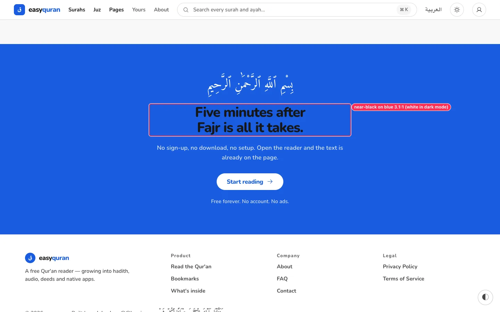

**What's wrong.**
- The closing band headline "Five minutes after Fajr is all it takes." is **near-black on blue (3.1:1)** in light mode but white in dark mode — the global `h1–h4` colour rule wins. The app home already works around the same rule.
- "See all 114" links to `#surahs` — the list it sits on top of, which already shows all 114. Visitors expect it to open the Surahs page.
- That full list is ~3,900 px tall, so the "Why" and "On the way" sections are ~4,800 px down the page.
- "On the way" still lists "Hadith, tafsir & translations" and "Recitation — for now the player is only a preview" (tracked as copy-corrections C05/C06).

**Fix.** Add `text-primary-foreground` to the band heading (and a contrast test for headings on `Band tone="accent"`). Show 12–18 popular surahs with "See all 114 →" linking to `/en/app/surah`. Update the roadmap cards.

---

### SCR-05 · "Nothing tracking what you read" while analytics is on by default

**P1** · privacy-conscious readers · landing "Why" section; `web/src/lib/firebase/index.ts:12` (`measurementId`)

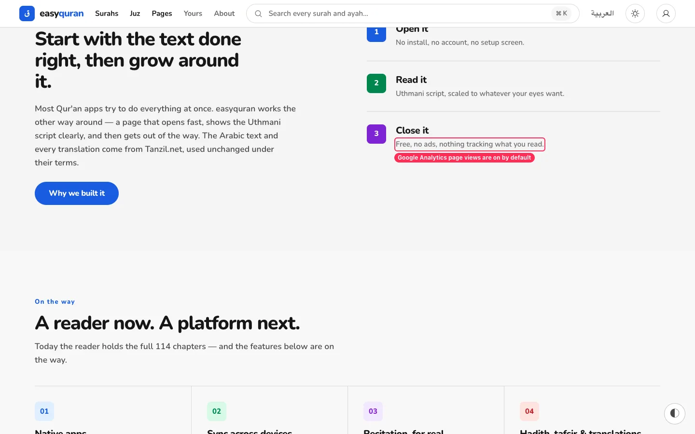

**What's wrong.** The landing says *"Close it — Free, no ads, nothing tracking what you read."* In the production build, opening `/en/app/al-kahf` fires Firebase Installations and **Google Analytics `g/collect`** requests (`tid=G-ZYL6HY24W6`) with the page location — i.e., which surah is being read. Analytics is "on" by default in Settings → Privacy ([SET-04](08-settings-and-appearance.md#set-04--toggles-are-on-text-pills-analytics-is-on-by-default)).

**Why it matters.** It's a direct contradiction a technical visitor can verify in seconds, and for a Qur'an reader it touches religious privacy.

**Fix.** Either change the copy ("No ads. Anonymous usage stats you can switch off in Settings.") or make analytics opt-in and strip reader paths to the route pattern (`/app/[surah]`) before sending.

---

### SCR-06 · Every reader type ends differently — and the end of the Qur'an is a small link

**P2** · everyone who finishes a surah, page or juz · `ReaderPageNav.svelte`, `RangeReader.svelte`

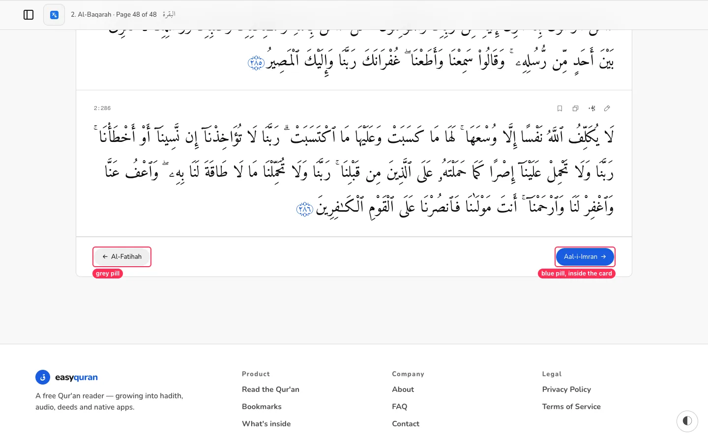

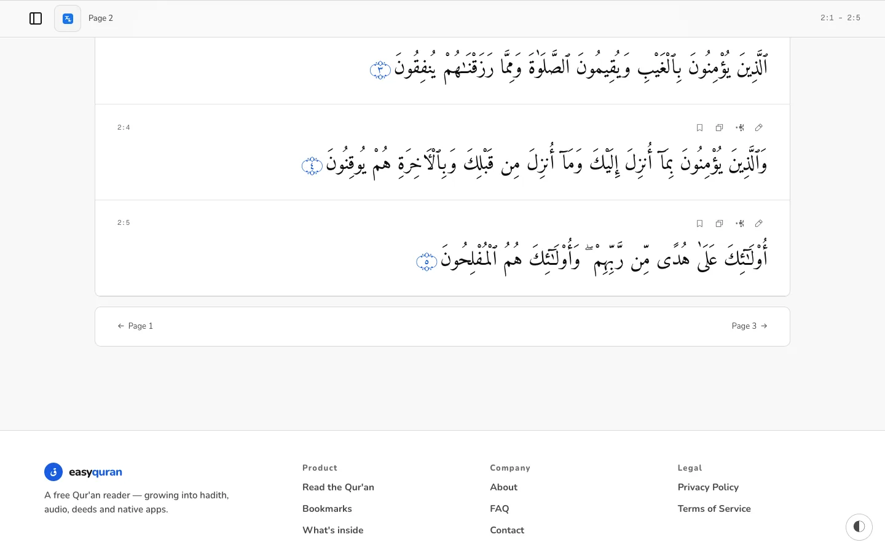

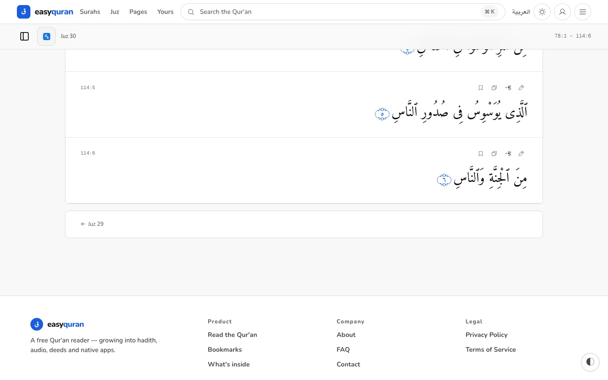

**What's wrong.**
- Surah reader: previous = grey pill, next = blue primary pill, both inside the reading card.
- Page and juz readers: 13 px text links ("← Page 1 · Page 3 →") in a separate card below.
- The last juz (and page 604) ends with only "← Juz 29" / "← Page 603": no "You've reached the end of the Qur'an", no "Back to all juz", no du'a of completion.
- Arrows are text characters (←/→), not the mirrored `Icon`.

**Fix.** One `ReaderEndNav` for all readers: two equal secondary pills (Previous / Next with names), plus a small "Back to list" link. At the very end, show a short completion card ("You have reached the end of the Qur'an · Start again from Al-Fātiḥah").

---

### SCR-07 · Special Qur'an moments aren't explained

**P3** · learners and new readers · reader

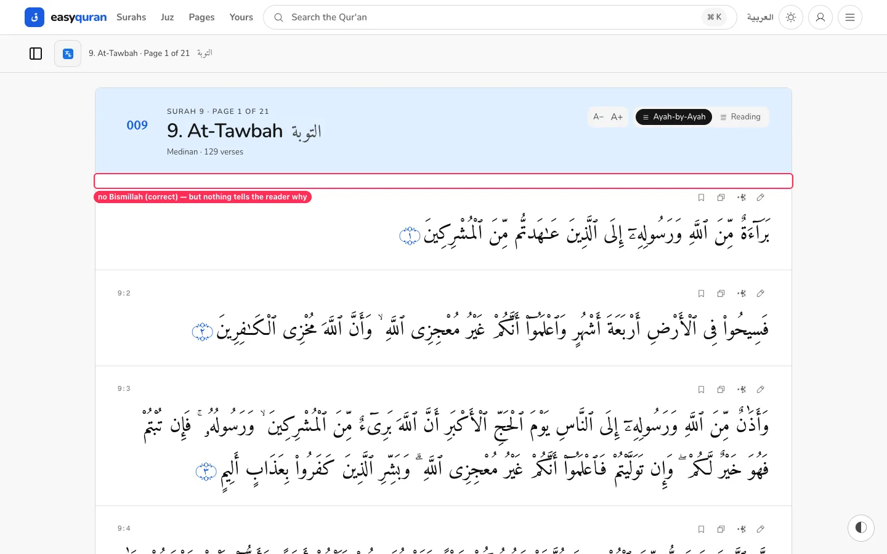

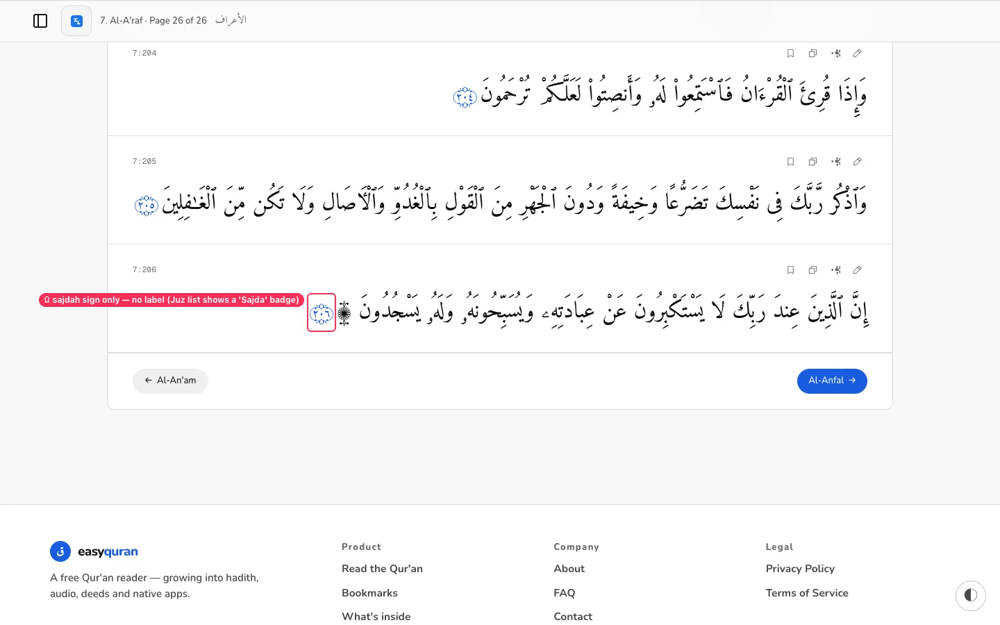

**What's wrong.** Surah 9 correctly has no Bismillah, but readers often think it's missing. Sajdah verses show the ۩ sign only; the Juz list marks them with a "Sajda" badge, the reader doesn't.

**Fix.** A one-line note under the At-Tawbah header ("This surah begins without Bismillah"), and a small "Sajdah (prostration)" label beside sajdah verses, both localized.

---

### SCR-08 · The reading-mode dialog uses its own button and list styles

**P3** · readers with stacked translations · `web/src/routes/(application)/app/_reader/ReadingModeDialog.svelte`

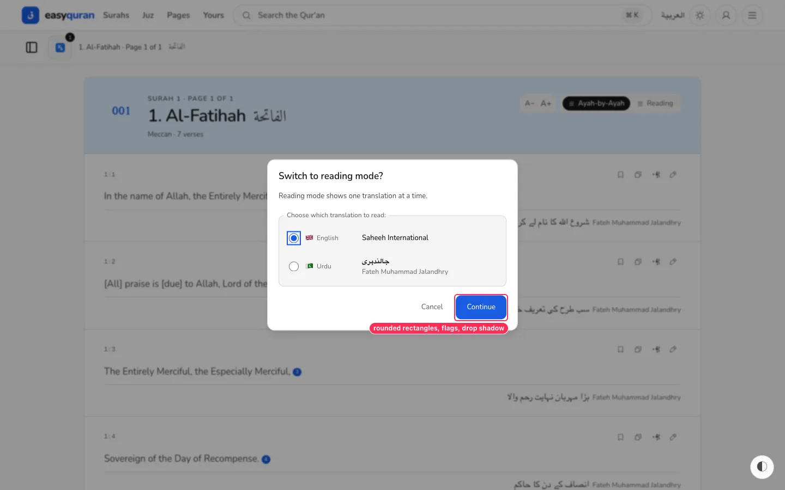

Shown when switching to Reading with more than one translation. Buttons are `rounded-lg` rectangles, rows carry flags, and the dialog uses `shadow-lg` (the design system says no elevation). It is also the **only** place that names the main translation ("Saheeh International"). Fix with the shared `Button`, drop flags (see [TR-03](04-translations.md#tr-03--the-translation-picker-opens-on-arabic-tafsir-uses-flags-and-says-primary)), remove the shadow.

---

## Flows

### FLOW-01 · "Clear cached pages & data" — no confirmation, no visible result

**P1** · anyone tidying storage · `web/src/routes/(application)/app/settings/_components/StorageSection.svelte:180-186`, `web/src/service-worker.ts:204-216`

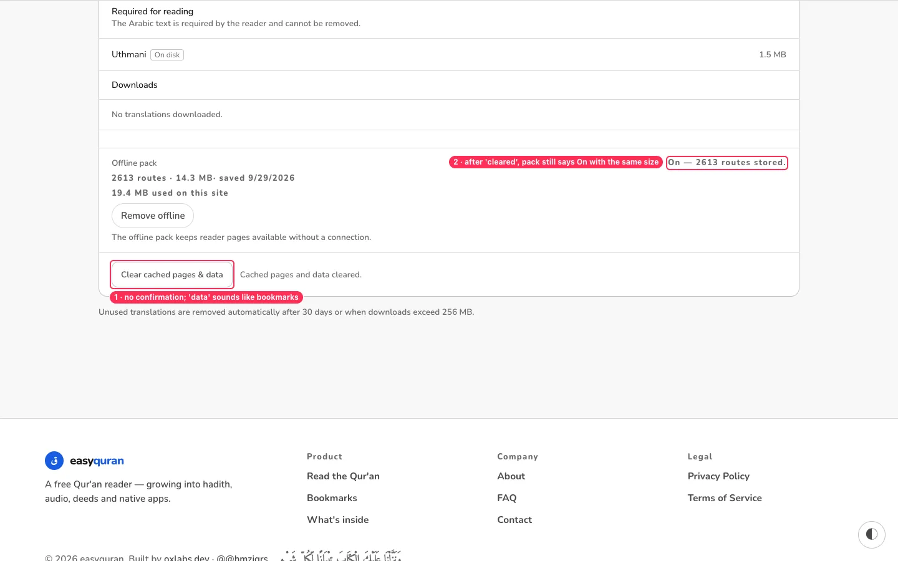

**What's wrong.**
- One tap clears immediately — no confirmation.
- "& data" reads like "your bookmarks and notes". They are in fact kept (checked: both survived), but nothing says so.
- Afterwards the page still shows "Offline pack · On — 2613 routes stored", the same 14.3 MB and 19.4 MB totals; offline reading still worked. The reader cannot tell what was removed.

**Fix.** Rename to **"Free up space"** with a one-line description of exactly what goes ("Saved copies of pages you've visited. Your bookmarks, notes and offline pack are kept."), ask for confirmation, then refresh the usage numbers and show "Freed 5.1 MB".

**Done when.** The label says what is removed, a confirmation appears, and the numbers visibly change.

---

### FLOW-02 · Offline pack: no progress, no "ready" moment, developer wording

**P2** · readers preparing for travel or bad signal · `web/src/lib/components/status/OfflinePack.svelte`, `messages/en.json` (`settings_storage_pack_*`)

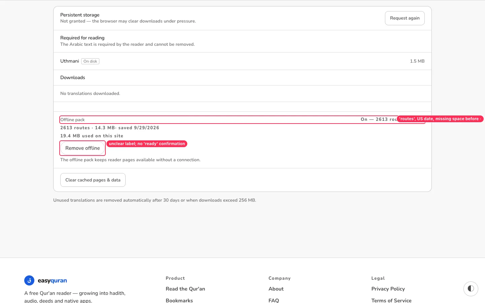

**What's wrong.** (Extends [SET-02](08-settings-and-appearance.md#set-02--storage-copy-is-browserdeveloper-jargon).) The pack finished in ~2 s locally — fine — but: the only feedback is letter-spaced micro text; the count appears twice ("On — 2613 routes stored." and "2613 routes · 14.3 MB"); the date is US-format "9/29/2026" in every locale; a space is missing before "·"; the button becomes "Remove offline". In local dev (no generated manifest) it fails instantly with "Offline download failed. Retry?" and no reason (environment-specific, but the error copy is the same in production).

**Fix.** Status line: "Ready to read offline · 14 MB · saved 29 Sep" (`Intl.DateTimeFormat(locale)`); a progress bar while downloading ("Downloading… 40%"); button "Remove offline copy"; error: "Couldn't download. Check your connection and try again."

---

### FLOW-03 · Search has a second, different translation picker — and it needs two steps

**P1** · anyone searching in English/Urdu/etc. · `web/src/routes/(application)/app/search/_components/TranslationPicker.svelte`, `TranslationRow.svelte`

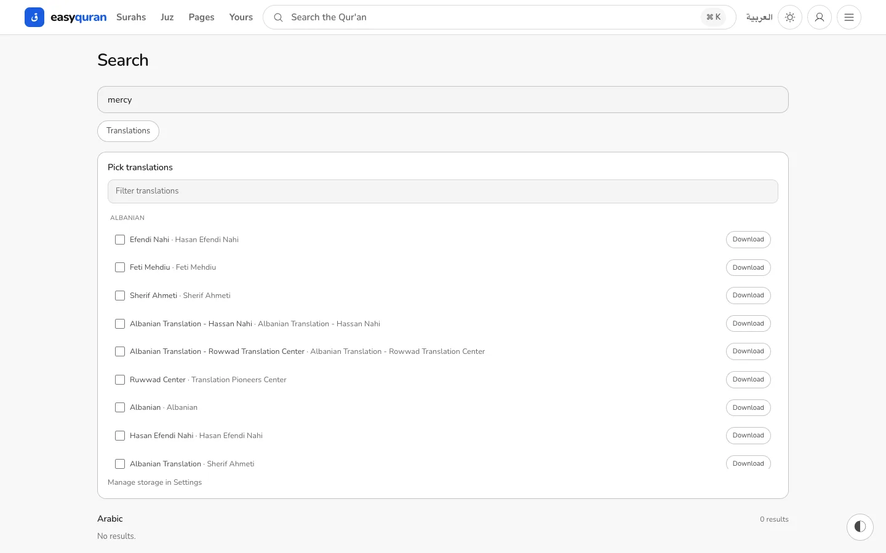

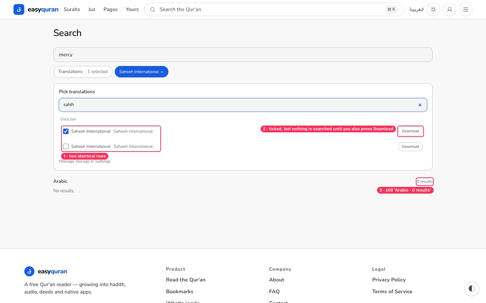

**What's wrong.**
- The search page's "Translations" opens an inline list that looks nothing like the reader's Translations modal: flat, alphabetical, **starting at Albanian**, names repeated ("Albanian · Albanian", "Efendi Nahi · Hasan Efendi Nahi").
- Two indistinguishable rows **"Saheeh International · Saheeh International"** (two sources, no hint which is which).
- Ticking a translation does nothing on its own — results only appear after also pressing that row's **Download**. After that: "Saheeh International — 143 results" (good), but the empty "Arabic · 0 results · No results." block stays above them.

**Fix.** Reuse the reader's picker (language → translations) with the UI language first; one action per row ("Add" — downloads automatically if needed, with progress); show the source/publisher when names collide; hide empty result groups or collapse them to one line ("No Arabic matches").

---

### FLOW-04 · Storage download rows: jargon chips and an unexplained disabled button

**P2** · `StorageArtifactRow.svelte`

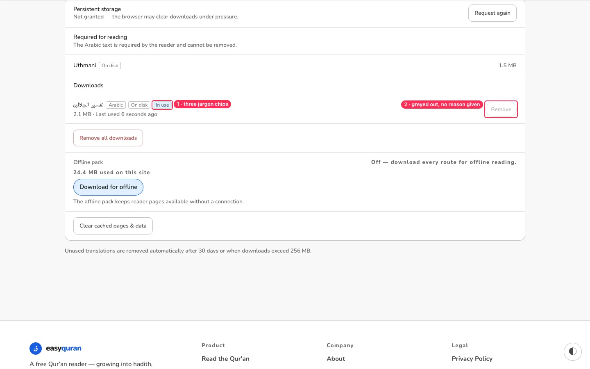

After adding a translation from the reader, Settings → Storage lists it with three chips (**Arabic · On disk · In use**) and a greyed-out **Remove** with no reason. Say "Downloaded · used in your reader now" and, instead of disabling, let Remove work with "It will download again next time you open it", or show a tooltip/text explaining why it can't be removed.

---

### FLOW-05 · Shared verses carry no link back

**P2** · everyone who shares · `web/src/lib/stores/reader-share.svelte.ts:29-43`

**What's wrong.** Share sends `{ title: "Al-Baqarah 2:1", text: "الٓمٓ\nAl-Baqarah 2:1" }` — **no URL**. Recipients can't open the verse in easyquran. If sharing fails, nothing is shown (the result `"failed"` is ignored). (Copy works well: "Copied" tooltip and check icon, also on phones.)

**Fix.** Include `url` = the verse deep link (`surahAyahPathFor(…)` → `…/page/41#ayah-2-255`, absolute) and the translation line if one is shown; show "Couldn't share — link copied instead" on failure.

---

### FLOW-06 · ⌘K "go to verse" lands on the page, not the verse; deep links don't highlight

**P2** · everyone using search to jump · `web/src/lib/components/search/GlobalSearchPalette.svelte`

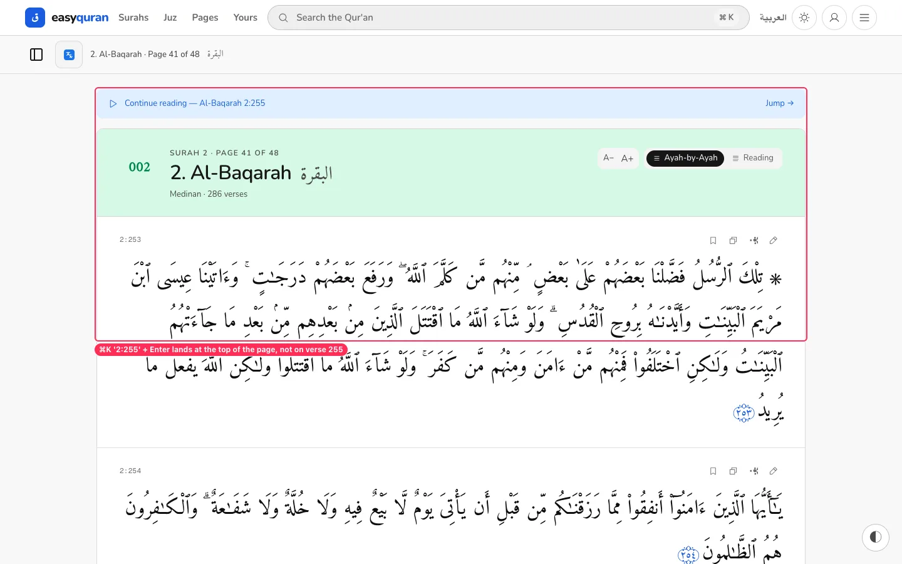

**What's wrong.** Typing `2:255` and pressing Enter opens `/en/app/al-baqarah/page/41` at scroll 0 — the `#ayah-2-255` anchor is dropped. Opening the same URL *with* the anchor does scroll to the verse (checked), but the target verse gets no highlight, so the reader still has to find it.

**Fix.** Navigate with the `#ayah-…` hash from the palette (use `surahAyahPathFor`), and briefly highlight the target row (2 s `--surface-hover` fade + focus for screen readers).

---

### FLOW-07 · Switching language throws away your reading position

**P2** · bilingual readers · `Nav.svelte` language link (`data-sveltekit-reload`), `app/+layout.svelte` `readerHrefFor(...)`

**What's wrong.** Reading Al-Baqarah at 2:7 and tapping **العربية** reloads `/ar/app/al-baqarah?mode=verse` at the top (2:1). On a later local page (e.g. `/page/41`) the page number is also lost.

**Fix.** Carry the current local page and the top-visible verse anchor into the other-locale href (`…/page/41#ayah-2-255`), or restore from `lastReadAnchor` after the reload.

---

### FLOW-08 · Many bookmarks become an unsorted wall

**P2** · regular readers · `web/src/routes/(application)/app/bookmarks/+page.svelte`

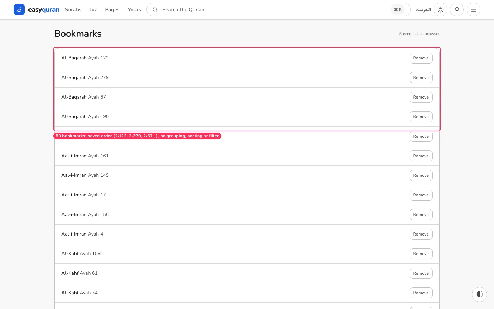

**What's wrong.** With 50 bookmarks the page is ~3,500 px of identical "Al-Baqarah Ayah 122 · Remove" rows in the order they were saved (2:122, 2:279, 2:67, 2:190…). No grouping by surah, no sort, no filter. Anonymous bookmarks are stored as `{ "2:255": true }`, so there is no date to sort by later. (Extends [BM-02](07-bookmarks-notes-yours.md#bm-02--bookmark-rows-have-no-context).)

**Fix.** Group by surah in mushaf order with counts; add "Sort: Qur'an order / Recently saved" (store a timestamp for new local bookmarks); add a filter box once there are more than ~10.

---

### FLOW-09 · Update and notification toasts cover the header and have tiny controls

**P2** · everyone after a release · `web/src/lib/components/status/UpdateToast.svelte`, `web/src/lib/components/notifications/NotificationToast.svelte`

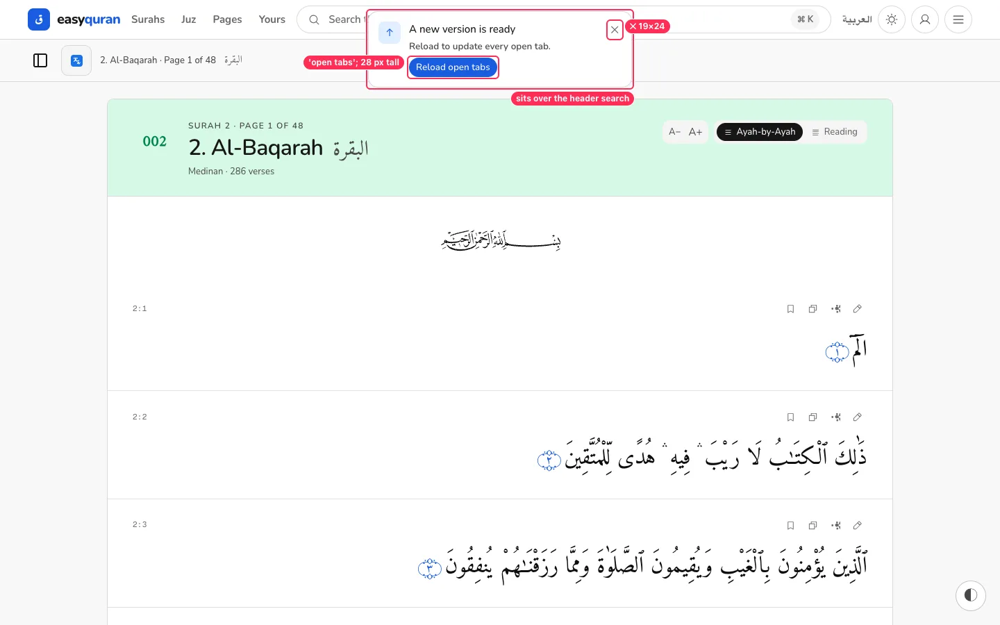

(Rendered by injecting the component's exact markup — a real service-worker update can't be triggered in this environment.)

**What's wrong.** Both toasts are `fixed top-4` centred, so they sit on top of the header search and would overlap each other if both appear. "Reload open tabs" (127 × 28 px) and the "✕" dismiss (19 × 24 px) are small; "open tabs" is browser vocabulary; icons are text glyphs (↑, ✦); notification body is 12 px and clamped to 2 lines.

**Fix.** Bottom-centre toasts (above any bottom bar), stacked in one region; copy "Update ready — Refresh"; 44 px buttons; `Icon` components; body ≥ 13.5 px.

---

### What works well (keep it)

- **Offline after download:** page 400, a translated page (`/en/app/t/en/sahih/page/10`) and Arabic search (رحمة → 75 results) all worked with the network off (production build).
- **Deep links** `…/page/41#ayah-2-255` scroll to the verse.
- **Copy on phones** shows "Copied" and a check icon.
- **Theme on reload:** the pre-paint script in `app.html` applies the saved theme before first paint; no light/dark flash was observed.
- **Bookmarks and notes survive** "Clear cached pages & data".
