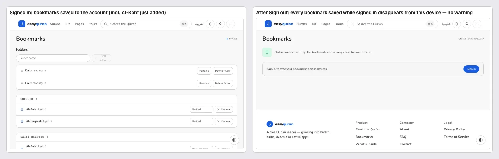
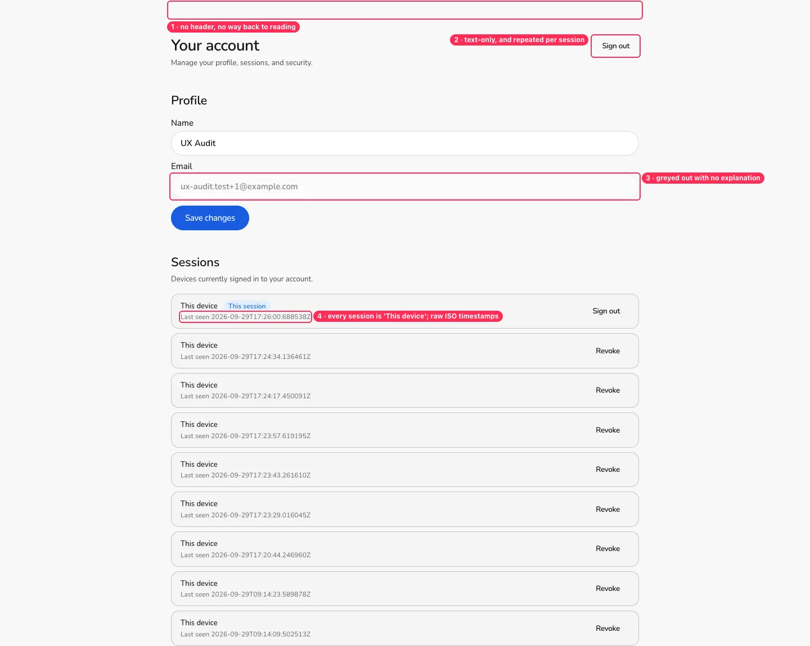
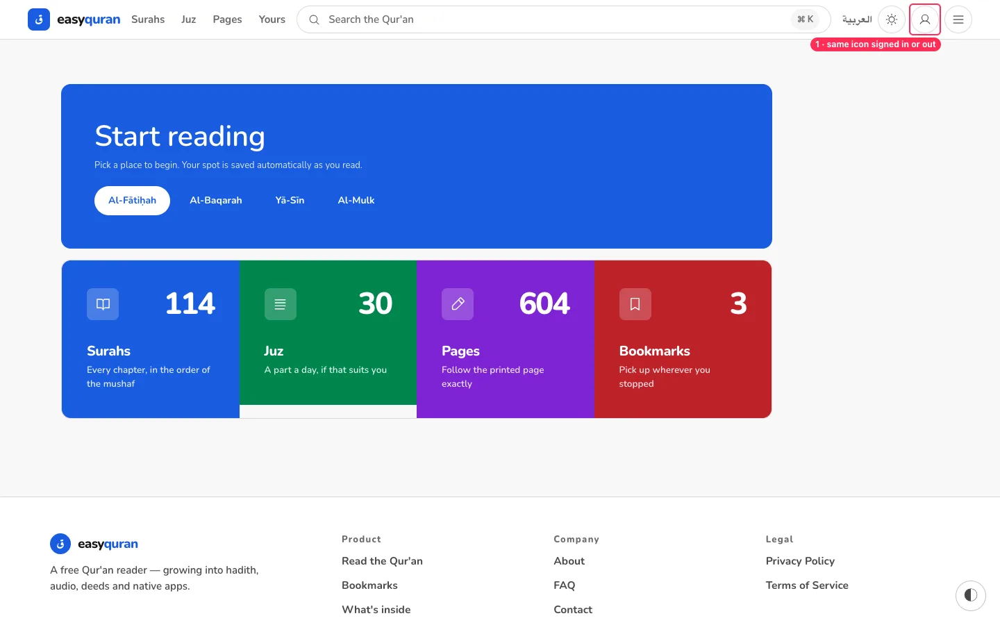
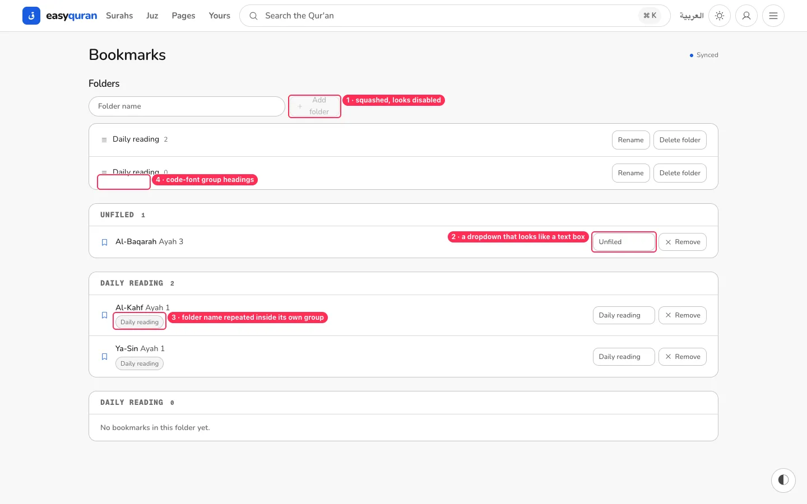
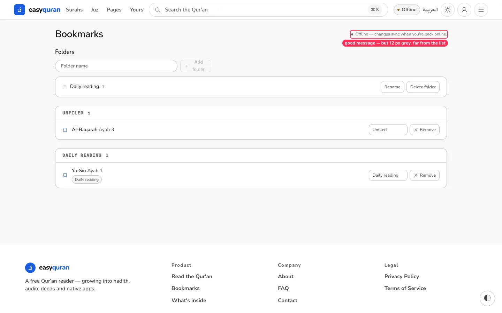
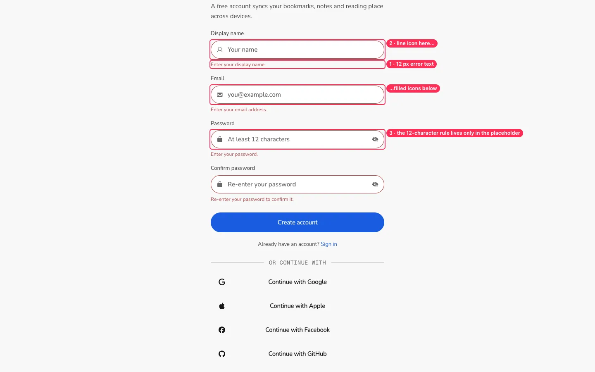
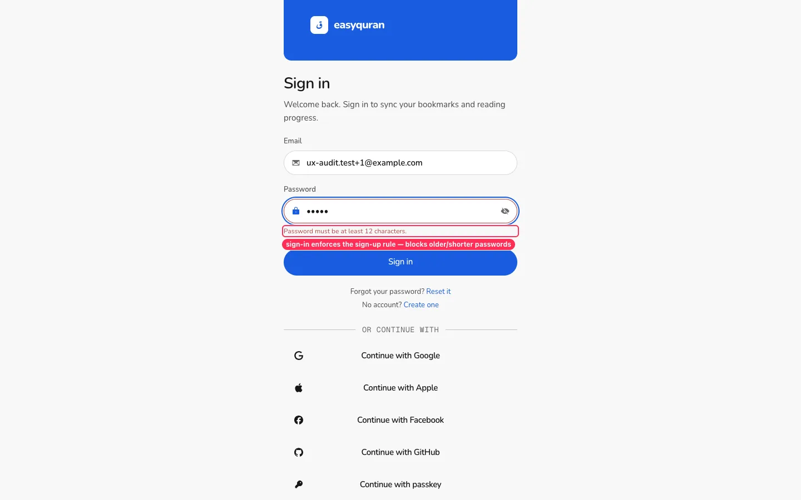
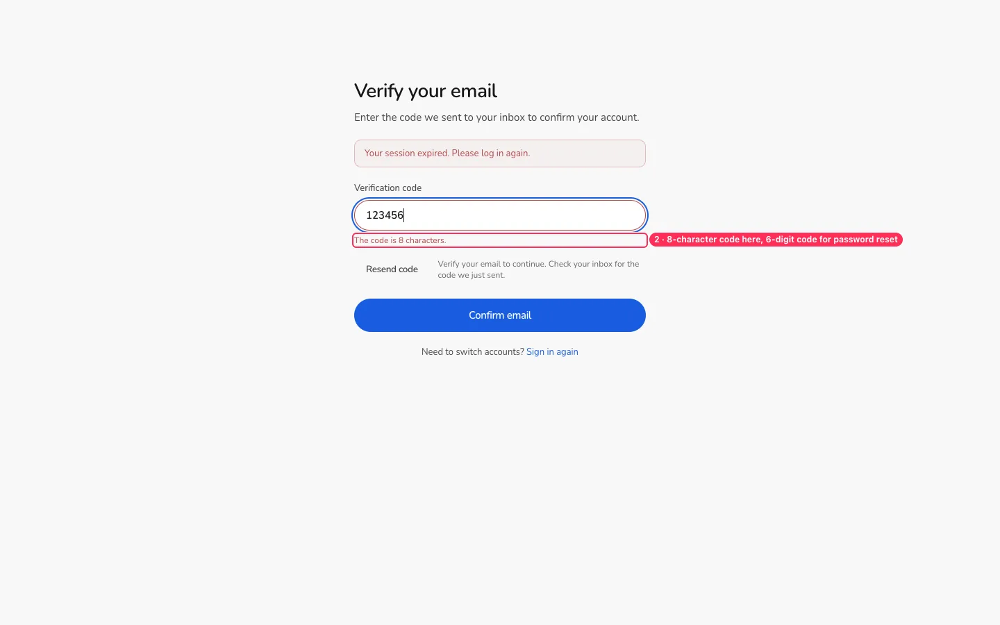
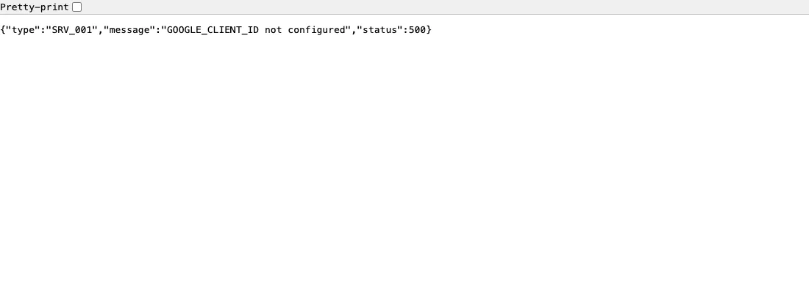

# 20 · Signed-in experience

[← Back to the index](README.md)

> **Question this page answers:** *Once someone creates an account and signs in, is it clear what changed, where their things are, and what happens when they sign out?*

Summary: the core sync works — bookmarks made before signing in are merged into the account, folders can be created, moved and deleted (with an inline confirmation), and offline changes queue with a clear "changes sync when you're back online" message. The rough edges are around the account itself: the Account page is a bare developer screen (every session is "This device" with raw timestamps), signing out silently removes every bookmark made while signed in from the device, nothing in the header shows you're signed in, and auth errors and codes are inconsistent.

**How this was tested.** A clearly fake local account (`ux-audit.test+1@example.com`) was registered through `/register` on the local API. Two environment notes:
- The API's CORS allowlist only includes the default Vite port (`CONSUMER_PORT=5173`), so the audit used a small local proxy on :5173 → the shared dev server; from :5391, registration fails with **"Network error. Check your connection and try again."** even though the server answered 403 (see ACCT-08).
- SMTP and OAuth providers aren't configured locally, so no email arrives. To continue past email verification, **only the test user's row was marked verified** in the local dev database (`rust/data/easyquran.db`, `users.is_verified = 1` for that email). No other data was touched.

---

### ACCT-01 · Signing out silently removes your account bookmarks from the device

**P1** · every signed-in reader · `web/src/lib/bookmarks/store.svelte.ts` (`onAuthChanged`), `web/src/routes/(application)/app/+layout.svelte` (auth effect)

**What's wrong.** While signed in, bookmarks live in the account. After **Sign out**, `/app/bookmarks` shows only whatever was saved locally *before* the first sign-in (or "No bookmarks yet") — everything saved while signed in, and the folders, disappear from the device. Nothing warns about this, and the page is redirected to Sign in, not back to reading. (Tested twice: once with two pre-sign-in bookmarks, which reappeared; once without, which showed an empty list.)

**Why it matters.** To a non-technical reader, "my bookmarks vanished" feels like data loss, even though they are safe on the server.

**Fix.** On Sign out, ask: "Keep a copy of your 3 bookmarks on this device?" (copy into the local store), or at least explain: "Your bookmarks are safe in your account. Sign in again to see them." After sign-out, return to the page the reader was on.

**Done when.** After signing out, the reader either still sees their bookmarks or sees a clear message saying where they are.

---

### ACCT-02 · The Account page is a bare developer screen

**P1** · every signed-in reader · `web/src/routes/(account)/account/+page.svelte`, `web/src/routes/(account)/+layout.svelte`

**What's wrong.**
- No app header or footer, no "Back to reading" — the only exits are the browser Back button or **Sign out**.
- **Every session is labelled "This device"**; each has a raw timestamp like `Last seen 2026-09-29T09:13:25.208354Z`. There is no browser/OS/location, so "Revoke" (jargon) is a guess.
- The email field is greyed out with no explanation ("Email can't be changed yet"?).
- "Sign out" appears top-right as plain text *and* inside the current session card.
- **Save changes**, **Set up 2FA** and **Add a passkey** are all solid primary buttons, competing equally.
- Missing for release: change password, delete account (Privacy promises "delete your account and its data at any time" — see copy-corrections C02). The page is English-only (`/account` has no locale).

**Fix.** Render inside the app layout. Sessions: "Chrome on Mac · Karachi · Active now / 2 hours ago" (`Intl.RelativeTimeFormat`), current device first with "This device", others with "Sign out of this device". One primary action per section. Add "Change password" and "Delete account" (with confirmation). Explain read-only email.

**Done when.** Every session is distinguishable, times are human-readable, and a reader can get back to the Qur'an in one tap.

---

### ACCT-03 · Nothing shows that you're signed in

**P2** · signed-in readers · `web/src/lib/components/nav/Nav.svelte:254-264`, app home metric card

**What's wrong.** The header account button is the same outline person icon whether signed in or out (only its hidden label changes from "Sign in" to "Account"). The home Bookmarks card still shows the empty-state caption "Bookmark an ayah and it appears here" and the word "Yours" even with 3 bookmarks ([HOME-02](02-home.md#home-02--layout-is-lopsided-on-desktop-and-the-juz-card-is-shorter-than-its-neighbours) covers the "Yours" numeral).

**Fix.** Show the reader's initial in a filled circle when signed in (tooltip "Signed in as UX Audit"); give the Bookmarks card the real count and "3 saved · synced".

---

### ACCT-04 · Bookmark folders: squashed add button, disguised dropdowns, repeated labels

**P2** · signed-in readers · `web/src/routes/(application)/app/bookmarks/_components/FoldersPanel.svelte`, `BookmarkRow.svelte`

**What's wrong.** (Signed-in only — anonymous readers get no folders at all, a parity gap worth stating on the Bookmarks page.)
- **Add folder** is a narrow grey button whose label wraps to two lines and looks disabled until you type.
- Each bookmark row has a native `<select>` ("Unfiled" / "Daily reading") styled like a text field, with no chevron — it doesn't read as "move to folder".
- Inside the "DAILY READING" group, every row repeats a "Daily reading" chip.
- Group headings are uppercase code font ([VIS-07](11-visual-consistency.md#vis-07--monospace-and-letter-spacing-where-people-read-words)); the folder row shows a "≡" icon that looks draggable but isn't.
- Signed-in rows (icon + folder picker + "× Remove") and anonymous rows ("Remove" only) look different for the same bookmark.

**What works.** Deleting a folder asks inline: *Delete "Daily reading"? Its bookmarks move to Unfiled.* — clear and safe.

**Fix.** Full-width "New folder" field with a pill **Add** button beside it; replace per-row selects with a "Move to…" menu (folder icon + chevron); drop the redundant chip; one row component for signed-in and anonymous bookmarks.

---

### ACCT-05 · Sync status is good but small

**P3** · signed-in readers offline · `web/src/routes/(application)/app/bookmarks/_components/SyncIndicator.svelte:33`

The states are well worded ("Synced", "Offline — changes sync when you're back online.", "1 change waiting to sync", "Couldn't sync your bookmarks. Retrying automatically…") and they resolve correctly after reconnecting. But they are 12 px grey text top-right, far from the list. Use `text-caption` (13.5 px), and when offline also show a one-line banner above the list.

---

### ACCT-06 · Auth forms: tiny errors, mixed icons, hidden password rule

**P2** · everyone creating an account or signing in · `web/src/lib/auth/components/RegisterForm.svelte`, `SignInForm.svelte`, `AuthField.svelte`, `web/src/lib/auth/schemas.ts`

**What's wrong.**
- Errors are 12 px red text under each field. Focus correctly moves to the first invalid field (good).
- Within one form, Name uses a line icon, Email and Password use filled glyphs ([VIS-01](11-visual-consistency.md#vis-01--four-icon-families-and-two-icon-weights)).
- The "at least 12 characters" rule exists only as placeholder text, which disappears as soon as you type.
- **Sign in** applies the sign-up rule: a short password is rejected client-side with "Password must be at least 12 characters." — that blocks anyone whose password predates the rule and reveals the policy on the wrong form.
- Messages checked: "Enter your display name." / "Enter a valid email address, like you@example.com." / "Passwords do not match." / "Email or password is incorrect." — clear and friendly; keep them.
- All auth copy is hard-coded English (see also [SCR-03](19-remaining-screens-and-flows.md#scr-03--auth-side-pages-look-like-a-different-product)).

**Fix.** Errors at ≥ 13.5 px with an icon; one icon style; show password rules as persistent helper text with a live check; on Sign in, only require "not empty".

---

### ACCT-07 · Verification and reset codes don't match, and the copy talks to strangers

**P2** · new accounts, password resets · `web/src/routes/(auth)/verify-email/+page.svelte:82`, `forgot-password/+page.svelte:113`, `web/src/lib/auth/auth-copy.ts:10`

**What's wrong.**
- Email verification expects an **8-character** code; password reset says "We sent a **6-digit** code". Two code formats for the same kind of step.
- After **Resend code**, a person who has just signed up (and is signed in) is told "*If that account exists and is unverified*, a new verification code has been sent." Enumeration-safe wording is right for anonymous reset requests, not for the owner of the account.
- The old validation error ("The code is 8 characters.") stays on screen after resending.
- After sign-up/sign-in the app always goes to `/app` or `/verify-email`, never back to where the reader started (e.g. Bookmarks).

**Fix.** One code format (6 digits) everywhere, with a segmented code input; signed-in resend copy: "We sent a new code to ux-audit…@example.com"; clear field errors on resend; honour a `return` target after auth ([AUTH-01](13-sign-in-and-account.md#auth-01--no-way-back-from-sign-in--create-account)).

---

### ACCT-08 · Server and configuration errors reach readers raw or mislabelled

**P1 (environment-triggered, production risk)** · `web/src/lib/auth/components/OAuthButtons.svelte`, `web/src/lib/auth/flows.svelte.ts`

**What's wrong.**
- **Continue with Google** (provider not configured locally) navigates the whole tab to `/api/auth/google/v1/login` and shows raw JSON: `{"type":"SRV_001","message":"GOOGLE_CLIENT_ID not configured","status":500}`. The buttons are shown whether or not a provider is configured.
- A registration rejected by the server's origin check (HTTP 403 "CORS origin not allowed") is shown as **"Network error. Check your connection and try again."** — the reader is told to fix their Wi-Fi.

**Why it matters.** In production, any provider outage or misconfiguration would dump a JSON page on a reader; and misleading "network" errors send people troubleshooting the wrong thing.

**Fix.** Only render providers the API reports as enabled (e.g. a `/auth/v1/providers` list); have the OAuth start route redirect to `/auth/[provider]/failure?error=…` on any server error; map HTTP 4xx/5xx to "Something went wrong on our side — please try again later" and reserve "network error" for real fetch failures.

**Done when.** No auth path can show raw JSON, and each error message matches its real cause.

---

### ACCT-09 · Signing in merges local bookmarks — say so, and say what doesn't sync

**P2** · readers signing in for the first time · bookmarks store (legacy migration), sign-in/register copy

**What's wrong.** Two bookmarks saved anonymously (36:1, 67:1) appeared in the account after signing in — good — but nothing told the reader it happened. A **note** saved anonymously ("Heart of the Qur'an") did not move to the account, and reading position/notes are device-only, while Sign in and Register promise "sync your bookmarks and reading progress" / "bookmarks, notes and reading place across devices" (tracked as copy-corrections C01).

**Fix.** After the first sign-in: a toast "2 bookmarks from this device were added to your account." Until notes/position sync ships, word the promise as "Keep your bookmarks safe and on all your devices."

---

### What works well (keep it)

- Anonymous bookmarks are merged into the account on first sign-in.
- Offline changes queue and sync on reconnect, with clear status text.
- Folder delete has an inline, explained confirmation.
- Auth validation messages are plain and specific; focus jumps to the first error.
- "Email or password is incorrect." doesn't reveal which one was wrong.
