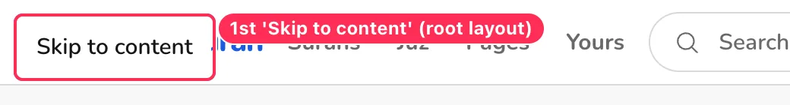
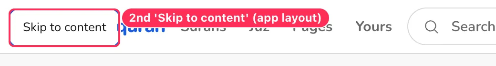
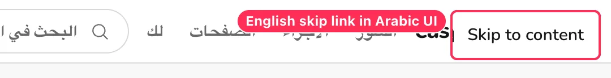
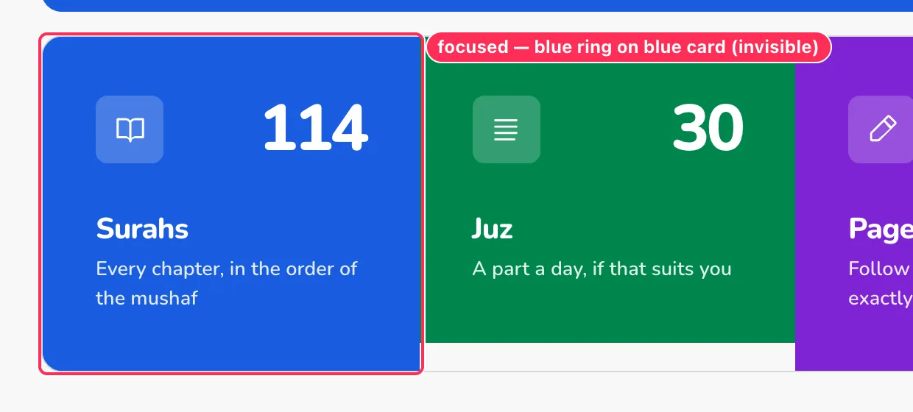

# 21 · Keyboard, focus and screen reader

[← Back to the index](README.md)

> **Question this page answers:** *Can someone who never touches a mouse — or who listens instead of looks — read, move around, and use every overlay without getting lost or interrupted?*

Summary: the foundations are good — visible focus rings almost everywhere, the menu panel is a textbook modal, focus returns to the button that opened most overlays, route changes are announced, and shortcuts even work on Arabic keyboard layouts. The problems are concentrated in the reader: a screen reader is **interrupted with a page announcement every few verses while scrolling**, and a keyboard user has to press Tab **four times per verse** (over 1,100 times in Al-Baqarah) to reach the bottom of a surah. Around those sit smaller gaps: a duplicated skip link, a palette that drops focus, dialogs that leave the page behind them readable, hidden single-key shortcuts, and vague button names.

**How this was checked.** Tab-order walks (recording every stop, its size, and whether a focus ring is drawn) on home, reader, lists, settings, search, bookmarks, Yours and sign-in; open → Tab ×25 → Escape tests on every overlay, opened by click, by keyboard and by hotkey; Chrome's accessibility tree (CDP `Accessibility.getFullAXTree`) for names, roles, landmarks and headings; a mutation observer on SvelteKit's route announcer while scrolling; sign-in form error states. English and Arabic UI, 1440 px and 390 px. Every finding below was reproduced at least twice.

---

### KEY-01 · Screen readers are interrupted with "Page N of 48" while you scroll

**P1** · screen-reader users · long surahs (`/en/app/al-baqarah` etc.) · `web/src/routes/(application)/app/_reader/SurahPageRoute.svelte:38-41, 189` (title includes the active local page) + `SurahReader.svelte:500-520` (`writeHistoryState` → `replaceState`)

**What's wrong.** The document title contains the local page ("Surah 2, Al-Baqarah — Page 3 of 48 · EasyQuran") and is updated every time the reader scrolls across a page boundary. SvelteKit's route announcer (`#svelte-announcer`, `aria-live="assertive"`) speaks the new title each time. Scrolling 12,000 px of Al-Baqarah produced **7 assertive announcements** (page 2 → page 8). The same happens with keyboard scrolling (arrow keys / Page Down).

**Why it matters.** An assertive announcement cuts off whatever the screen reader is reading — here, the Qur'an text or its translation — in the middle of a verse. It makes continuous listening almost impossible.

**Fix.**
- Keep `<title>` stable while scrolling inside a surah ("Al-Baqarah · easyquran"); update only on a real navigation.
- If the local page must stay in the URL for restore, keep it in the URL only (it is already written with `replaceState`), not in the title.
- If a page-change cue is wanted, use a **polite** live region and only when the user moves by keyboard page command, never on free scroll.

**Done when.** A mutation observer on `#svelte-announcer` records 0 changes while scrolling Al-Baqarah from top to page 10.

---

### KEY-02 · Two "Skip to content" links — and in Arabic the first one is English

**P2** · keyboard and screen-reader users · every `/app/*` page · `web/src/routes/+layout.svelte:129-131` and `web/src/routes/(application)/app/+layout.svelte:204-206` (+ the hide rule in its `<style>` block)

**What's wrong.** The first two Tab presses on every app page land on two different "Skip to content" links (127 × 39 and 111 × 35 px). The app layout tries to hide the root one with `body:has([data-reader-root]) > a[href="#main"] { display: none }`, but the root link is not a direct child of `<body>` (SvelteKit wraps the app in a `div`), so the rule never matches. In Arabic UI the first link reads "Skip to content", the second "انتقل إلى المحتوى".

**Fix.** Render the skip link in one place only (the root layout), with localized text from the current locale; delete the second one. If both must stay, fix the selector (`body:has([data-reader-root]) a[href="#main"]:not([data-reader-root] a)`).

**Done when.** The first Tab on `/en/app` and `/ar/app` shows one skip link in the page's language; the second Tab is the logo.

---

### KEY-03 · Every verse adds four Tab stops with identical names

**P1** · keyboard, switch and screen-reader users · reader · `web/src/routes/(application)/app/_reader/VerseTools.svelte:65-111`

**What's wrong.**
- Each verse contributes 4 Tab stops (Bookmark, Copy, Share, Note). Al-Fatihah has 28 before the page navigation; **Al-Baqarah has 286 × 4 = 1,144**, and the surah loads more pages as you go, so the footer and "Next surah" are effectively unreachable by Tab.
- The names do not say *which* verse: the accessibility tree lists "Bookmark this verse" ×7, "Copy ayah" ×7, "Share verse" ×7, "Open note and tafsir" ×7 on Al-Fatihah (the same in Arabic: «إضافة إشارة مرجعية إلى هذه الآية» ×7). A screen-reader user browsing by buttons cannot tell them apart.
- There is no way to jump verse-to-verse or skip to the page navigation.

**Fix.**
- One Tab stop per verse: make each verse row a focusable group (`tabindex="0"`, `aria-label="Verse 2:5"`), with the tools reachable by arrow keys inside it (roving tabindex), or collapse the four tools into one "Verse actions" button (this also solves [RDR-02](03-reader.md#rdr-02--verse-actions-are-tiny-unlabeled-and-ambiguous)).
- Put the verse in every name: "Bookmark verse 2:5", "Copy verse 2:5".
- Add `J`/`K` (or ↓/↑ when a verse is focused) to move between verses, and a skip link "Skip to page navigation" at the top of the reader.

**Done when.** From the top of Al-Baqarah, the page navigation is reachable in under 20 key presses, and no two buttons on a reader page share a name.

---

### KEY-04 · The focus ring vanishes on the blue "Surahs" card

**P2 (WCAG 2.4.7 / 2.4.11)** · keyboard users · `/en/app` · `web/src/routes/(application)/app/+page.svelte:219, 227, …`

**What's wrong.** The home metric cards use `focus-visible:-outline-offset-2 focus-visible:outline-focus-ring`: a 2 px **inset** ring in the primary blue. On the blue Surahs card (hue-1 = the same cobalt) the ring is invisible; on the green/purple/red cards it is barely visible. Tab stop 17 on the home page shows nothing.

**Fix.** On coloured cards use a white inner ring plus an outer primary ring (`outline-primary-foreground` inset + `ring-2 ring-focus-ring ring-offset-2`), or move the outline outside the card (`outline-offset-2`).

**Done when.** Each metric card shows a ring with ≥ 3:1 contrast against both the card and the page ground.

---

### KEY-05 · The search palette drops focus when it closes

**P2** · keyboard and screen-reader users · `web/src/lib/components/search/GlobalSearchPalette.svelte`

**What's wrong.** Open the palette from the header search button (Enter), press Escape: focus lands on `<body>`, not back on the search button. The same happens when it is opened with ⌘K or `/`. (By contrast, the menu panel, sidebar, translations modal and floating panel all return focus to their trigger.) A screen reader then starts again from the top of the page.

**Fix.** Return focus to the element that was focused before opening (bits-ui `Dialog.Content` `onCloseAutoFocus` → `triggerEl.focus()`; for hotkey opens, remember `document.activeElement` at open time).

**Done when.** After Escape, focus is on the header search button (or the element that had focus before the shortcut).

---

### KEY-06 · Three dialogs leave the page behind them readable

**P2** · screen-reader users (especially iOS VoiceOver) · sidebar sheet, translations modal, ⌘K palette

**What's wrong.** These three set `aria-modal="true"` and trap Tab correctly, but the rest of the page is neither `inert` nor `aria-hidden`: with the translations modal open, the accessibility tree still exposes both skip links, the header, the footer and the floating button. The menu panel does this right (`main` gets `inert` + `aria-hidden="true"`). Screen readers that ignore `aria-modal` — and swipe navigation on iOS — can wander behind the dialog.

**Fix.** Apply the same pattern as the menu panel: while any modal is open, set `inert` on the app root's siblings (or use bits-ui's `preventScroll` + a portal root with `inert` on `#svelte > *:not(portal)`).

**Done when.** With each modal open, the accessibility tree contains only the dialog's contents.

---

### KEY-07 · Focus wanders behind the floating appearance panel

**P3** · keyboard users · `web/src/lib/components/tweaks/Tweaks.svelte`

**What's wrong.** The floating panel is a non-modal dialog. After its last control, Tab continues into page controls that sit *underneath* the panel (10 of 25 Tab stops were outside it), so the focused element is hidden. Escape and focus return work.

**Fix.** If the panel is kept (see [RDR-01](03-reader.md#rdr-01--the-floating-appearance-button-covers-the-quran-text-on-phones)), close it when focus leaves it, or make it modal.

---

### KEY-08 · Overlays open on an unhelpful first control

**P3** · keyboard and phone users

| Overlay | First focus | Problem |
| --- | --- | --- |
| Menu panel | "Toggle theme" | Enter/Space — the most likely next key — flips the theme |
| Translations modal | "Close" (✕) | Enter closes the thing you just opened |
| Reader sidebar (phone) | Search field | On a phone this pops up the keyboard and covers half the surah list |
| ⌘K palette | Search field | Correct |

**Fix.** Menu panel → focus the panel container or the first navigation row; translations → the search field; sidebar on touch devices → the sheet container (keep the search autofocus on desktop).

---

### KEY-09 · Keyboard shortcuts are hidden, and some are single keys that can't be turned off

**P2 (WCAG 2.1.4 Character Key Shortcuts, level A)** · keyboard and speech-input users

| Shortcut | Does | Where | Issue |
| --- | --- | --- | --- |
| ⌘/Ctrl K | Open/close search palette | `GlobalSearch.svelte:43` | Shown on the search pill only |
| `/` | Open search palette | `GlobalSearch.svelte:48` | Single key; Firefox uses `/` for quick-find |
| `` ` `` (backtick) | Jump to where you last read | `GlobalSearch.svelte:55` | Single key; undiscoverable; navigates away without warning |
| `T` | Open translations | `TranslationButton.svelte:25` | Single key |
| ⌘/Ctrl , | Open Settings | `app/+layout.svelte:173` | Overrides the browser's own "Settings" shortcut on macOS |
| ⌘/Ctrl B | Toggle reader sidebar | `ui/sidebar/sidebar-provider.svelte:37`, `constants.ts:6` | Hand-rolled `keydown` (against the repo's TanStack-only rule); Firefox uses Ctrl B for its bookmarks sidebar |
| ↑ ↓ PgUp PgDn Home End | Scroll + load more | `SurahReader.svelte:818-836` | Fine |

There is no list of shortcuts anywhere (no "?" help, no Settings section, no tooltip beyond ⌘K). Speech-input users (Voice Control, Dragon) can trigger `T` or `` ` `` by saying words. On the positive side, TanStack falls back to the physical key, so the shortcuts work on Arabic keyboard layouts.

**Fix.**
- Add a "Keyboard shortcuts" dialog on `?` and a matching section in Settings → Reading.
- Add a Settings switch "Single-key shortcuts" (on by default for keyboard users is fine) so `T`, `/` and `` ` `` can be turned off (WCAG 2.1.4).
- Move Ctrl/⌘ B onto `registerHotkey`; drop ⌘ , (or use a two-key sequence) so the browser keeps its own shortcut.
- Confirm before the `` ` `` jump if the reader is mid-surah elsewhere.

**Done when.** Every shortcut is listed in one place, and single-key shortcuts can be switched off.

---

### KEY-10 · Vague or duplicated control names

**P2** · screen-reader and voice-control users

| Control | Accessible name now | Suggested |
| --- | --- | --- |
| Header menu button | "Open panel" | "Menu" |
| Header theme button | "Toggle theme" | "Dark mode" + `aria-pressed`, or "Switch to dark mode" |
| Reader sidebar button | "Toggle Sidebar" | "Browse surahs, juz and pages" |
| Reader translations button | "Translations" | "Translation: Sahih International" (current choice) |
| Translation chips | "Remove", "Move up", "Move down" (×N) | "Remove Urdu — Jalandhry", "Move Urdu — Jalandhry up" |
| Primary badge in chip | a button named "The translation used when reading mode shows one." | Plain text "Main" with the explanation as `aria-describedby` |
| Language rail rows | "Arabic العربية 2" | "Arabic (العربية), 2 translations" |
| Verse tools | "Bookmark this verse" ×286 | See [KEY-03](#key-03--every-verse-adds-four-tab-stops-with-identical-names) |
| Logo | "EasyQuran · home" | "easyquran — home" (brand spelling, [VIS-11](11-visual-consistency.md#vis-11--terminology-drifts-between-screens)) |
| Yours quick pills | "Surahs", "Juz", "Pages", "Bookmarks" (duplicate the header) | Fine once `aria-current` exists; or drop them |

---

### KEY-11 · English accessible names in the Arabic UI

**P2** · Arabic screen-reader users · extends [RTL-01](10-arabic-and-rtl.md#rtl-01--app-home-hero-and-continue-card-are-english)–[RTL-03](10-arabic-and-rtl.md#rtl-03--surah-list-metadata-is-english-in-arabic-ui)

In `/ar/app/*` the accessibility tree still contains: "Skip to content", "EasyQuran · الرئيسية", "السورة التالية: Al-Baqarah" (next-surah link), the home chips "Al-Fātiḥah / Al-Baqarah / Yā-Sīn / Al-Mulk", every surah-list link ("99 Az-Zalzalah · Az-Zalzala The Earthquake · Medinan · 8 verses الزلزلة"), the reader region "Al-Fatihah، الصفحة 1 من 1" and the tab title "السورة 1، Al-Fatihah · EasyQuran". An Arabic screen reader switches voice mid-phrase or mispronounces these.

**Fix.** Use Arabic surah names in every Arabic-UI label and title; mark any remaining Latin fragment with `lang="en"`.

---

### KEY-12 · Heading outline gaps

**P2** · screen-reader users navigating by headings

| Page | Headings in DOM order | Gap |
| --- | --- | --- |
| Home | h2 Start reading · h2 Product · h2 Company · h2 Legal | No h1 ([HOME-06](02-home.md#home-06--no-page-title-h1)) |
| Surah reader | h1 1. Al-Fatihah · h2 (sr-only) "Al-Fatihah, page 1 of 1" | OK; the sr-only h2 repeats the h1 |
| Page / Juz reader | h1 "Page 1" / "Juz 1" only | Surah groups inside a juz ("1. Al-Fatihah … Full surah →") are not headings, so you cannot jump between surahs in a juz |
| Settings | h1 · h2 Storage · h3 × 4 | Good |
| Search, Bookmarks, Yours | h1 only | Result groups and "Continue reading"/"Bookmarks" sections should be h2 (Yours uses `h2` only when data exists) |

**Fix.** Make range-reader surah headers `<h2>`; drop the duplicate sr-only h2 in the surah reader; give search result groups `<h2>`.

---

### KEY-13 · Browser tab titles follow five different patterns

**P3** · everyone with several tabs; screen-reader users (titles are announced on every navigation)

| Page | Title |
| --- | --- |
| App home | `Home` (no brand) · Arabic: `الرئيسية` |
| Surah list | `Surah index — Qur'an · EasyQuran` |
| Surah reader | `Surah 1, Al-Fatihah · EasyQuran` → `Surah 18, Al-Kahf — Page 2 of 12 · EasyQuran` |
| Juz reader | `Juz 3 (2:253–3:92) — Qur'an · EasyQuran` |
| Page reader | `Page 1 (1:1–1:7) — Qur'an · EasyQuran` |
| Yours | `Yours — Qur'an · EasyQuran` |
| Settings | `Settings · EasyQuran` |
| Sign in / Register | *(empty)* — [A11Y-05](09-accessibility.md#a11y-05--duplicate-and-nested-landmarks-missing-page-titles) |

**Fix.** One pattern: `{What} · easyquran` — "Al-Kahf · easyquran", "Juz 3 · easyquran", "Page 1 · easyquran", "Surahs · easyquran", "easyquran" for home. No code ranges, no local page numbers (see KEY-01).

---

### KEY-14 · The verse note button doesn't say it opens a panel

**P3** · screen-reader users · `VerseTools.svelte:103-109`

The "Open note and tafsir" button toggles a panel below the verse but has no `aria-expanded`/`aria-controls`, and nothing is announced when the panel appears. Add both attributes and give the panel `id`, `role="region"`, and an accessible name ("Note for verse 2:1").

---

### KEY-15 · Sign-in errors: well built, two gaps

**P3** · `/login` · `web/src/lib/auth/components/SignInForm.svelte`

**Good:** empty/invalid submit sets `aria-invalid="true"`, links each message with `aria-describedby`, announces via `role="alert"`, and moves focus to the first invalid field.

**Gaps:**
- The sign-in form shows **"Password must be at least 12 characters."** — a *registration* rule. A returning user with an older, shorter password is told their password is invalid before the server is asked.
- After a server error (seen locally as "Network error. Check your connection and try again."), focus falls back to `<body>`; move it to the error message.

---

## What already works (keep it)

- Visible 2 px focus ring on almost every control (except KEY-04).
- Menu panel: modal, Tab-trapped, background `inert` + `aria-hidden`, Escape closes, focus returns to the menu button.
- Sidebar, translations modal and floating panel return focus to their trigger on Escape; hotkey-opened translations return focus to the verse button you were on.
- Route changes are announced (SvelteKit announcer) and focus resets to the top on navigation.
- Landmarks are labelled (Primary, Product/Company/Legal, Settings sections, Surah navigation).
- Verse text is marked `lang`/`dir` per script; in the DOM the verse text comes before its tools, so screen readers read the verse first.
- Shortcuts use the physical key, so they work on Arabic keyboard layouts.
- Reduced motion: a global rule in `layout.css:934` shortens all animations.

## Tab order reference (home, 1440 px)

1–2 Skip to content ×2 · 3 logo · 4–7 Surahs, Juz, Pages, Yours · 8 search · 9 العربية · 10 theme · 11 account · 12 menu · 13–16 hero chips · 17–20 metric cards · 21–28 footer links · 29–30 credits · then the floating appearance button last.
