# 22 · Translations deep dive

[← Back to the index](README.md)

> **Question this page answers:** *Beyond the basics in [04 · Translations](04-translations.md): does every kind of translation — right-to-left, commentary, transliteration, stacked, empty — display correctly, and does the picker help people choose among 378 translations in 105 languages?*

Summary: the engine is capable — right-to-left translations align and are tagged correctly, up to five extras stack on surah, page and juz readers, reading mode explains its one-translation rule, and search understands native language names. But four things need fixing before release: **Arabic commentary (tafsir) chosen as the main "translation" sits exactly where the Qur'an text goes**, the **transliteration shows raw HTML tags**, the picker **lists the same translators twice** under different names, and the chosen-translation chips hide most of the choices. Smaller issues: switching translation loses your place, the serif font forgets itself, empty verses look broken.

**How this was checked.** Every translation type opened as the main text and as a stacked extra, in English and Arabic UI, at 1440 px and 390 px: `ur.jalandhry`, `fa.makarem`, `ar.muyassar` (tafsir), `en.transliteration`, the four known empty verses (`fa.safavi` 80:39, `ku.asan` 108:3, `sq.mehdiu` 21:56 & 77:14), five stacked on a phone, page and juz readers with extras, reading mode with extras, translation size 13 and 28 px, serif font, the longest verse (2:282). The picker was driven by mouse and keyboard: search, the 5-extra cap, reorder, remove, clear, primary switching, Done vs ✕. All with the API running.

---

### TRX-01 · Arabic commentary chosen as the main translation looks like Qur'an text

**P0** · everyone, especially Arabic readers · `/en/app/al-baqarah/t/ar/muyassar`, `/…/t/ar/jalalayn` · `VerseRow.svelte:95-101`, `TranslationModal.svelte` (Arabic group lists tafsir as translations) · extends [TR-01](04-translations.md#tr-01--picking-a-translation-removes-the-arabic-text-and-the-bismillah) and [TR-03](04-translations.md#tr-03--the-translation-picker-opens-on-arabic-tafsir-uses-flags-and-says-primary)

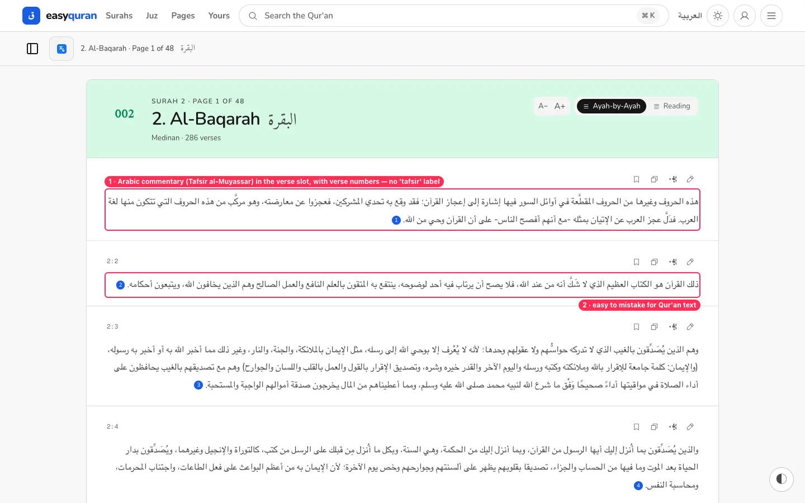

**What's wrong.** The picker files *Tafsir al-Muyassar* and *Tafsir al-Jalalayn* under "Arabic" translations (and opens on that group). Choosing one as the main text replaces the Qur'an verses with Arabic commentary paragraphs, right-aligned, with the same verse-number markers, and nothing on the page says "commentary". Because the real Arabic is hidden on translated routes ([TR-01](04-translations.md#tr-01--picking-a-translation-removes-the-arabic-text-and-the-bismillah)), the commentary is the only Arabic on screen.

**Why it matters.** A reader can take a scholar's explanation for the words of the Qur'an. For a Qur'an app this is the most serious possible content mix-up.

**Fix.**
- Treat tafsir as its own kind: a **"Commentary (tafsir)"** section in the picker, never offered as the main text.
- If shown stacked, render it under the Arabic verse in a visibly different block, labelled "Tafsir al-Muyassar (commentary)", in the UI font, never in the Qur'an font or position.
- Block `/t/ar/muyassar` and `/t/ar/jalalayn` as primary routes (redirect to the Arabic reader with the tafsir stacked).

**Done when.** No route shows commentary in the verse position, and every tafsir line carries the word "commentary"/"تفسير".

---

### TRX-02 · The transliteration shows raw HTML tags

**P1** · readers who can't read Arabic script (a large group for transliteration) · `/en/app/al-fatihah/t/en/transliteration` · `VerseRow.svelte:95-101` (text rendered verbatim)

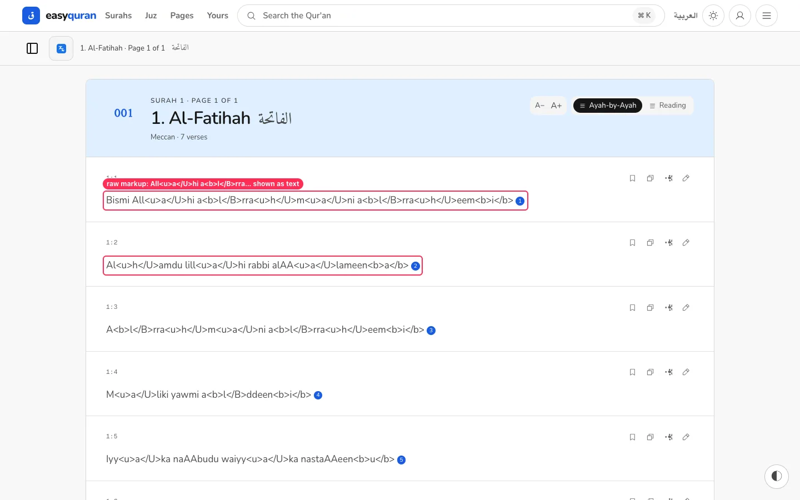

**What's wrong.** The Tanzil transliteration marks long vowels and assimilated letters with `<u>…</U>` and `<b>…</B>`. The reader prints them as text: *"Bismi All&lt;u&gt;a&lt;/U&gt;hi a&lt;b&gt;l&lt;/B&gt;rra&lt;u&gt;h&lt;/U&gt;m…"*. Every verse is unreadable. (The same text goes into copy/share output.)

**Fix.** The source data is immutable (repo rule) — fix it in the view, the same way Tajweed markup is parsed (`lib/quran/view/tajweed.ts`): parse the `<u>`/`<b>` runs (case-insensitive closing tags) into styled spans (underline = long vowel, bold = silent/assimilated letter, or a single consistent style) and strip them in copy text. Add a legend line "underlined = stretch the vowel".

**Done when.** No `<` or `>` character appears in any rendered or copied transliteration verse.

---

### TRX-03 · The same translator is listed twice, and some languages twice

**P1** · everyone choosing a translation · catalogue grouping in `TranslationModal.svelte:125-153` (`buildGroups`)

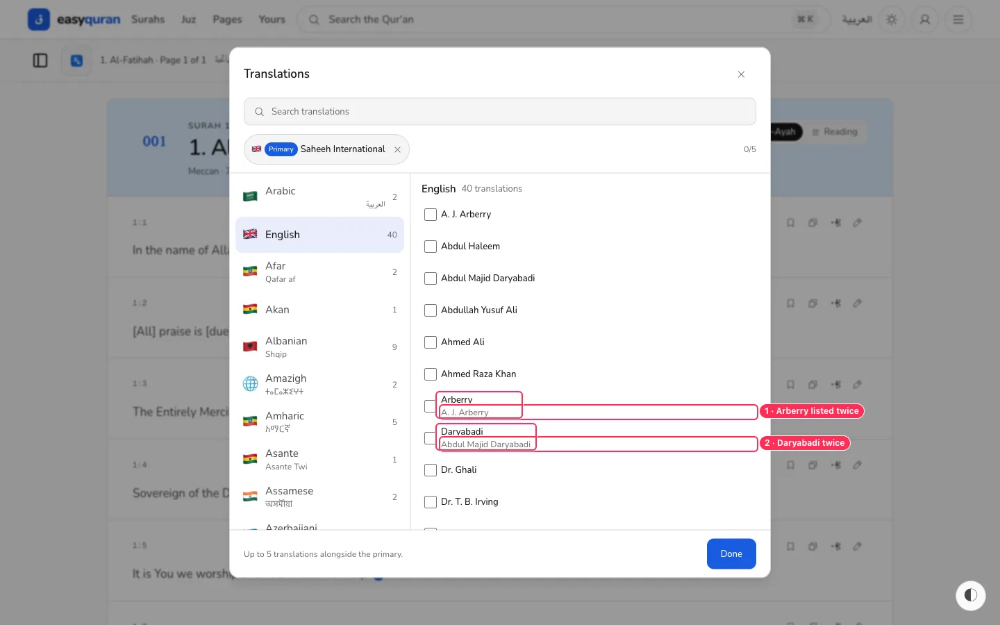

**What's wrong.** The catalogue merges two sources (Tanzil and QUL/Tarteel) without de-duplicating:
- English: **A. J. Arberry** and **Arberry (A. J. Arberry)**; **Abdul Majid Daryabadi** and **Daryabadi (Abdul Majid Daryabadi)**; **Pickthall** twice; French **Muhammad Hamidullah** twice.
- Languages split in two: **Azerbaijani (Azərbaycanca, 3)** and **Azeri (Azərbaycanca, 2)**; **Divehi (1)** and **Divehi, Dhivehi, Maldivian (2)**.

**Why it matters.** People can't tell which one to pick, may stack the same translation twice, and the counts ("English 40") overstate the choice.

**Fix.** De-duplicate at catalogue build time by (language, translator): keep one entry (prefer the source with better metadata), and keep the other id as an alias so old links still work. Normalise language names (ISO 639 code → one display name).

**Done when.** No translator appears twice within a language, and each language appears once in the rail.

---

### TRX-04 · Picker search misses common spellings

**P2** · everyone · `TranslationModal.svelte` search

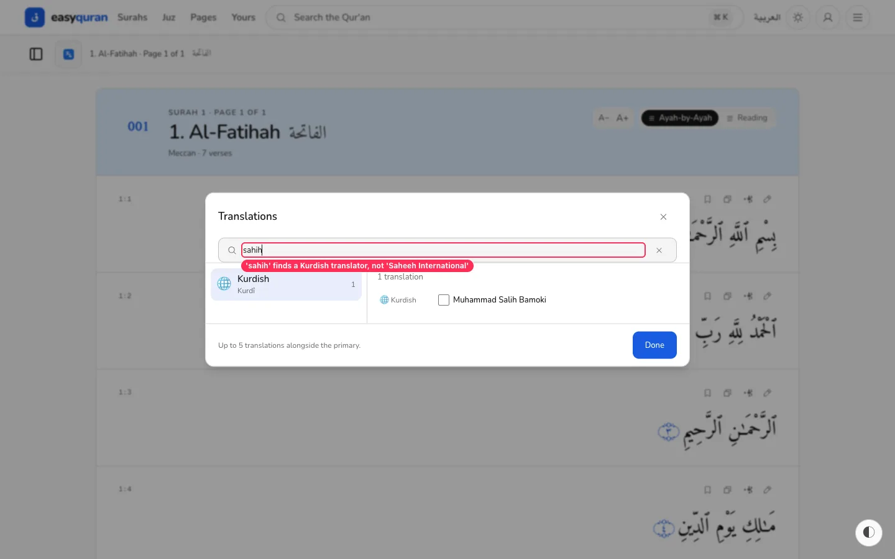

| Query | Result |
| --- | --- |
| `sahih` (how most people spell it) | only *Muhammad Salih Bamoki* (Kurdish) — **Saheeh International** not found |
| `pikthal` | "No translations match your search." |
| `tafsir` | 2 hits; *تفسير الميسر* is not found |
| `urdu`, `اردو`, `Français`, `Pickthall`, `jalal` | work |

**Fix.** Add aliases for well-known names (Sahih/Saheeh, Yusuf Ali/Yusufali, Pickthall/Pickthal, Hilali-Khan/Muhsin Khan), match accent- and case-insensitively, and allow small typos (edit distance ≤ 1 for queries ≥ 5 letters). Search both the Latin and native titles ("tafsir" ↔ "تفسير").

---

### TRX-05 · The chosen-translation chips hide most of your choices

**P2** · phone users especially · `TranslationModal.svelte:385-495`

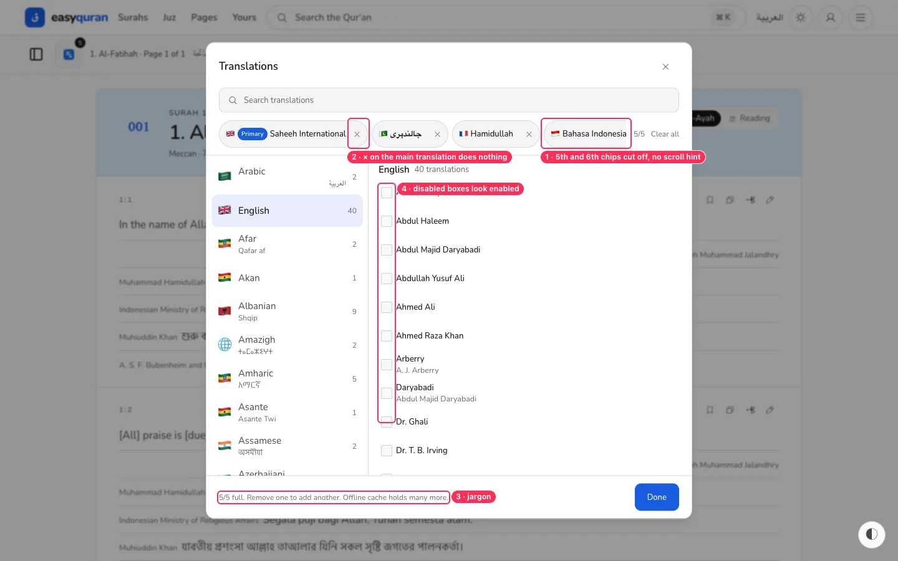

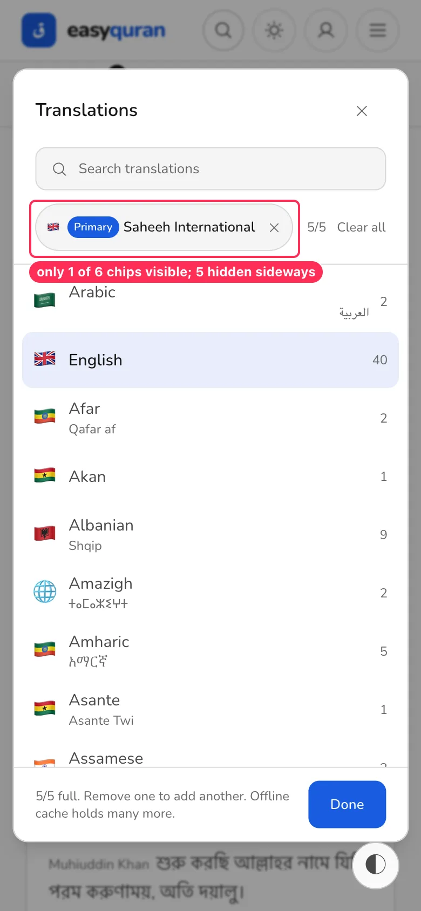

**What's wrong.** The selected translations sit in a single horizontally scrolling row. With five extras, the desktop shows four chips and cuts the fifth mid-word; on a phone only the main chip is visible, with no fade or arrow to show there is more. To remove or reorder an extra on a phone you have to discover sideways scrolling.

**Fix.** Wrap chips onto two lines (max ~2 rows), or show a compact "Main: Saheeh International · +5 more ▾" summary that expands into a vertical, reorderable list. Add an edge fade if horizontal scroll stays.

**Done when.** All selected translations are visible (or clearly counted and one tap away) at 390 px.

---

### TRX-06 · The × on the main translation does nothing; "Primary" is a mystery button

**P2** · everyone · `TranslationModal.svelte:255-258, 404-420`

**What's wrong.** The main (primary) chip has the same × as the extras, but clicking it calls `remove(primaryId)`, which is a no-op — nothing happens (reproduced with script and real mouse). The blue "Primary" badge is a button whose accessible name is "The translation used when reading mode shows one."

**Fix.** Remove the × from the main chip, or make it do something explicit ("Show Arabic only"). Make "Primary" plain text ("Main") with a tooltip; rename the concept to "Main translation" everywhere ([15 · Plain language](15-plain-language-copy.md)).

---

### TRX-07 · At the 5-translation cap, disabled boxes look enabled and the message is jargon

**P3** · `TranslationModal.svelte:507, 800-806`

When 5 extras are chosen, every other checkbox is disabled, but they look almost identical to enabled ones (see the screenshot in TRX-05), so taps seem to do nothing. The footer says *"5/5 full. Remove one to add another. Offline cache holds many more."* — the last sentence is internal. **Fix:** grey out the rows (label at `--muted`, 50% opacity), show a lock/"Full" hint on tap, and end the message after "Remove one to add another."

---

### TRX-08 · Changes apply instantly; "Done" and ✕ are the same thing

**P3** · `TranslationModal.svelte:810`

Ticking a box updates the URL and the reader immediately; Escape, ✕ and "Done" all just close. That's fine (and fast), but "Done" suggests a save step and there's no way to back out of several changes. **Fix:** keep live apply, drop one of the two close controls (keep "Done" at the bottom on phones), and add "Undo" in the toast that confirms the change ("Added Urdu — Jalandhry · Undo").

---

### TRX-09 · Switching the main translation mid-surah loses your place

**P2** · readers comparing translations · translated surah routes · `TranslationModal.svelte:287-295` (`onPrimary` → navigation)

**What's wrong.** Reading English (Sahih) at **2:43** (local page 6), then choosing "Switch to this translation: Abdul Haleem" lands at **2:30** (page 5) — about a page earlier. Reproduced twice. The new URL is `/en/app/al-baqarah/t/qul/r85.en-haleem/page/5`: the translator slug is an internal id (`qul/r85.en-haleem`), not a readable name.

**Fix.** Carry the current verse anchor through the switch (`#ayah-2-43`) and restore to it; give QUL translations readable slugs (`/t/en/haleem`) with the id kept as an alias.

**Done when.** Switching translation keeps the same verse at the top of the screen.

---

### TRX-10 · The serif translation font is forgotten after a reload

**P2** · readers who prefer serif · `web/src/lib/stores/reader-persistence.svelte.ts:143-157` (`applyPersisted` has no `translationFamily`)

**What's wrong.** Settings → Reading → Translation font → **Serif** applies immediately and survives in-app navigation. After a page reload, translations are back in Nunito (`--reader-translation-family` resets), while the Settings page still shows the choice. Arabic font and both sizes persist correctly. Reproduced twice. The persisted blob (`easyquran.reader`) has no translation-family field and `applyPersisted` never restores it.

**Fix.** Persist and restore `translationFamily` like `arabicFont`; also apply it in the `app.html` pre-paint script so there is no flash.

**Done when.** Serif survives a reload and a new tab.

---

### TRX-11 · Verses with no translation text look broken

**P2** · readers of `fa.safavi`, `ku.asan`, `sq.mehdiu` · `VerseRow.svelte:95-101`

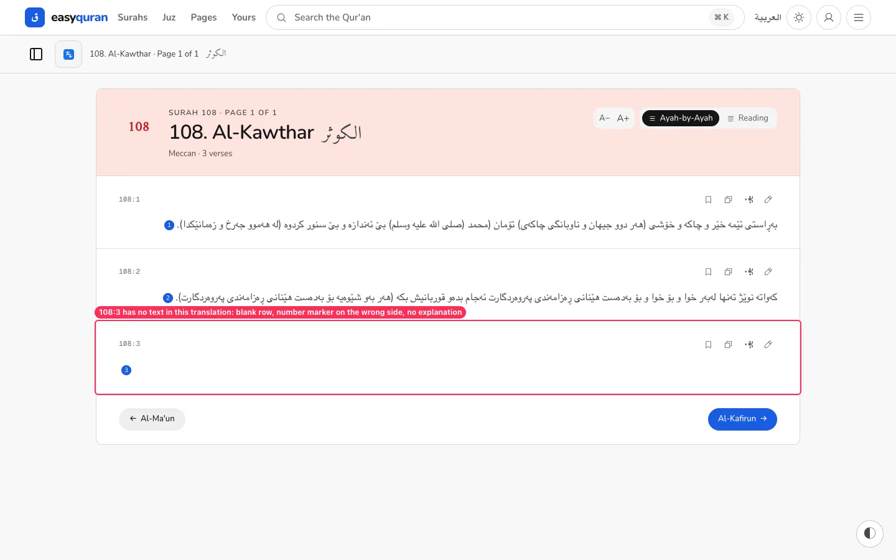

**What's wrong.** The four verses that are blank in the source ([docs/research/translation-empty-verses.md](../translation-empty-verses.md)) render as an empty row containing only the blue number bubble. Because the text is empty, `dir="auto"` falls back to left-to-right, so in these right-to-left translations the number jumps to the **left** edge, unlike every other row.

**Fix.** Follow option 1 of that research note: show the Arabic verse with a small line "No translation for this verse in {translator}." Set `dir` from the translation's declared direction, not `auto`, so markers stay on the correct side.

---

### TRX-12 · Right-to-left translations are set like English

**P2** · Urdu, Persian, Kurdish, Pashto readers · extends [TR-05](04-translations.md#tr-05--extra-language-lines-are-small-and-use-a-generic-font)

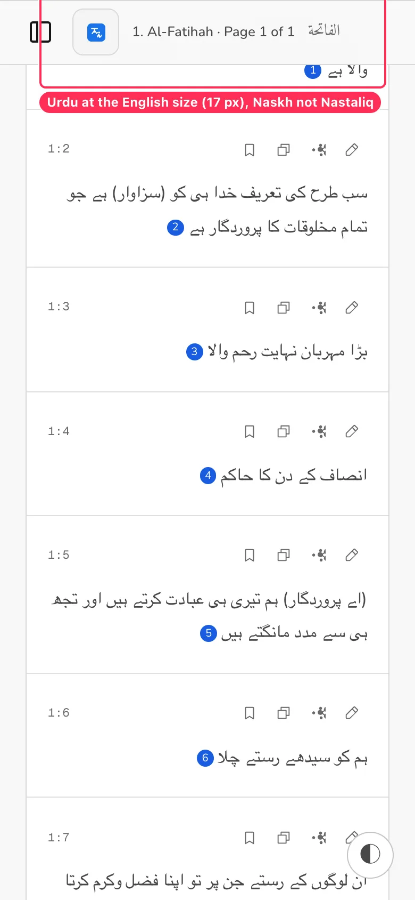

Urdu and Persian as the main text are correctly right-aligned (`dir="auto"`, `lang="ur"`), but use the English translation size (17 px) and the generic Arabic UI face. Urdu readers expect Nastaliq, and all Arabic-script translations need ~1.25× the Latin size to be equally readable. **Fix:** per-script size multiplier (Arabic script ×1.25) and a self-hosted Nastaliq face for `ur` (per the no-CDN rule).

---

### TRX-13 · Stacked credits break right-to-left lines

**P2** · stacked RTL translations · `VerseRow.svelte:118-130` (`.verse-extra-label` inline before the text)

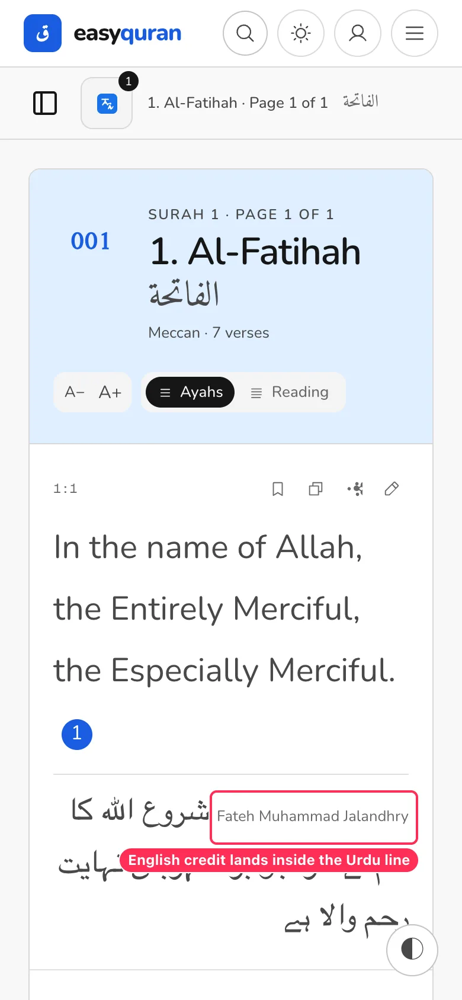

The translator name is an inline Latin label placed before RTL text inside a `dir="rtl"` span. At larger sizes it lands in the middle of the Urdu line, splitting the sentence. **Fix:** put the credit on its own line above the text (small caps, UI font) — or once per page as proposed in [TR-02](04-translations.md#tr-02--the-main-translation-is-never-credited) — and wrap it in `<bdi lang="en">`.

---

### TRX-14 · Five stacked translations on a phone: one verse per screen

**P3** · phone users · `?more=` with 5 ids

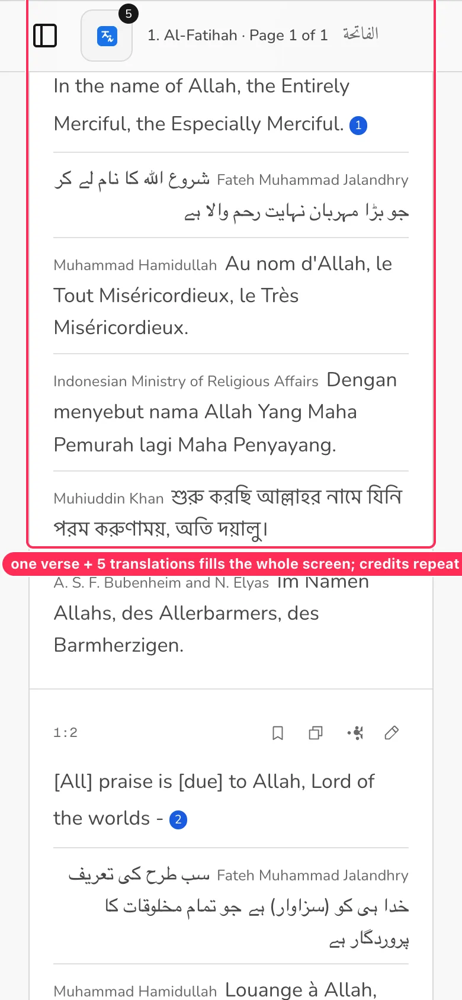

Stacking works, but each extra repeats a long credit ("Indonesian Ministry of Religious Affairs") on every verse, and one verse fills the screen. **Fix:** short language tags per line (EN · UR · FR · ID · BN), full credits once per page, and on phones suggest "Compare" mode for one verse at a time.

---

### TRX-15 · Reading-mode choice dialog: clear, with small inconsistencies

**P3** · `web/src/routes/(application)/app/_reader/ReadingModeDialog.svelte`

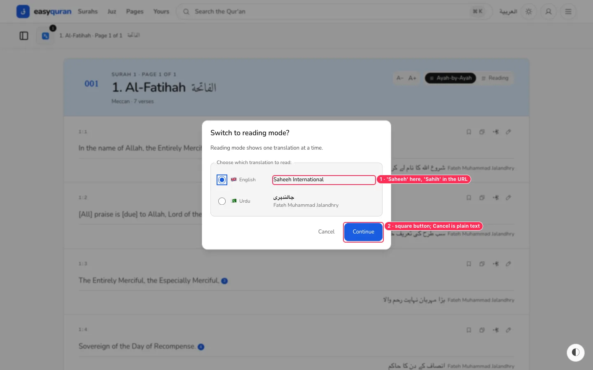

Good: when extras are stacked and you choose Reading, a dialog explains "Reading mode shows one translation at a time" and lets you pick which. Small issues: country flags again ([TR-03](04-translations.md#tr-03--the-translation-picker-opens-on-arabic-tafsir-uses-flags-and-says-primary)), "Saheeh International" here vs `sahih` in the URL and "Sahih" in the docs, and "Continue" is a rounded rectangle while "Cancel" is plain text.

---

### TRX-16 · The row hover card shows technical metadata

**P3** · `TranslationModal.svelte:640-690`

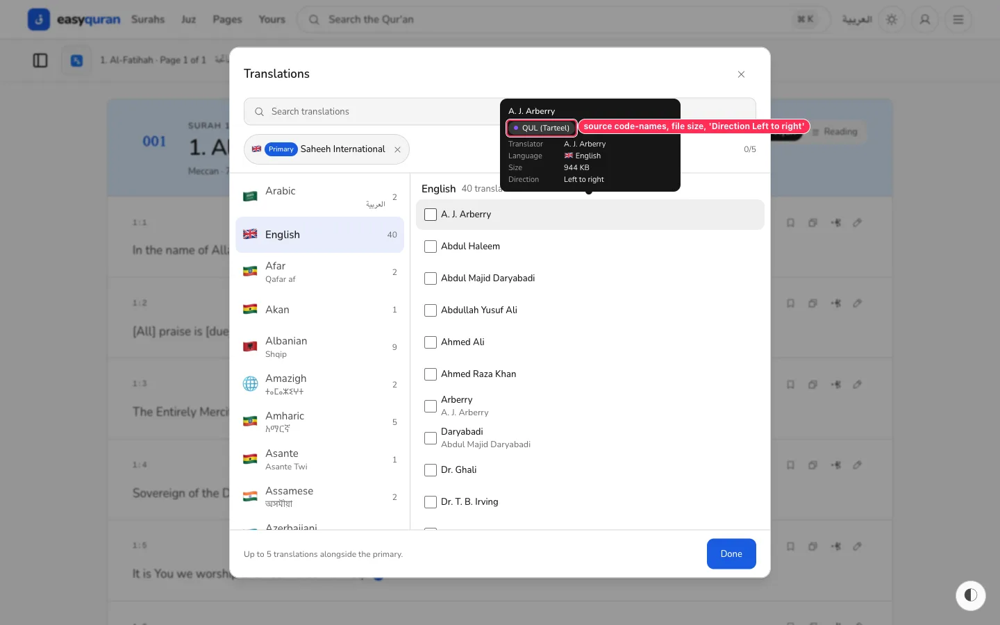

Hovering a translation shows a card with "QUL (Tarteel)", "Size 952 KB", "Direction Left to right". For readers, show: full name, translator, a one-line description ("Modern, easy English"), and "Downloaded" / "Needs internet" instead of the byte size.

---

## What already works (keep it)

- Right-to-left main translations right-align and carry the right `lang`, both in English and Arabic UI.
- Up to 5 extras stack on surah, page **and** juz readers, loaded lazily with skeleton rows.
- Reading mode disables stacking and says why ("Only one translation is shown in reading mode…").
- The cap is enforced and explained; "Clear all" exists.
- Search understands native names ("اردو", "Français") and translator surnames.
- Reorder arrows are 44 px tall and always visible on touch devices.
- Long verses (2:282) wrap cleanly at 390 px.
