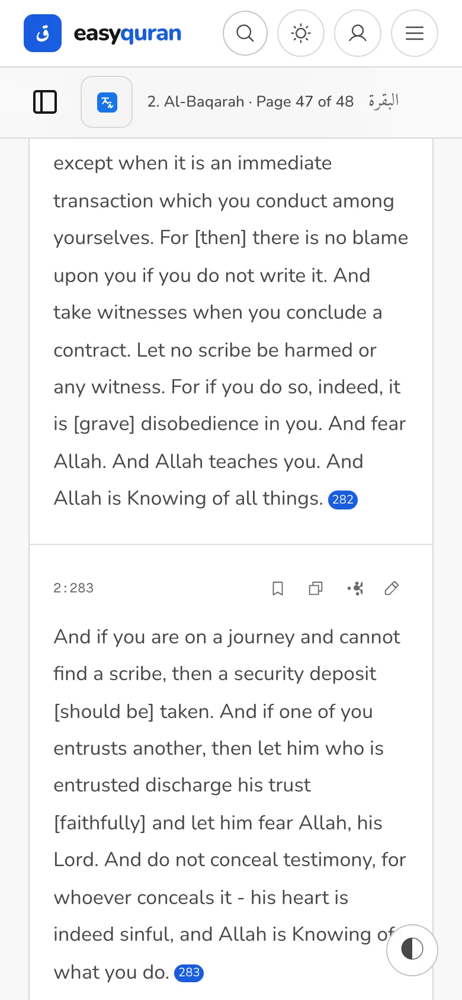
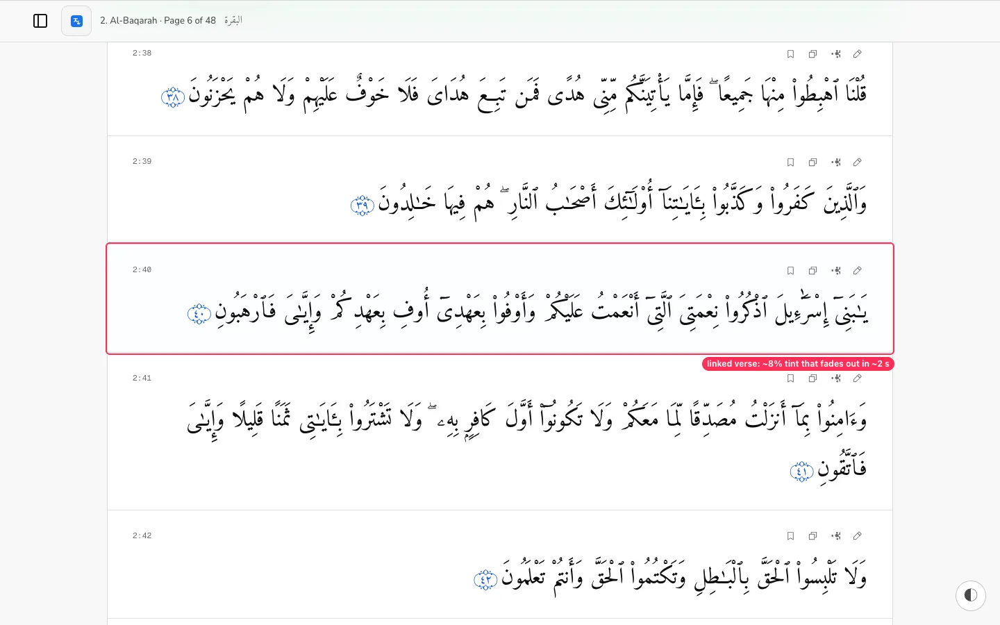
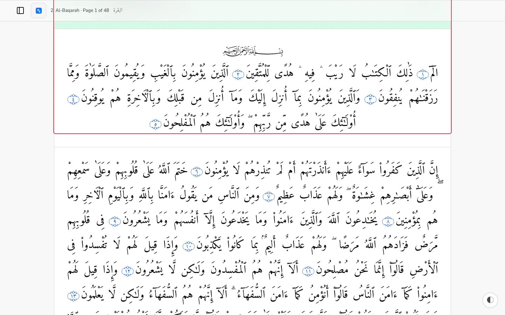
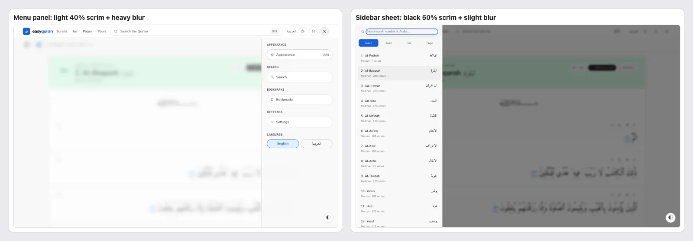
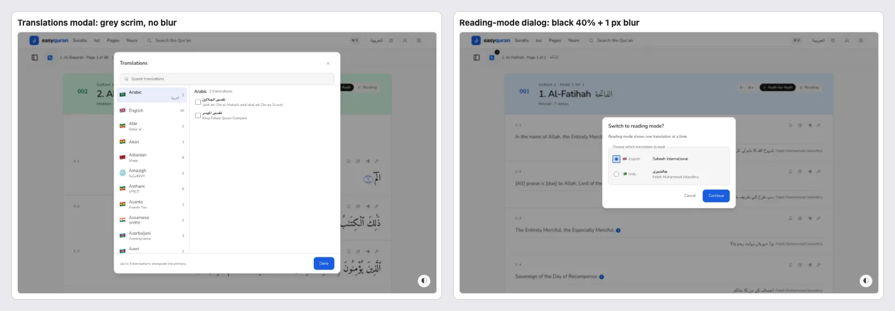
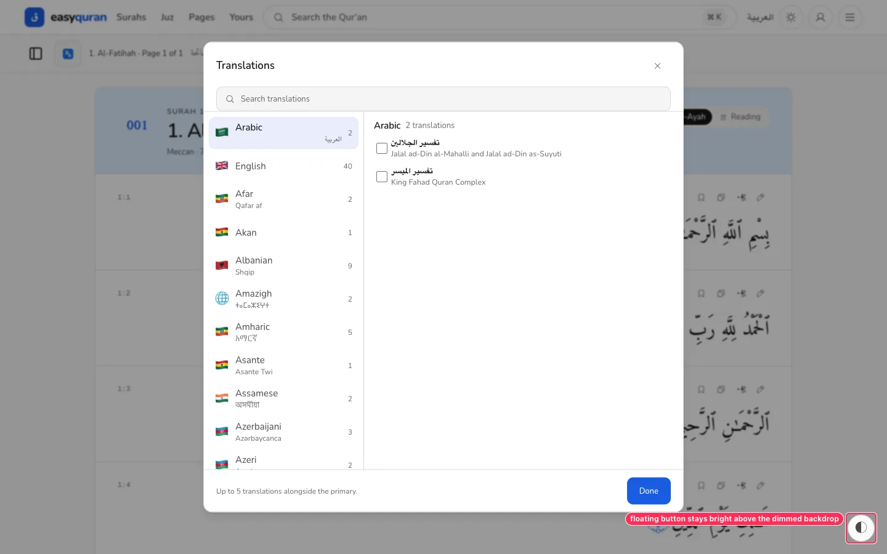
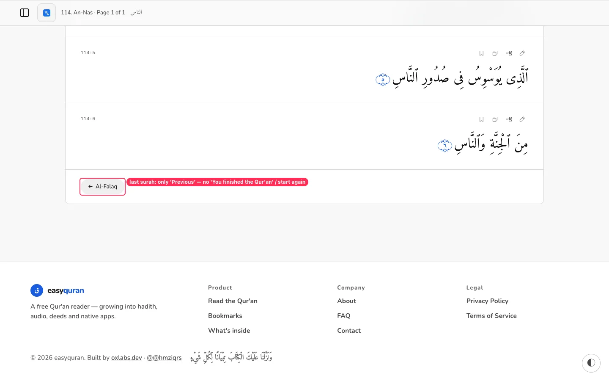

# 23 · Interaction details (the last 10% of polish)

[← Back to the index](README.md)

> **Question this page answers:** *When you tap, hover, scroll, share a link, copy a verse, or reach the end — does the app respond the way a careful product would?*

Summary: the big mechanics are solid — the header hides on scroll and comes back when you scroll up, Back from a surah to the list restores your place, reduced-motion is honoured globally, and Copy gives clear "Copied" feedback. The rough edges: **a shared link to a long verse opens in the wrong place on phones**, the "this is the verse you opened" highlight is nearly invisible, Back after "Next surah" throws you to the top, reading mode removes every verse action, copied text mixes languages, and pressed states, backdrops and loading indicators each come in several styles.

**How this was checked.** Hover/press measured by comparing computed styles before hover, on hover and while the mouse button is held, for ~25 control types; deep links opened cold at 1440 and 390 px and sampled at 0.8 s, 2.5 s and 5 s; Back/Forward after list→reader, Next surah, sidebar picks and scrolling; clipboard contents read after Copy in Arabic, translated, stacked and Arabic-UI routes; slow network (1.5 s latency, 20 KB/s) + 6× CPU throttling during infinite scroll; overlay animation classes read from source. Each finding was reproduced at least twice.

---

### INT-01 · A shared link to a long verse opens in the wrong place on phones

**P1** · anyone who shares or receives a verse link · `/…#ayah-2-282` · `SurahReader.svelte` (history restore / hash scroll), `VerseRow.svelte:77` (`scroll-mt-24`)



**What's wrong.** Opening `/en/app/al-baqarah/t/en/sahih#ayah-2-282` on a 390 px phone leaves the top of verse 2:282 about **757 px above the screen** — the reader sees the last lines of the verse and the next one, and has to scroll up to find the start (reproduced 3 times). On desktop the same link lands with the verse's label pressed right against the sticky bar (row top at 88 px, bar bottom at 117 px). Short verses (2:40 desktop, 18:10 phone) land correctly. The row's `scroll-mt-24` (96 px) is smaller than header + sub-bar (118 px), and the scroll position is computed before the pages above the verse have finished loading and laying out.

**Why it matters.** "Here's the verse I mentioned" is one of the most common ways people share the Qur'an. Landing mid-verse on a phone makes the link look wrong.

**Fix.** After the target page and fonts are ready (`document.fonts.ready` + the reader's page-settled signal), scroll so the **top** of the verse row sits just under the sticky bar (`bar.bottom + 16px`); re-apply once if layout shifts in the next second; set `scroll-margin-top` from the real bar height (CSS variable).

**Done when.** `#ayah-2-282` opens with the start of 2:282 fully visible below the bar at 390 and 1440 px.

---

### INT-02 · The highlight on a linked verse is nearly invisible

**P2** · everyone following a verse link · `.revealed-ayah` keyframes in `web/src/routes/layout.css:849-870`



**What's wrong.** The linked verse gets a tint of about **8% opacity** that fades to nothing within ~2.5 s (sampled: alpha 0.08–0.10 at 0.8 s, 0 at 2.5 s). On a white or near-black page it is hard to see even at its peak, and it's gone before many people have oriented themselves. (Under reduced motion it stays as `--primary-soft`, which is better.)

**Fix.** Use `--primary-soft` plus a 3 px inline-start accent bar, hold it for ~4 s, then fade; keep a small persistent marker next to the verse number until the reader scrolls away.

---

### INT-03 · Back after "Next surah" returns to the top, not where you were

**P2** · readers moving surah by surah · `SurahReader.svelte` (`beforeNavigate` / `restoreHistory`)

**What's wrong.** Scroll to the end of a surah, tap **Next surah**, then press Back: you land at the **top** of the previous surah, not at its end. Reproduced on Al-Ikhlas (631 px → 0), Al-Fātiḥah (975 → 0) and Al-Mulk (1950 → 0). By contrast, Surahs list → reader → Back (5000 px restored) and sidebar pick → Back (3000 px restored in Al-Baqarah) work.

**Fix.** Make sure `writeHistoryState()` runs on the in-page "Next/Previous surah" links for single-page surahs as it does for multi-page ones, and restore the saved anchor on `popstate`.

**Done when.** Next surah → Back returns to the same scroll position in all three test surahs.

---

### INT-04 · Reading mode removes every verse action

**P2** · readers who prefer continuous reading · `VerseTools.svelte:146-150` (`display: none` in reading mode)



**What's wrong.** In reading mode the verse toolbar is hidden with `display: none`. There is no tap, long-press or context menu to bookmark, copy, share or add a note — the only option is switching back to verse mode, finding the verse again, and acting there.

**Fix.** Tapping (or long-pressing) a verse in reading mode opens the same verse action sheet proposed in [RDR-02](03-reader.md#rdr-02--verse-actions-are-tiny-unlabeled-and-ambiguous) for that verse; keyboard users get it by focusing the verse (see [KEY-03](21-keyboard-focus-and-screen-reader.md#key-03--every-verse-adds-four-tab-stops-with-identical-names)).

---

### INT-05 · What "Copy" puts on the clipboard

**P3** · everyone who copies verses · `copyVerse` in `lib/stores/reader-share.svelte.ts:20`, `VerseTools.svelte:33-39`

Measured clipboard contents:

```text
Arabic route, 2:2:
ذَٰلِكَ ٱلْكِتَـٰبُ لَا رَيْبَ ۛ فِيهِ ۛ هُدًى لِّلْمُتَّقِينَ
Al-Baqarah 2:2

Arabic UI (/ar/app/al-baqarah), 2:2:
ذَٰلِكَ ٱلْكِتَـٰبُ لَا رَيْبَ ۛ فِيهِ ۛ هُدًى لِّلْمُتَّقِينَ
Al-Baqarah 2:2                      ← English reference in Arabic UI

English translation route, 2:2:
This is the Book about which there is no doubt, a guidance for those conscious of Allah -
Al-Baqarah 2:2                      ← no Arabic, no translator name

English + Urdu stacked, 1:2:
[All] praise is [due] to Allah, Lord of the worlds -
Al-Fatihah 1:2                      ← the Urdu the reader is looking at is not included
```

**Fix.** Localize the reference ("البقرة ٢:٢" in Arabic UI); in translated views copy **Arabic + the main translation + translator name**; offer "Copy with all shown translations" when extras are stacked; append a short link to the verse (e.g., `easyquran.fyi/app/al-baqarah#ayah-2-2`) — optional, set in Settings. Strip transliteration markup ([TRX-02](22-translations-deep-dive.md#trx-02--the-transliteration-shows-raw-html-tags)).

---

### INT-06 · Pressed feedback exists on only a few buttons; buttons show an arrow cursor

**P3** · touch and mouse users

| Control type | Hover | Pressed |
| --- | --- | --- |
| `ui/button` (Sign in, Continue, Get in touch) | ✓ | ✓ (`active:translate-y-px`) |
| Header icons, A−/A+, mode toggle, verse tools, chips, settings tabs, list cards | ✓ | ✗ |
| Settings "Request again", reader "Translations" button | ✗ (no measurable change) | ✗ |
| Filled hero chip "Al-Fātiḥah" | ✗ | ✗ |

All `<button>`s show the default arrow cursor (Tailwind v4 no longer sets `cursor: pointer` on buttons) while links show the hand, so identical-looking pills behave differently on hover.

**Fix.** One shared "pressable" recipe for every custom control: hover `--surface-hover`, active `translate-y-px` (or `scale-[0.98]`), and add `button:not(:disabled) { cursor: pointer }` to the base layer.

---

### INT-07 · Four different backdrops behind overlays

**P3** · everyone · `Nav.svelte:284-292`, `ui/sheet/sheet-overlay.svelte:15`, `TranslationModal.svelte`, `ReadingModeDialog.svelte`





| Overlay | Backdrop | Enter motion |
| --- | --- | --- |
| Menu panel | `bg-background/40` + `backdrop-blur-sm`; panel `bg-background/95 backdrop-blur-xl` | Svelte `fly` 220 ms |
| Sidebar sheet | `bg-black/50` + `backdrop-blur-xs` | slide 2.5 rem + fade, 200 ms |
| Translations modal | grey scrim, no blur | fade/zoom |
| Reading-mode dialog | `bg-black/40` + 1 px blur | fade/zoom |

`docs/design-system.md` §14 specifies one mode-invariant `bg-black/55` scrim. The heavy blur behind the menu panel also costs frames on low-end phones.

**Fix.** One `Scrim` component (`bg-black/55`, no blur), one enter/exit timing (e.g., 180 ms ease-out), used by all overlays.

---

### INT-08 · The floating button stays on top of open dialogs

**P3** · `Tweaks.svelte` z-index · covered by [RDR-01](03-reader.md#rdr-01--the-floating-appearance-button-covers-the-quran-text-on-phones)



With the translations modal (or sidebar) open, the floating appearance button is not dimmed and sits above the backdrop, so it looks available while a modal is open. Removing the button (RDR-01) fixes this; otherwise put it under the scrim's z-index.

---

### INT-09 · New verses appear before their tools; no "loading more" cue

**P3** · readers on slower phones · `VerseRow.svelte:65-71` (per-row dynamic `import("./VerseTools.svelte")`), `SurahReader.svelte` infinite load

**What's wrong.** Under a slow network and 6× CPU throttling, newly loaded verse rows appeared with an empty 62 px band where the verse number and tools go; the tools popped in a moment later, shifting nothing but flashing. While the next page loads there is no visible or announced "loading" state (no `aria-busy`, no spinner, no skeleton at the end of the list). At the same time a centred pill "Preparing offline Quran· Translation 0%" (missing space) appeared over the reader's sticky bar.

**Fix.** Import `VerseTools` once for the reader (not per row) or render the verse reference statically in `VerseRow`; show three skeleton verse rows at the end while the next page loads and set `aria-busy="true"` on the list; place the download pill below the bar with friendly copy ("Saving the English translation for offline use… 0%").

---

### INT-10 · Loading indicators come in four styles

**P3** · everyone

| Where | Indicator |
| --- | --- |
| `/account`, `/auth/[provider]/success` | Spinning ring using v1 tokens (`border-line-2 border-t-accent`) — `account/+page.svelte:121`, `auth/[provider]/success/+page.svelte:52` |
| Bookmarks, search results | Pulsing grey skeleton (`ui/skeleton`) |
| Stacked translations | Static grey bars (`.verse-extra--skeleton`, no pulse) |
| Offline/download | Pulsing dot + pill (`DownloadBar.svelte:52`, `OfflinePackBar.svelte:24`) |
| Reader first open | Screen-reader-only "Opening the reader…" (nothing visible) |

**Fix.** One `Spinner` (for short waits in buttons/pages) and one `Skeleton` (for content), both on v2 tokens; give the reader's first open a visible skeleton of 3 verse rows.

---

### INT-11 · Finishing the Qur'an has no ending

**P3** · readers completing a khatm · `/en/app/an-nas` · `ReaderPageNav.svelte`



At the end of An-Nās the only control is "← Al-Falaq". Finishing the whole Qur'an is a meaningful moment for many readers. **Fix:** a quiet closing block — "You've reached the end of the Qur'an" · "Start again from Al-Fātiḥah" · (optional) the du'a of completing the Qur'an — and on other surahs keep "Next surah" as the primary action.

---

## What already works (keep it)

- The site header slides away when scrolling down and returns as soon as you scroll up, on every page and width; only a 1 px edge remains.
- Back from a reader to the Surahs list restores the list position (5000 px); Back after a sidebar pick restores the reader position.
- Short-verse links (2:40 desktop, 18:10 phone) land correctly and are highlighted.
- Copy shows an immediate "Copied" tooltip and check icon; Share uses the system share sheet where available.
- `prefers-reduced-motion` shortens every animation site-wide (`layout.css:934`) and keeps the linked-verse highlight static.
- Verse rows have a quiet hover tint; list cards, footer links and tabs all have hover states.
