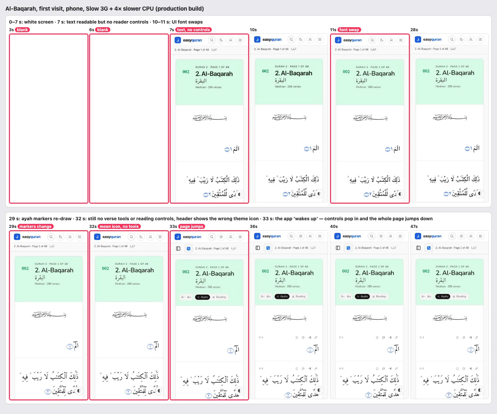
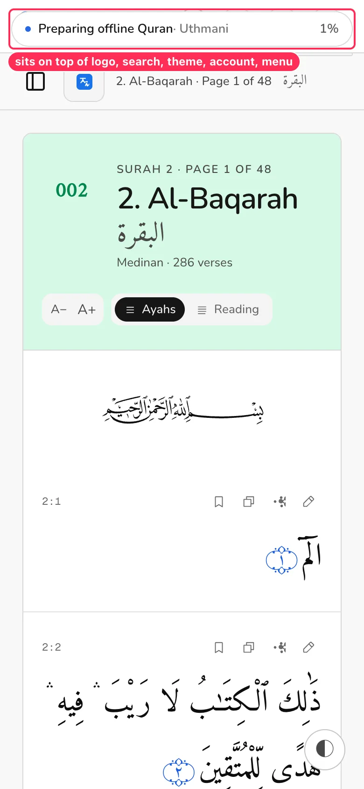
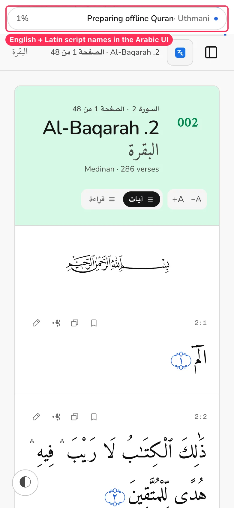
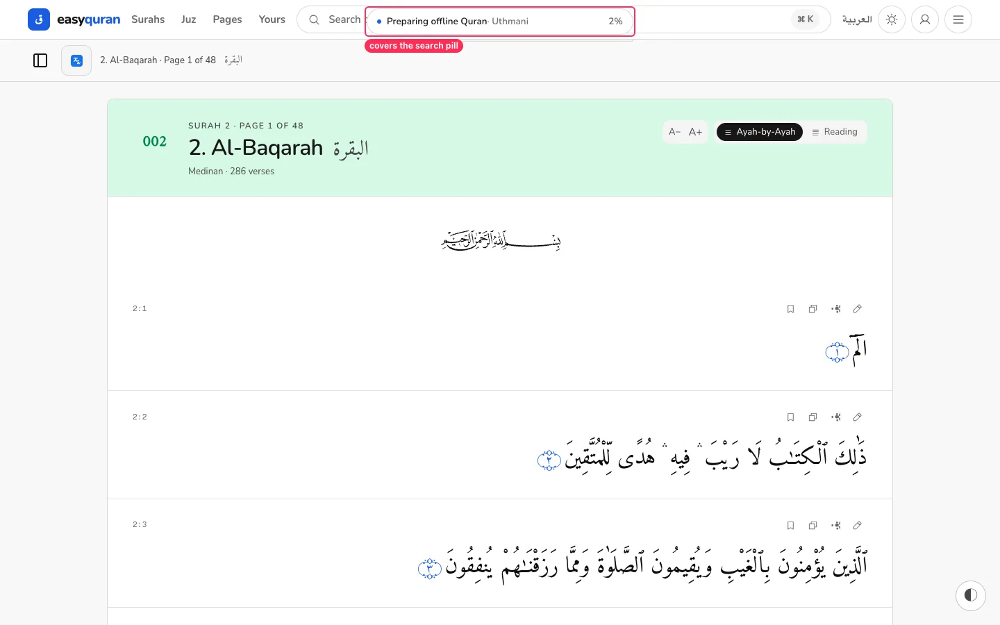
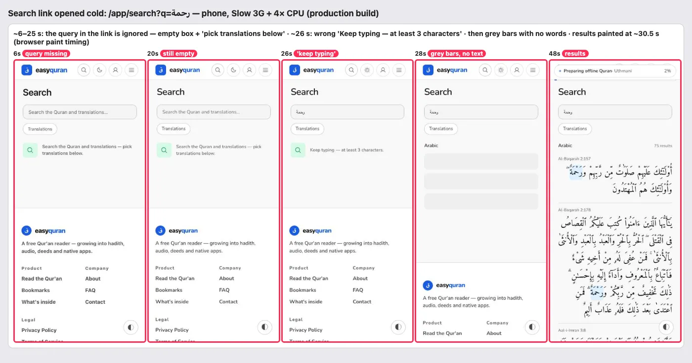
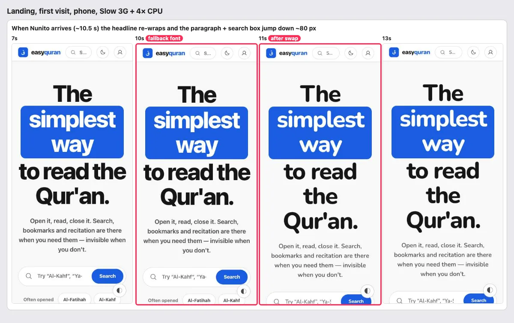
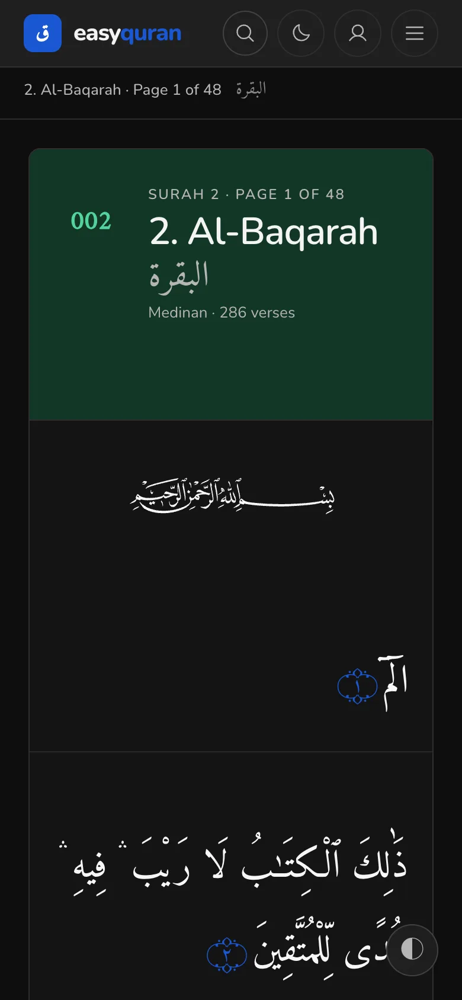
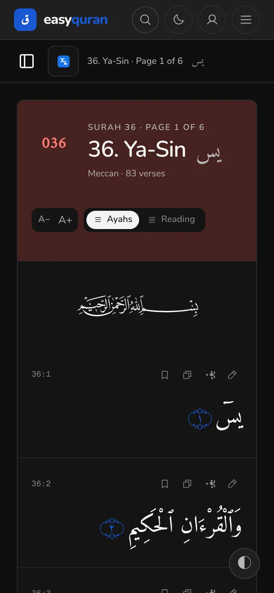

# 24 · Loading and perceived performance

[← Back to the index](README.md)

> **Question this page answers:** *On a slow phone and a weak connection, what does a reader actually see while the app loads — and does anything jump, flash or block them?*

Summary: once the service worker is installed, the app is **excellent** — every page opens in ~0.2 s, and pages you have never opened (another surah, a juz, a mushaf page, search) still work fully offline. The **first visit** is where polish is needed: 6–7 s of white screen on a slow connection, the reader shows text for ~25 s before its controls exist (then the page jumps), the UI font swaps late and moves the landing page, a shared search link ignores its query for ~25 s, and a "Preparing offline Quran" banner sits on top of the header for the whole download.

## How this was measured

- **Production build** (`PUBLIC_ENV=local pnpm build`, served by `bun server.ts` on :5392) — not the dev server.
- Phone viewport 390 × 844, **Slow 3G** (≈400 kbps, 2 s round trip) + **4× slower CPU** — a mid-range Android on a weak signal. Plus desktop 1440 × 900 on Fast 3G for comparison.
- Cold = fresh browser profile; warm = second navigation after the service worker took control.
- Timings from the browser's own paint/layout-shift APIs (FCP, LCP, CLS) plus custom marks (verse visible, Amiri loaded, app hydrated). Filmstrips are screen recordings; under heavy CPU load the recording can pause, so frame times are approximate — the table numbers are authoritative.
- Harness: `scratchpad/fork-d/perf.mjs` (CDP throttling + screencast), not committed.

| Page (phone, Slow 3G + 4× CPU) | White screen until | App responds (hydrated) | Transferred (cold) | Layout shift (CLS) | Warm (SW) |
| --- | --- | --- | --- | --- | --- |
| Landing `/` | 6.3 s | — (marketing page) | 367 KB | **0.073** (font swap) | 0.14 s |
| App home `/en/app` | 6.2 s | **27.8 s** | 485 KB | 0.001 | 0.16 s |
| Surahs `/en/app/surah` | 6.2 s | **30.3 s** | 521 KB | **0.110** | 0.24 s |
| Reader `/en/app/al-baqarah` | 6.7 s | **32.6 s** | 526–693 KB | **0.114** | 0.24 s |
| Translated reader `…/t/en/sahih` | 5.2 s | > 23 s (not reached in window) | 402 KB | 0.000 | 0.15 s |
| Search link `/app/search?q=رحمة` | 5.4 s | 25.9 s · results 30.5 s | 628 KB | **0.374** | 0.44 s (results) |
| Settings `/app/settings` | 5.1 s | 30.8 s | 513 KB | 0.001 | 0.15 s |
| Reader, desktop, Fast 3G, normal CPU | 1.9 s | 9.3 s | 695 KB | 0.057 | — |

Google's "good" thresholds are CLS ≤ 0.1 and content within ~2.5 s on a typical connection; Slow 3G is deliberately harsh, but the *shape* of the problems (late controls, jumps, blocked header) is the same at any speed, just shorter.

---

### LOAD-01 · The reader shows text for ~25 s before its controls exist, then the page jumps

**P1** · first-time readers on slow phones · `/en/app/[surah]`, `/en/app/page/[n]`, `/en/app/juz/[n]` · `web/src/routes/(application)/app/_reader/ReaderShell.svelte:75-88`, `VerseRow.svelte:65-71`, `ReaderHeader.svelte`

**What's wrong.** The prerendered page shows the Arabic at ~7 s (good), but the sidebar button, the Translations button, A−/A+, the mode toggle and every verse's tools are wrapped in `{#if mounted}` or lazily imported in `onMount`. For the ~25 s until the app hydrates on a slow phone, the reader has **no controls at all**. When they arrive, the sticky sub-bar grows (44 px Translations button) and the header card grows (A−/A+ row), so everything shifts down ~17 px — **CLS 0.111** in one jump, the same on the Surahs list (0.109). The header's theme button also shows a **moon** for light-mode readers until hydration, then flips to a sun.

**Why it matters.** People start reading and tapping as soon as text appears. A page that moves under their thumb, or buttons that appear half a minute late, feels broken.

**Fix.**
- Render the controls in the server/prerender output (disabled or as plain links until hydration) so the layout is final from the first paint; only *behaviour* should wait for `onMount`. At minimum reserve their space (`min-h-11` sub-bar content box, a fixed-height controls row in `ReaderHeader`).
- Render `VerseTools` markup statically (it is small) and lazy-load only the tooltip/share logic.
- Theme icon: render both sun and moon and toggle with CSS on `html[data-mode]`, which the inline script in `app.html` already sets before paint.

**Done when.** Reader and Surahs CLS < 0.02 on the throttled run; controls are visible in the first frame that shows text.

---

### LOAD-02 · "Preparing offline Quran" sits on top of the header for the whole download

**P1** · every first-session reader · `web/src/lib/components/status/DownloadBar.svelte` (mounted in `web/src/routes/+layout.svelte:135`)

**What's wrong.** While the Arabic text database downloads to the device, a `fixed top-0 z-[80]` pill ("Preparing offline Quran · Uthmani 1%") plus a progress line is drawn **over the site header**, and the pill has `pointer-events-auto`, so the logo, search, theme, account and menu buttons underneath can't be tapped. On Slow 3G it reached only 13 % after 18 s (≈ 2–3 minutes in total); on Fast 3G roughly 8 s (estimated from the 1.5 MB size). It re-appears on the next page if the download hasn't finished. It shows even when the Arabic text is already on screen (the reader never needed it to read).
- Text is hard-coded English ("Preparing offline Quran", "Uthmani", "Simple-clean", "Translation") — English in the Arabic UI; "Quran" without the apostrophe.
- It uses `shadow-md` (the design system has no shadows) and the same slot as `OfflinePackBar`, so the two can overlap.

**Fix.** Move progress out of the header's space: a slim 2 px progress line **under** the sticky header, plus a small, dismissible toast at the **bottom** only for downloads the user started. Background downloads the reader didn't ask for should be silent (or a tiny status in Settings → Offline). Localize all strings; say what it's for: "Saving the Qur'an text for offline reading — 34 %".

**Done when.** No status element overlaps or blocks header controls at any time; Arabic UI shows Arabic.

---

### LOAD-03 · A shared search link ignores its query until the app wakes up

**P1** · anyone opening a search link (shared, bookmarked, from Google) · `/app/search?q=…` · `web/src/routes/(application)/app/search/+page.svelte`, `messages/en.json:428`

**What's wrong.** The server-rendered search page doesn't read `?q=`. For ~25 s (Slow 3G) the box is empty and the page shows the idle message *"Search the Quran and translations — pick translations below."* Then, for a moment, the **wrong** message *"Keep typing — at least 3 characters."* (the query رحمة has 4 letters). Then grey skeleton bars with **no words** ("Searching…", "Downloading Arabic text 40 %") until results paint at ~30 s. The mobile footer sits right under the short page and jumps twice — **CLS 0.374**, the worst on the site.

**Fix.** Render the query into the input on the server; show "Searching for 'رحمة'…" with the download/indexing progress from the start; only show "Keep typing" after the user edits; give the results area a `min-height` of one screen so the footer doesn't jump.

**Done when.** From the first paint the box contains the query and a status line; CLS < 0.1.

---

### LOAD-04 · The UI font arrives late and moves the page

**P2** · first-time visitors · all pages · `web/src/routes/layout.css:4` (`@import "@fontsource-variable/nunito"`), no preload in `web/src/routes/+layout.svelte`

**What's wrong.** Only Amiri is preloaded (`app/+layout.svelte:199`). Nunito — the font of every heading, button and label — is discovered from the CSS and swaps in late (≈ 10.5 s on Slow 3G, ≈ 3 s on Fast 3G desktop). The fallback (`ui-rounded`/system) has different widths, so on the phone landing the headline re-wraps from 4 to 5 lines and the paragraph and search box jump **~80 px** (CLS 0.073). In the reader the header text shifts a few pixels and bold headings visibly change weight.

**Fix.** Preload the Latin Nunito variable woff2 (`<link rel="preload" as="font" type="font/woff2" crossorigin>` in the root layout), and add a metric-matched fallback `@font-face` (`size-adjust`, `ascent-override`, `descent-override`) for `ui-rounded`/Arial so a late swap doesn't reflow. Keep `font-display: swap`.

**Done when.** Landing CLS < 0.02 on the throttled phone run.

---

### LOAD-05 · 6–7 seconds of white screen on a slow first visit

**P2** · first-time visitors on weak connections · every page

**What's wrong.** On Slow 3G the first paint is at 5–7 s. The HTML itself is small once compressed (≈ 12–13 KB brotli), but the page waits for **34–57 module-preloaded JS chunks** (`/en/app/al-baqarah` lists 57 `modulepreload` links) and render-blocking CSS before painting; total first-visit transfer is **0.4–0.7 MB** for a page whose content is ~20 KB of Arabic. The translated reader (SSR) is sent **uncompressed** by the local `bun server.ts` (28.7 KB, no `content-encoding`) — check whether the production proxy compresses dynamic responses.

**Fix.** Audit the eager chunk graph (Firebase, analytics, search palette, hotkeys and the reader tools should all be off the critical path); inline the critical CSS for the first viewport; ensure brotli/gzip for SSR responses. Target: first paint < 3 s on Slow 3G for the reader.

**Done when.** Reader first paint < 3 s and first-visit transfer < 250 KB on the throttled run.

---

### LOAD-06 · Ayah markers change shape during loading

**P3** · first-time readers · reader

**What's wrong.** Until the Qur'an font's marker glyphs load (~29 s on Slow 3G in our run), end-of-verse markers show as a plain number in a thin circle; then they switch to the ornamental ۝ marker. Small, but it's the one part of the page that should look finished first.

**Fix.** Preload the font that draws the marker together with Amiri, or render markers as an inline SVG/CSS ornament independent of font loading.

---

### LOAD-07 · Without JavaScript the app is always dark

**P3** · readers with JS blocked, some "reader modes", link-preview crawlers · `web/src/app.html:2`

**What's wrong.** `app.html` hard-codes `data-mode="dark"` and relies on the inline script to switch to light. With JavaScript blocked, every visitor gets dark mode even if their device is light, and the reader has no controls. The Arabic text is still fully readable (good).

**Fix.** Default the SSR attribute to no mode and add a `@media (prefers-color-scheme: light)` fallback block for `:root:not([data-mode])` so the OS preference applies before/without JS.

---

### What already works well (keep it)

- **Warm loads are instant**: 0.1–0.25 s for every page once the service worker controls the page.
- **Offline, after one visit**, these all opened fully with the network cut: a surah never opened before (`/en/app/ya-sin`), `/en/app/juz/5`, `/en/app/page/300`, the Surahs list, Settings, Yours, About, the landing page, the Arabic UI reader (`/ar/app/al-mulk`), and search for a new word (صبر → 84 results). Two translation pages never opened before (Sahih, Pickthall) also rendered offline in our run — apparently prefetched in the background; worth confirming this is intentional.
- The Arabic is part of the prerendered HTML, so the Qur'an text is the **first** thing readable on the reader (LCP element = the verse text).
- Amiri is preloaded; the Arabic font is ready ~3 s after first paint.
