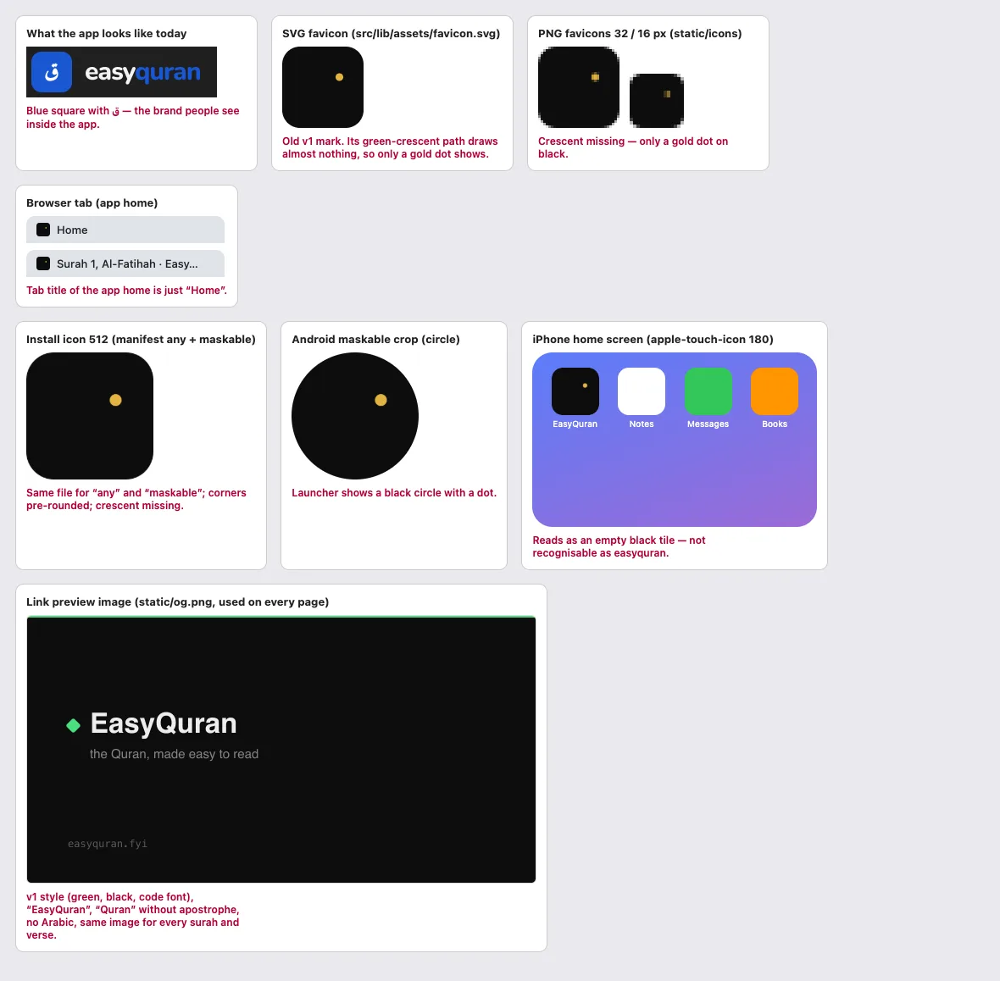

# 25 · Installed app (PWA) and page metadata

[← Back to the index](README.md)

> **Question this page answers:** *When someone installs easyquran to their home screen, bookmarks it, shares a link, or looks at their browser tabs — does it look like the same polished product?*

Summary: the install, favicon and link-preview assets are still from the old v1 design, and the icon artwork is broken — the home-screen icon is a black tile with one gold dot. The installed app always opens in English, tab titles follow five different patterns (the app home is just "Home"; sign-in pages have no title at all), and nothing helps non-technical readers install the app or know an update is waiting.

Checked on the production build (`bun server.ts`, :5392): `static/manifest.webmanifest`, `static/icons/*`, `static/apple-touch-icon.png`, `static/og.png`, `src/lib/assets/favicon.svg`, head tags of 33 routes, service-worker update UI.



---

### PWA-01 · The home-screen icon and favicons are broken, off-brand artwork

**P0** · everyone who installs the app or has it in a tab · `web/static/icons/icon-{16,32,192,512}.png`, `web/static/apple-touch-icon.png`, `web/static/logo.png`, `web/src/lib/assets/favicon.svg`, `web/src/routes/+layout.svelte:119-122`

**What's wrong.**
- Inside the app, the brand is a **blue rounded square with ق** and the "easy**quran**" wordmark.
- Every icon file shows the retired v1 mark — a **black** square — and its green crescent path (`M320 144a112 112 0 1 0 0 224 104 104 0 1 1 0-224z`) renders as almost nothing, so what people actually see is **a black tile with a single gold dot**: in the browser tab, on the Android launcher, on the iPhone home screen, and in the task switcher.
- `logo.png` (used as the Organization logo in structured data, `src/lib/seo/site-schema.ts:67`) is the same broken image.
- The manifest lists the *same* 192/512 file for `purpose: "any"` and `"maskable"`. The art has rounded corners baked in and no safe zone, so Android crops it to a black circle.
- `apple-touch-icon.png` has transparent rounded corners; iOS applies its own mask — use a full-bleed square.
- No dark-mode favicon variant.

**Why it matters.** The icon is the app's face on the home screen. A dark tile with a dot is unrecognisable next to other apps, and looks unfinished — the opposite of "trustworthy Qur'an app".

**Fix.** Export the current ق mark as: `favicon.svg` (with a `@media (prefers-color-scheme: dark)` block if needed), 16/32/48 PNG + `favicon.ico`, a full-bleed 180 px `apple-touch-icon.png`, 192/512 "any" icons, and **separate** 192/512 maskable icons with the glyph inside the central 80 % safe zone on the brand blue. Replace `logo.png`. Test with maskable.app and an iOS "Add to Home Screen".

**Done when.** Tab, launcher (circle and squircle masks) and iOS home screen all show the blue ق mark.

---

### PWA-02 · Manifest: installed app always opens in English, old colours, brand spelling

**P1** · everyone who installs · `web/static/manifest.webmanifest`

```json
"name": "EasyQuran — the Quran, made easy to read",
"short_name": "EasyQuran",
"start_url": "/app",
"background_color": "#0c0d0c", "theme_color": "#0c0d0c",
"shortcuts": [{ "name": "Continue reading", "url": "/app" }, { "name": "Juz index", "url": "/app/juz" }]
```

**What's wrong.**
- `start_url: "/app"` is a prerendered page that always redirects to **`/en/app`** (`<meta http-equiv="refresh" content="0;url=/en/app">`). An Arabic reader who installs from `/ar/app` gets the English app every time they open it.
- The "**Continue reading**" shortcut also goes to `/app` → the app home; it does not continue anything unless the hidden "Resume instantly" setting is on ([HOME-01](02-home.md#home-01--once-you-have-read-anything-the-browse-shortcuts-disappear)).
- `theme_color`/`background_color` `#0c0d0c` are v1 near-black; the splash screen and Android title bar will be black even for light-mode readers. v2 grounds are ≈ `#f8f8f8` (light) / `#141414` (dark).
- Name is "**EasyQuran**" and "**Quran**" — the wordmark is "easyquran" and the app writes "Qur'an" (see [15 · Plain language](15-plain-language-copy.md)).
- No `lang`/`dir`, no localized manifest, no `screenshots` (Chrome's richer install sheet), no `id` beyond `/`.

**Fix.** `start_url: "/app?source=pwa"` handled by a small script that sends the user to their **saved** locale and, if they have a last-read position, to it. Point "Continue reading" at a resume URL (`/app/continue`). Set `theme_color`/`background_color` to the v2 light ground (and update `theme-color` at runtime, PWA-04). Use the chosen brand spelling. Serve `/ar/manifest.webmanifest` with Arabic `name`, `lang: "ar"`, `dir: "rtl"` from Arabic pages. Add 2–3 phone screenshots.

**Done when.** Installing from an Arabic page opens the Arabic app; the splash colour matches the reader's theme; "Continue reading" resumes.

---

### PWA-03 · Tab titles follow five patterns; several pages have no title

**P1** · everyone with more than one tab, bookmarks, history, screen-reader users · `<svelte:head>` in each route, `web/src/lib/components/seo/Seo.svelte`

| Route | `document.title` today |
| --- | --- |
| `/` | EasyQuran · the Quran, made easy to read |
| `/ar/` | إيزي قرآن · القرآن الكريم، قراءة ميسّرة |
| `/about`, `/faq`, `/contact` | About easyquran · easyquran FAQ · Contact easyquran |
| `/privacy`, `/terms` | Privacy Policy · Terms of Service *(no brand)* |
| `/en/app`, `/ar/app` | **Home** · **الرئيسية** *(no brand at all)* |
| `/en/app/surah` | Surah index — Qur'an · EasyQuran |
| `/en/app/al-fatihah` | Surah 1, Al-Fatihah · EasyQuran |
| `/ar/app/al-fatihah` | السورة 1، **Al-Fatihah** · EasyQuran *(English name in Arabic title)* |
| `/en/app/al-baqarah/t/en/sahih` | Surah 2, Al-Baqarah — Page 1 of 48 · EasyQuran *(identical to the Arabic page — no translation named)* |
| `/en/app/page/1` | Page 1 (1:1–1:7) — Qur'an · EasyQuran |
| `/app/search`, `/app/bookmarks`, `/app/settings` | Search · EasyQuran … *(query not in title)* |
| `/app/yours` | Yours — Qur'an · EasyQuran |
| `/account` | Account |
| `/login`, `/register`, `/forgot-password`, `/verify-email` | **(empty — the tab shows the URL)** |
| `/en/app/nope` | (empty — plain-text 404, [STATE-01](12-states-errors-offline.md#state-01--wrong-reader-urls-return-a-plain-text-not-found)) |

The brand appears as **EasyQuran**, **easyquran** and **إيزي قرآن**.

**Fix.** One pattern everywhere: **"{Page} · easyquran"** (or the chosen brand spelling), page part first so it survives tab truncation:
- Home: "easyquran — read the Qur'an" · Surah: "Al-Fātiḥah (الفاتحة) · easyquran" · Translation: "Al-Baqarah · English (Sahih Intl.) · easyquran" · Page: "Page 1 · Al-Fātiḥah 1–7 · easyquran" · Search: "'mercy' — Search · easyquran" · Sign in: "Sign in · easyquran".
- Arabic titles use Arabic names: "سورة الفاتحة · …".
- Add a unit test that every route sets a non-empty title ending in the brand.

**Done when.** All 33 routes above have a title in the one pattern, in the page's language.

---

### PWA-04 · Browser/status-bar colour never matches the chosen theme

**P2** · phone users · `web/src/app.html:7-8` · extends [VIS-09](11-visual-consistency.md#vis-09--browser-theme-colour-is-from-the-old-design)

The two static `theme-color` metas are v1 (`#0D1210`, `#F8F7F2`), keyed to the *OS* scheme, and nothing updates them when the reader toggles light/dark in the app (no runtime `theme-color` code exists). A reader who picks dark on a light phone gets a cream address bar over a black page. **Fix:** in `prefs.apply()`, set a single `<meta name="theme-color">` to the current `--background` value.

---

### PWA-05 · No help to install the app

**P2** · non-technical readers who would benefit most from an installed, offline app · no `beforeinstallprompt`/`appinstalled` handling anywhere in `web/src`

The landing and About pages talk about offline reading and future apps, but nothing tells people they can install easyquran today. Non-technical users won't find "Add to Home Screen" in a browser menu.

**Fix.** After a reader's second visit (or finishing a surah), show a small, dismissible card: **"Keep easyquran on your home screen — it opens instantly and works without internet."** On Chrome/Android use the captured `beforeinstallprompt`; on iOS show two-step pictured instructions (Share → Add to Home Screen). Never show it inside the installed app (`display-mode: standalone`).

---

### PWA-06 · In the installed app, some screens have no way back

**P1** · installed-app users (no browser back button in standalone mode) · extends [AUTH-01](13-sign-in-and-account.md#auth-01--no-way-back-from-sign-in--create-account), [STATE-01](12-states-errors-offline.md#state-01--wrong-reader-urls-return-a-plain-text-not-found), [STATE-03](12-states-errors-offline.md#state-03--account-page-spins-forever-when-the-api-is-unreachable)

In `display-mode: standalone` there is no browser toolbar. Sign in, Create account, Forgot password, Verify email, the `/account` loading screen and the plain-text reader 404 have **no in-page navigation**. Android still has the system Back button, but on iPhone the only way out is an edge-swipe gesture many readers don't know, so they can get stuck. The app has no `display-mode` handling at all. **Fix:** every screen needs a visible exit (logo link + "Back"), and consider a small back button in the reader sub-bar when `matchMedia('(display-mode: standalone)')` is true.

---

### PWA-07 · Safe-area padding is dead code; no `viewport-fit`

**P3** · iPhones with a notch/Dynamic Island, landscape · `web/src/app.html:5`, `TranslationModal.svelte:334`, `ReadingModeDialog.svelte:58`

The viewport is `width=device-width, initial-scale=1` without `viewport-fit=cover`, so `env(safe-area-inset-*)` is always 0 and the careful safe-area padding in the two dialogs does nothing; in landscape iOS letterboxes the page with bars. **Fix:** add `viewport-fit=cover`, then pad the sticky header, the reader sub-bar, and any fixed bottom element (floating button, toasts) with `env(safe-area-inset-*)`.

---

### PWA-08 · The update notice speaks in "tabs" and has a tiny button

**P2** · every reader when a new version ships · `web/src/lib/components/status/UpdateToast.svelte`, `messages/reader/en.json` (`reader_new_version_ready`, `reader_reload_update`, `reader_reload_open_tabs`)

**What's wrong.** "A new version is ready — Reload to update every open tab. [Reload open tabs] ✕". Non-technical readers (and anyone in the installed app) don't think in tabs. The action button is ~26 px tall (`px-2.5 py-1 text-caption`), the icon is a text "↑" and the close is a text "✕"; it uses the retired `text-body-s` role and sits at the top, in the same zone as the header and the download pill ([LOAD-02](24-loading-and-perceived-performance.md#load-02--preparing-offline-quran-sits-on-top-of-the-header-for-the-whole-download)).

**Fix.** Copy: "**easyquran has been updated.** [Update now] [Later]". 44 px pill buttons, `Icon` components, bottom placement on phones, and never while the reader is mid-scroll (wait for idle or next navigation).

---

### PWA-09 · Link previews: one old image for every page

**P2** · anyone a link is shared with (WhatsApp, X, Telegram) · `web/static/og.png`, `Seo.svelte:60`, `MarketingSeo.svelte:12`

Every page — landing, each surah, each translated page — shares the same v1 preview card (black/green, "EasyQuran", "the Quran", code-font URL, no Arabic). A shared verse or surah link gives no hint of its content. **Fix:** a new branded card, and per-surah cards (Arabic name + transliteration + meaning, generated at build time for the 114 surahs; optional per-verse cards via the share feature). Titles/descriptions of translated pages should name the translation.

---

### PWA-10 · Personal pages are indexable; search/settings lack robots rules

**P3** · SEO hygiene · route `<svelte:head>`

`/app/yours` is `index, follow` with an OG card, although its content is personal (empty for crawlers). `/app/search`, `/app/bookmarks`, `/app/settings` send no `robots` meta and no description. The app home `/en/app` reuses the landing description. **Fix:** `noindex` on Yours/Search/Bookmarks/Settings/Account/auth pages; give indexable pages their own descriptions.

---

### What's right

- The manifest exists, is valid JSON, `display: standalone`, has shortcuts and categories.
- Canonical, `hreflang` (en/ar/x-default) and `og:locale` are set on marketing and reader pages; Arabic pages have Arabic descriptions.
- `robots.txt` exists; the 404 page is `noindex`.
