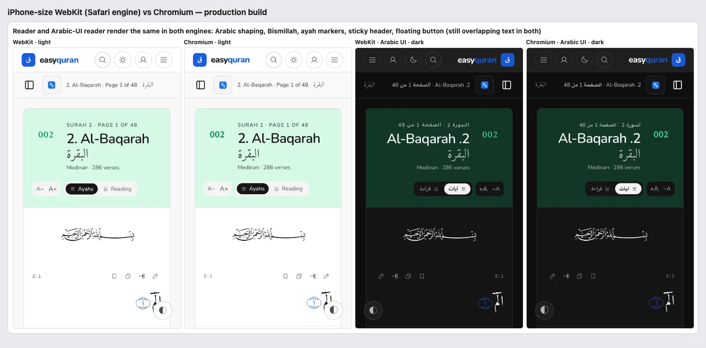
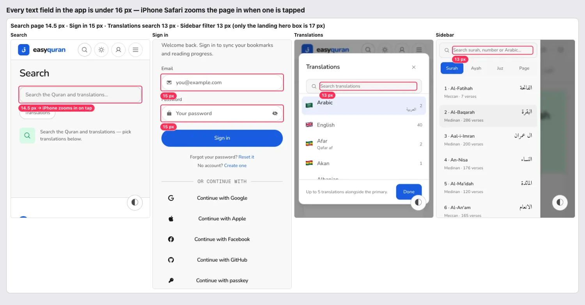
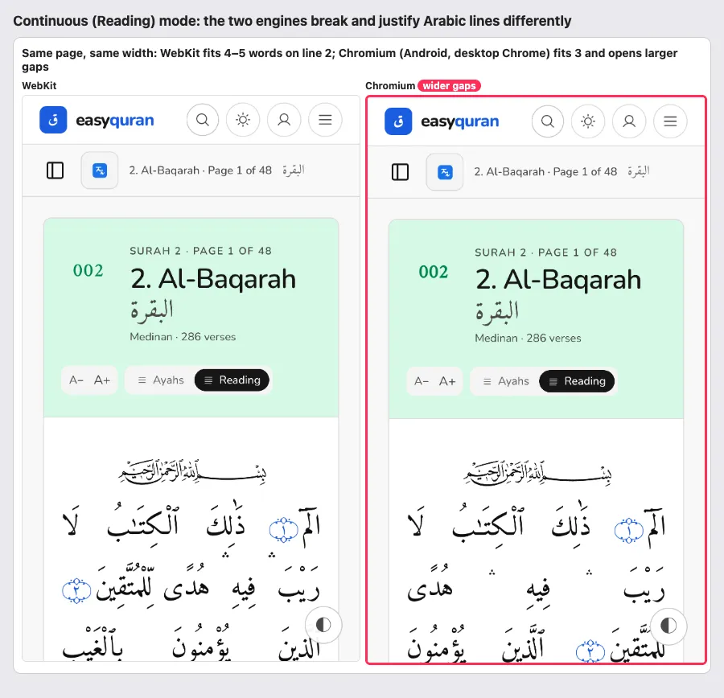

# 26 · Cross-browser (Safari engine vs Chrome)

[← Back to the index](README.md)

> **Question this page answers:** *Does the app look and behave the same on an iPhone (Safari/WebKit) as on Android/desktop Chrome?*

Summary: rendering parity is **very good** — Arabic shaping, the Bismillah, ayah markers, sticky header, dialogs and dark mode match between WebKit and Chromium. The real iPhone risk is behavioural: **every text field is smaller than 16 px, so iPhone Safari zooms the page in whenever someone taps search or sign-in**. Continuous reading mode also breaks Arabic lines differently per engine. Firefox could not be tested here (see Coverage).

## How this was checked

- Production build on :5392. Playwright 1.x in a scratch folder: **WebKit 26.6** with the "iPhone 15" device profile (393 × 852, touch, mobile UA) and 1440 × 900 desktop; **Chromium** (Chrome for Testing 152) with the same sizes and code path.
- 12 screens on phone (reader, Arabic-UI reader, translated reader with a stacked Urdu line, app home, landing, surah list, settings, sign in, search results, translations modal, continuous reading mode, menu panel) in light; 6 of them also in dark and on desktop — 60 screenshots, compared side by side.
- Probes in each: input font sizes, sticky/fixed elements, Arabic font actually applied, font loading, page overflow.

---

### BRW-01 · Every text field is under 16 px — iPhones zoom in on tap

**P1** · iPhone/iPad Safari users (and the installed app on iOS) · all inputs · `web/src/lib/components/ui/input/`, `ui/command/command-input.svelte:26` (`text-body` = 15 px), search page input, `TranslationModal.svelte`, sidebar filter, `VerseTools.svelte` textarea

**What's wrong.** iOS Safari automatically zooms the page when a focused field's font is smaller than 16 px, and does not zoom back out. Measured in WebKit on the iPhone profile:

| Field | Font size |
| --- | --- |
| Header search palette (⌘K) | 15 px |
| Search page box | 14.5 px |
| Reader sidebar "Search surah, number or Arabic…" | **13 px** |
| Translations modal search | **13 px** |
| Verse note textarea | 14.5 px |
| Sign in / Create account / Forgot password fields | 15 px |
| Landing hero search | 17 px ✓ (the only one) |

**Why it matters.** Tapping search makes the whole page jump in and slide sideways; readers then have to pinch to get back — confusing for non-technical users and it breaks the fixed header layout.

**Fix.** Use at least 16 px for form fields on touch devices: e.g. in `ui/input` and `command-input` add `text-base sm:text-body` (16 px on phones, 15 px from `sm`), or a global `@media (pointer: coarse) { input, textarea, select { font-size: max(16px, 1em) } }`. Do **not** "fix" it with `maximum-scale=1` in the viewport — that blocks pinch-zoom for low-vision readers.

**Done when.** Every `input`/`textarea` computes to ≥ 16 px at 393 px width.

---

### BRW-02 · Continuous reading mode breaks Arabic lines differently per engine

**P2** · phone readers, mostly Android/Chrome · reading-mode styles · extends [RDR-06](03-reader.md#rdr-06--reading-mode-on-phones-spreads-words-far-apart)

On the same page and width, WebKit fits 4–5 words on a line where Chromium fits 3 and stretches the gaps, so the "holes between words" problem from RDR-06 is worst on Android — the most common phone platform. The page also flows differently between a reader's iPhone and their Android tablet. **Fix:** as RDR-06 — no full justification on narrow screens (`text-align: start`), and consider `text-wrap: pretty` where supported.

---

### BRW-03 · Viewport-height and tap details for iOS

**P3** · iPhone users · `web/src/routes/(application)/app/+layout.svelte:202` (`min-h-screen`), `web/src/routes/layout.css:785` (`min-height: 100vh`), no `-webkit-tap-highlight-color` anywhere

- `min-h-screen` / `100vh` equal the *largest* viewport on iOS, so short pages (empty Bookmarks, Search, Settings on a phone) can be taller than the visible area and scroll a little under Safari's toolbar. Use `min-h-dvh` (the sidebar already uses `h-svh` correctly).
- No `-webkit-tap-highlight-color: transparent`, so iOS paints a grey flash over every tapped link/button on top of the app's own pressed styles. Set it once on `html` and rely on `:active`/`focus-visible` styles.
- Safe-area insets are inactive because `viewport-fit=cover` is missing — see [PWA-07](25-pwa-and-page-metadata.md#pwa-07--safe-area-padding-is-dead-code-no-viewport-fit).

---

### BRW-04 · Firefox is untested — code-level risk list

**P2 (risk, not a confirmed bug)** · Firefox users (desktop and Android)

Playwright's Firefox build (155) would not start on this macOS ("Could not find profile folder", inside and outside the sandbox), so nothing was rendered in Firefox. From the code:

| Feature used | Firefox status | Risk |
| --- | --- | --- |
| `navigator.share` for "Share verse" (`lib/stores/reader-share.svelte.ts:34`) | Not on desktop Firefox | Falls back to copy — OK, but the button still says "Share"; label the fallback "Copy link" |
| OPFS for the offline Qur'an (`lib/workers/opfs-cache.ts`) with an IndexedDB fallback | Supported | Low — the IDB fallback also covers private windows |
| `:has()` in `app/+layout.svelte` (skip-link rule) | Supported since 121 | Low |
| `text-wrap: balance / pretty` on landing headings | balance yes, pretty ignored | Cosmetic |
| `backdrop-filter` on menu, modal, sticky bars | Supported | Low |
| Arabic shaping (Amiri, Noto) | HarfBuzz, same as Chrome | Low; verify ayah markers once |
| Scrollbars (sidebar list, translations list) | Classic scrollbars on Windows/Linux | Check the modal's two scrolling columns don't show double bars |

**Fix.** Run the same 12-screen check in real Firefox (desktop + Android) before release; adjust the Share label.

---

### What matches (keep it)

- Arabic text, Bismillah art, ayah markers and verse spacing render the same in WebKit and Chromium, light and dark.
- Sticky site header + reader sub-bar, the translations dialog and the menu panel behave the same; no horizontal overflow at 393 px in either engine.
- Hover styles are safe on touch: Tailwind v4 only applies `hover:` under `@media (hover: hover)`, so no "stuck hover" after a tap on iPhone.
- The build ships `-webkit-backdrop-filter` alongside `backdrop-filter`, so blurs will work on real Safari (headless WebKit didn't paint the blur, a known headless limitation).
- No native `<select>` elements, so no cross-browser select styling drift.

## Coverage

| Checked | Not checked |
| --- | --- |
| WebKit 26.6 (Safari engine), iPhone 15 profile + desktop, light + dark | Real iPhone/iPad hardware, iOS Safari's own toolbar behaviour and zoom (inferred from the documented < 16 px rule) |
| Chromium 152, same screens | **Firefox** — Playwright Firefox failed to launch on this macOS |
| 12 phone screens, 6 desktop, 6 dark | Samsung Internet, Windows scrollbars, Android WebView |
| Input sizes, sticky/fixed elements, fonts applied, overflow | VoiceOver on iOS, TalkBack on Android |
